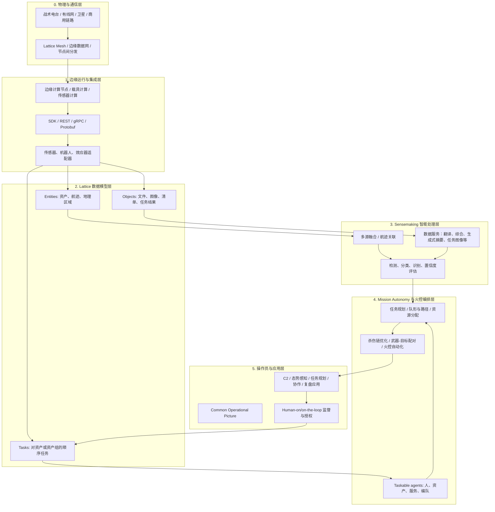
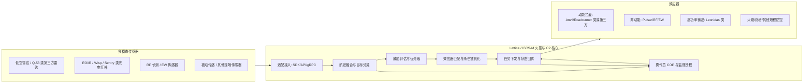

# Anduril Lattice AI Native C2 架构机理深度分析

调研日期：2026-05-20

资料包：`D:\knowledge\AI 原生 C2架构\参考资料\Anduril_Lattice_IBCSM_20260520`

本稿只使用公开资料和可解释的架构推断。凡公开资料没有明确给出的系统细节，均标注为“推断”或“未证实”。

## 1. 最核心判断

Anduril 的 AI native C2 不是一个单独的指挥软件，也不是一个“无人机群遥控界面”。更准确地说，Lattice 是一个面向战术边缘的“任务自治与杀伤链编排平台”：它把传感器、无人平台、有人平台、效应器、操作员和第三方数据源纳入同一套实体模型、任务模型、对象分发、边缘网络和应用接口中。

它解决的关键问题有五个：

1. 传统 C2 烟囱化：每个传感器、效应器和任务系统各自生成态势，互相难以复用。
2. 人工处理链路过慢：小型无人机和蜂群目标把发现、识别、决策、交战窗口压缩到人工难以独立处理的时间尺度。
3. 前沿网络不可靠：战术边缘经常处于断连、降级、间歇、低带宽状态，不能依赖中心云端闭环。
4. 能力升级太慢：新传感器、新效应器、新无人平台不能按年度集成，必须按小时/天级别接入。
5. 操作员负荷过高：未来作战不是一人遥控一机，而是一人监督多个自治系统和多条任务链。

这也是为什么 Anduril 反复强调 software-centric、open architecture、local-first、mesh、SDK、mission autonomy，而不是只宣传某一类无人机或拦截器。

## 2. 证据分级

| 等级 | 可确认内容 | 主要来源 |
|---|---|---|
| 强证据 | Lattice SDK 有 Entities、Tasks、Objects 三类基础 API；支持 REST/gRPC；内部使用 gRPC/Protobuf；强调 local-first 和开放数据交换 | Anduril Developer Docs |
| 强证据 | NGC2 官方架构是 transport / infrastructure 或 integration / data / applications 四层技术栈，目标是打通旧系统数据并让 AI/ML 组织分析数据 | 美国陆军 NGC2 官方文章 |
| 强证据 | IBCS-M 选择 Lattice 作为 C-UAS 火控平台；Yuma 七天演示中数小时集成未公开传感器/效应器，4/4 实弹拦截 | Anduril IBCS-M 新闻稿、DefenseScoop |
| 中强证据 | Lattice for Mission Autonomy 面向多域自治资产编队，任务包括区域搜索、跟踪拦截、信号中继、同时到达、打击等 | DIU ACT/Replicator 资料 |
| 中强证据 | Lattice 在 C-UAS kit 中连接 Mobile Sentry、Wisp、Pulsar、Anvil，并覆盖 detect / track / identify / defeat | USNORTHCOM Falcon Peak 资料 |
| 中证据 | 早期 Anduril 工程栈包含 mesh pub/sub 通信层、autonomy 层、perception 层，支持边缘运行与模型指标评估 | Software Engineering Daily 2020 工程访谈，需注意时间较早 |
| 需谨慎 | 公开视频展现了 Lattice 的传感器融合、目标识别、智能网络、C2、复杂机动和效果同步，但视频是宣传演示，不等于实战验证 | Anduril 视频及 Cambridge 2025 对演示视频的分析 |

## 3. Lattice 的具体架构：公开事实 + 合理推断

公开资料没有给出完整内部系统图，但 SDK、演示、集成案例和工程访谈能拼出一个相当清晰的架构。下面是“可公开证据支撑的合理架构模型”。

### 3.1 物理与通信层：为什么必须 mesh/local-first

Lattice SDK 的 Principles 明确要求 local-first：开发时要假设网络会间歇不可用，并关注带宽占用。Objects 文档还显示，在 mesh 部署中每个节点运行对象分发实例，本地没有对象时先查同层 peer，再查上层节点。

这背后的设计逻辑很明确：

- C2 不能等待所有数据回传中心云端再决策；
- 前沿节点必须能本地运行感知、融合、任务状态和部分任务分发；
- 大对象、图像、清单和任务结果不能每次都跨层级传输，必须缓存、分层查询、按需同步；
- mesh 降低单点失效风险，但它不是魔法，低带宽下仍需控制数据量。

合理推断：Lattice 的 mesh 不只是通信网络，更是“数据和任务的分发平面”。它承担传输、缓存、同步、路由、对象分发和局部态势维护。2020 年工程访谈中提到的 Flux mesh routing/pub-sub 机制也支持这一判断，但该名称是否仍用于当前 Lattice 未公开确认。

### 3.2 边缘运行与集成层：为什么要开放 SDK/API

Anduril Developer 文档写得很直接：Lattice SDK 用于构建 applications、data services、hardware integrations；集成可以把数据推入 Lattice，也可以从 Lattice 拉取航迹等数据。入口 API 是 Entities、Tasks、Objects。协议层支持 REST 和 gRPC，内部用 gRPC/Protobuf 降低传输负载。

这解决的是“集成速度”问题。传统防空/反无人机系统常见困境是：新雷达、新 RF 侦测器、新拦截器、新电子战设备进入体系时，需要定制适配、系统联调、现场工程师支持，周期很长。IBCS-M 的公开演示强调“数小时集成未公开传感器和效应器”，本质上就是平台化 SDK/API 的价值验证。

合理推断：IBCS-M 最重要的工程资产不是某个 AI 模型，而是可快速把“新传感器/新效应器”转成 Lattice 可理解的 Entity、Taskable agent、Object 和火控输入输出的适配框架。

### 3.3 数据模型层：为什么 Entity/Task/Object 是 C2 核心

SDK 文档显示：

- Entity 是支撑 COP 的互操作数据结构，由组件组合而成，不依赖严格继承树；可表示 asset、track、geo-entity。
- Track 可表示雷达、传感器、信号、车辆、人员等“被跟踪对象”。
- Task 表示操作员可以对资产或资产组执行的有序动作；taskable agent 可以是服务、资产、编队或人。
- Object 是在 Lattice mesh 中分发的文件或数据，可与实体结合，例如航迹缩略图、清单等。

这是一套很有工程含义的抽象：

| 抽象 | C2 含义 | 解决的问题 |
|---|---|---|
| Entity | 世界中有意义的对象 | 把雷达航迹、友方资产、目标、区域、控制区放进同一态势语义 |
| Task | 对人/系统/编队的任务意图 | 把操作员意图转成机器可路由、可执行、可回报状态的任务 |
| Object | 大文件与辅助数据 | 让图像、视频片段、清单、任务结果可以在 mesh 内分发和缓存 |

为什么不用传统“数据库表 + 地图图层”？因为 C2 的对象经常是不完整、实时变化、来自多个来源、带置信度和生命周期的。Entity component 模型能容忍信息不完整，便于把 radar track、EO/IR 识别、RF 侦测、人工标注、任务状态逐步拼接到同一对象上。

合理推断：这套模型类似战术边缘的“实时作战知识图谱 + 任务总线”，但它更偏工程实时系统，不是后方情报知识库。

### 3.4 Sensemaking 层：为什么 AI 首先用于融合、筛噪、分类

Anduril 早期工程访谈把软件栈概括为 communications、autonomy、perception 三大部分，并说明 C-UAS 中雷达、相机、RF 各自都有短板：雷达误警多，相机视场窄，RF 依赖目标通信特征。把这些弱信号组合起来，才能形成较高置信度的“无人机正在接近”的判断。

这解释了 Lattice 为什么首先强调 sensor fusion、target identification、classification、track correlation，而不是先强调大模型对话。反无人机和火控 C2 的核心不是“问答”，而是连续处理多源低质量数据、维护航迹、降低误报漏报、把噪声变成可行动威胁。

合理推断：IBCS-M 的 AI 模块至少包括以下类别：

- 航迹生成与航迹关联；
- EO/IR/RF/雷达的多源分类；
- 威胁优先级排序；
- 目标-效应器匹配；
- 操作员告警与推荐动作；
- 模型/规则持续评估与更新。

未证实：公开资料没有说明 IBCS-M 具体使用哪些模型、训练数据、置信度阈值、误警率、漏警率和安全认证流程。

### 3.5 Mission Autonomy 与火控编排层：为什么不是一人控一机

C4ISRNet 对 Lattice for Mission Autonomy 的报道中，Anduril 高管把它描述为负责控制资产的时间和空间、处理/编排任务系统，并同步效果投送。DIU ACT/Replicator 资料进一步说明，Lattice for Mission Autonomy 面向多域自治资产团队，支持区域搜索、目标跟踪与拦截、信号中继、同时到达、打击等任务。

这说明 Lattice 的任务层不是“遥控器”，而是“任务编排器”：

- 操作员下达的是任务意图；
- 系统把意图分解给 taskable agents；
- agents 回传任务状态、进展、结果、错误；
- 系统持续维护 COP，并在需要时重新分配任务；
- 在 C-UAS/IBCS-M 场景中，这一层进一步接入火控和效应器选择。

为什么这样设计？因为未来资产数量远大于操作员数量。若仍按一人一平台控制，蜂群作战、协同无人系统和多效应器防御都会被人工操作瓶颈卡死。

### 3.6 操作员与应用层：为什么仍需要 human supervision

公开资料更支持“人监督下的自动化”，而不是完全自主交战。SDK 任务模型区分 operator、integration、agent；C4ISRNet 和 Cambridge 对 Lattice 演示的材料也都把 human supervision 作为表达的一部分。

这对于 C2 系统很关键：AI 可以压缩感知、融合、推荐、任务编排、交战准备时间，但交战授权、交战规则、误伤风险和法律责任仍需要制度化边界。Cambridge 对 Anduril 演示视频的批评也提醒：演示画面倾向把战争表现为可控、清洁、精确，但真实战场中存在不确定性、遮蔽、误判和平民风险。

因此，专业判断应是：

- Lattice 的方向是 machine-speed C2；
- 但公开证据不能支持“完全无人自主杀伤链”；
- 更稳妥的表述是“人监督下的任务自治、火控自动化和效果同步”。

## 4. IBCS-M 的可能架构

IBCS-M 的正式系统架构未公开。基于 Anduril IBCS-M 新闻稿、USNORTHCOM C-UAS kit、Epirus/Rheinmetall/Lockheed 集成案例，可以做以下专业推断。

### 4.1 IBCS-M 解决的不是“能不能打下一架无人机”，而是“能不能持续压缩多目标杀伤链”

单个无人机拦截不是新问题。IBCS-M 的关键在于：

- 多源探测：一个传感器很难覆盖低慢小、低空、遮蔽、电子干扰等复杂目标。
- 多目标管理：无人机蜂群的压力来自数量和并发，不是单体性能。
- 多效应器选择：动能、电子战、高功率微波、火炮各有成本、射程、附带损害和规则限制。
- 快速升级：无人机形态和通信方式变化很快，系统不能锁死在某一传感器或效应器组合上。
- 机动作战：陆军 CTO 对 IBCS-M 的公开表述强调 counter-UAS 不能像反弹道导弹一样静态，必须机动、软件中心、适应性强。

### 4.2 IBCS-M 的能力边界

可确认：

- Lattice 是 IBCS-M 的 C-UAS 火控平台。
- 支持传感器融合、自动化火控、新能力集成、单操作员多威胁管理。
- 演示中有 autonomy-enhanced fire control、distributed tracking、kill-chain optimization。
- Yuma 演示完成了数小时集成和 4/4 实弹拦截。

合理推断：

- IBCS-M 会把传感器、效应器和操作员工作流统一成 Lattice 的 Entity/Task/Object 模型。
- 系统会采用边缘本地处理和 mesh 分发，以支撑机动 C-UAS。
- 它会支持软杀伤/硬杀伤组合，因为 Anduril 现有 C-UAS kit 和合作案例已经展示了 RF、动能、高功率微波、火炮等组合路径。

不能确认：

- 具体传感器/效应器清单；
- 目标容量、最大蜂群规模、延迟指标；
- 与 Northrop IBCS IFCN 的具体接口；
- 是否采用某个特定数据湖/数据平面；
- 自主交战授权规则。

## 5. 为什么 Anduril 要这样设计

### 5.1 从“平台中心”转向“任务效果中心”

传统系统往往围绕单个平台建设：某雷达、某发射车、某无人机、某操作站。Lattice 的公开叙事则是把平台、载荷、传感器和武器放到任务效果链中。它关心的是“哪个传感器发现、哪个模型判断、哪个效应器处理、哪个操作员监督、结果如何回写”。

这符合 C4ISRNet 采访中提到的思路：任务自治要控制资产在时间和空间中的行为，编排任务系统，并同步效果投送。

### 5.2 从“中心云智能”转向“边缘自治 + 分层同步”

Anduril 早期工程访谈和 SDK 文档都强调边缘处理。原因很现实：

- 前沿没有稳定网络；
- 军事数据不一定能回传商业云；
- 火控和反无人机不能等待云端推理；
- 不同密级、不同盟友、不同任务域要求局部控制；
- 大规模对象和媒体必须就近缓存。

因此，Lattice 更像一个边缘自治网络，而不是单中心平台。

### 5.3 从“固定接口集成”转向“开放数据模型 + 适配器”

Lattice SDK 暴露的是数据模型和协议，而不是只给某个专用接口。这样做能降低新能力接入成本，但代价是必须维护稳定的数据语义、权限、安全和版本治理。

这解释了为什么 NGC2 官方也强调“common and integrated data layer”以及“technology stack”。AI native C2 的前提是数据能被系统和算法共同理解，否则 AI/ML 只是孤立工具。

### 5.4 从“人工态势理解”转向“机器筛噪后的人工监督”

在无人机蜂群场景中，操作员不可能逐个读雷达点、逐个看视频、逐个选择效应器。系统必须先自动筛噪、融合、分类、排序，再把少量高价值决策点推给人。

这也是 Anduril 2022 Lattice OS 材料里“把数据变成信息、信息变成理解、理解变成决策、决策变成行动”的工程含义。

## 6. 对我们做 AI 原生 C2 的可借鉴点

### 6.1 架构上不要从大模型入口开始

Anduril 的路径说明，AI native C2 应先有统一实体模型、任务模型、对象分发、边缘运行、传感器/效应器适配和任务状态闭环。大模型可以做摘要、辅助规划、文本生成和对话解释，但它不是底座。

### 6.2 把“任务”设计成一等对象

Task 不是 UI 按钮，而是系统内可路由、可监听、可执行、可回传状态的对象。只有这样，操作员意图才能被机器人、效应器、传感器服务、数据服务共同执行。

### 6.3 把“目标航迹/实体”设计成组件化对象

Entity 需要支持信息不完整、来源多样、实时过期、逐步增强。低慢小目标尤其如此：雷达看到的是点，RF 看到的是信号，EO/IR 看到的是图像，人工看到的是意图线索，系统必须把它们合成一个可行动对象。

### 6.4 把“杀伤链编排”作为 AI 主战场

真正提升效率的是检测、融合、分类、优先级、武器-目标匹配、任务分发、战果回写的链路压缩。自然语言界面只是其中一层。

### 6.5 必须内置证据、置信度和监督边界

Cambridge 对 Anduril 视频的批评值得重视：宣传演示会把战争表现成可控的屏幕流程，但真实 C2 必须显式处理误判、误伤、规则、授权、责任和模型不确定性。AI native C2 如果只追求“机器速度”，很容易忽略治理边界。

## 7. 还需要进一步确认的问题

1. IBCS-M 是否已公开正式合同号、金额、交付节点和集成对象。
2. IBCS-M 与 Northrop IBCS/IFCN 的接口关系，是直接接入、网关桥接，还是暂时平行能力。
3. Lattice Mesh 在 IBCS-M 中的网络形态，是自有 mesh、接入陆军 C2 Fix/NGC2 transport，还是二者组合。
4. IBCS-M 的效应器授权流程，哪些环节自动化，哪些环节必须人工确认。
5. 传感器融合算法和火控推荐是否经过独立测试评估，有无误警/漏警/拦截窗口等公开指标。
6. Lattice SDK 的外部开发者接入边界，哪些 API 可用于真实系统，哪些仅用于 sandbox。

## 8. 主要来源

- Anduril Developer Docs, “Building with Lattice,” “Principles,” “Entities overview,” “Tasks overview,” “Objects overview.” https://developer.anduril.com/guides/concepts/overview
- Anduril / ASDNews, “Anduril Selected for US Army's Integrated Battle Command System Maneuver Program,” 2025-11-10. https://www.asdnews.com/news/defense/2025/11/10/anduril-selected-us-armys-integrated-battle-command-system-maneuver-program
- DefenseScoop, “Army picks Anduril to provide next-gen fire control platform for IBCS-M program,” 2025-11-11. https://defensescoop.com/2025/11/11/army-ibcs-maneuver-anduril-lattice-counter-uas/
- C4ISRNet, “Anduril unveils software to manage hordes of drones,” 2023-05-03. https://www.c4isrnet.com/industry/2023/05/03/anduril-unveils-software-to-manage-hordes-of-drones/
- DIU / Anduril via ASDNews, “DIU Selects Anduril to Enable Collaborative Autonomy for Replicator Systems,” 2024-11-20. https://www.asdnews.com/news/defense/2024/11/20/diu-selects-anduril-enable-collaborative-autonomy-replicator-systems
- U.S. Army, “Army announces Next Generation Command and Control (NGC2) prototype award,” 2025-07-18. https://www.army.mil/article/287180/army_announces_next_generation_command_and_control_ngc2_prototype_award
- Army University Press, “What Is Next Generation Command and Control,” 2026. https://www.armyupress.army.mil/Journals/NCO-Journal/Muddy-Boots/What-Is-Next-Generation-Command-and-Control/
- Line of Departure / Army Communicator, “How the Army Is Putting the Commander Back in 'Command and Control' NGC2,” 2025. https://www.lineofdeparture.army.mil/Journals/Army-Communicator/Archive/Fall-Winter-2025/NGC2-Faster-Better/
- CDAO, “DoD Chief Digital and AI Office Announces Award of Edge Data Integration Services Agreement,” 2024-12-03. https://www.ai.mil/Latest/News-Press/PR-View/Article/3983856/dod-chief-digital-and-ai-office-announces-award-of-edge-data-integration-servic/
- U.S. Department of War, “Contracts For Dec. 3, 2024,” Anduril edge data integration services. https://www.war.gov/News/Contracts/Contract/Article/3983769/contracts-for-dec-3-2024/
- Software Engineering Daily, “SED1123 Anduril,” 2020. https://softwareengineeringdaily.com/wp-content/uploads/2020/08/SED1123-Anduril.pdf
- Robin Vanderborght and Anna Nadibaidze, “Military demonstrations as digital spectacles,” European Journal of International Security, 2025. https://www.cambridge.org/core/services/aop-cambridge-core/content/view/03F20FD3B84F32D281376F2FDC269C33/S2057563725100151a.pdf/military-demonstrations-as-digital-spectacles-how-virtual-presentations-of-ai-decision-support-systems-shape-perceptions-of-war-and-security.pdf
- Epirus, “Anduril and Epirus Integration Leads to New Counter-UAS Capability,” 2023-07-27. https://www.epirusinc.com/press-releases/anduril-and-epirus-integration-leads-to-new-counter-uas-capability-2
- Lockheed Martin, “Lockheed Martin And Anduril Join Forces To Successfully Detect And Track Drone Threats In Middle East,” 2024-11-13. https://news.lockheedmartin.com/2024-11-13-Lockheed-Martin-and-Anduril-Join-Forces-to-Successfully-Detect-and-Track-Drone-Threats-in-Middle-East
