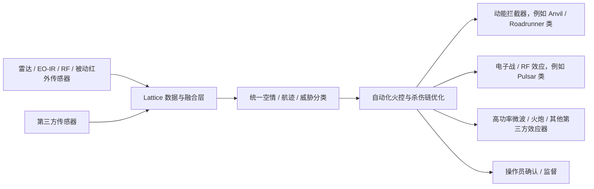

# Anduril Lattice 与 IBCS-M 深度调研分析（证据版）

调研日期：2026-05-20

资料包位置：`D:\knowledge\AI 原生 C2架构\参考资料\Anduril_Lattice_IBCSM_20260520`

## 0. 结论先行

Anduril 构建 AI native C2 的核心不是“在传统 C2 上加一个大模型助手”，而是把 C2 系统拆成可持续演进的四类能力：边缘可运行的分布式数据网、标准化实体/任务/对象数据模型、可快速接入传感器与效应器的开放接口、以及面向多平台自主系统的任务编排与火控/杀伤链优化。Lattice 是这套体系的“软件底座”和“集成面”，Anduril 自有硬件和第三方硬件都围绕它接入。

针对 IBCS-M，公开资料能确认的事实是：美国陆军选择 Anduril Lattice 作为 IBCS-M 的下一代 C-UAS 火控平台；它面向小型无人机蜂群造成的速度与饱和威胁，目标能力包括多传感器融合、自动化火控、分布式跟踪、快速集成新传感器/效应器、压缩“发现到毁伤”时间、降低单操作员负荷。Yuma Proving Grounds 七天演示中，Lattice 在数小时内集成未公开传感器与效应器，并完成 4/4 实弹拦截，这是目前公开资料里最硬的性能证据。

不能确认的内容包括：IBCS-M 的精确部署层级、覆盖半径、毫秒级延迟、单操作员可管理目标数量、可处理 50+ 蜂群、离线 72 小时、采用 Apache Iceberg/Palantir MMDP 作为统一数据层、与 NGC2/IBCS 的具体互联协议和路线图。这些都可能合理，但公开资料不足，不能写成确定事实。

## 1. 已下载资料

已成功下载并保存：

| 文件 | 作用 |
|---|---|
| `Northrop_IBCS_Overview.pdf` | IBCS 基线能力、架构和“any sensor, best shooter”说明 |
| `Northrop_IBCS_Timeline.pdf` | IBCS 历史里程碑、IOC/FRP、LTAMDS 集成等 |
| `Lockheed_Anduril_Q53_Lattice_2024.pdf` | Q-53 雷达与 Lattice C2 集成案例 |
| `Rheinmetall_Anduril_MOU_2024.pdf` | Rheinmetall Skymaster/火炮与 Lattice/Sentry/Wisp/Anvil 分层 C-sUAS 合作 |
| `C_UAS_USA_Market_Report_2024.pdf` | C-UAS 市场与技术背景 |
| `DefenseScoop_Anduril_IBCSM_2025.html` | IBCS-M 选型报道 |
| `Army_IBCS_Future_Integrated_Fires_2026.html` | 美国陆军 IBCS 官方解释 |
| `ASD_Anduril_IBCSM_2025.html` | Anduril IBCS-M 新闻稿转载，包含关键原文 |
| `ASD_Anduril_DIU_ACT_2024.html` | Lattice for Mission Autonomy / Replicator 协同自主资料 |
| `ASD_Anduril_USNORTHCOM_CUAS_2025.html` | USNORTHCOM 快速部署 C-UAS kit：Mobile Sentry/Wisp/Pulsar/Anvil/Lattice |
| `Epirus_Anduril_Leonidas_Lattice_2023.html` | Lattice 与 Leonidas 高功率微波反蜂群能力集成 |
| `Army_NGC2_Team_Anduril_Prototype_2025.html` | 美国陆军 NGC2/Team Anduril 原型合同官方说明 |
| `Army_NGC2_Competitive_Award_2025.html` | NGC2 多团队竞争与数据层原型说明 |
| `Anduril_Home_Lattice_Snapshot.html` | Anduril 官网关于 Lattice、产品域和能力域的页面快照 |
| `download_manifest.csv` | 下载清单与失败记录 |

未能本地下载但已通过浏览器读取的资料：Anduril Developer / Lattice SDK 文档页面被 `Invoke-WebRequest` 返回 403；EPICOS Pulsar 页面返回 401；War.gov 2026-03-13 合同公告页面被 `Invoke-WebRequest` 返回 403。相关事实在本文只引用浏览器读取结果，不列为本地下载文件。

## 2. Anduril 的 AI Native C2 是怎么搭起来的

### 2.1 从“系统集成商”转为“软件定义武器与自治系统平台”

Anduril 官网对 Lattice 的定位是：Lattice 是支撑其软件定义武器能力的软件平台，并能与第三方和政府自有能力集成，形成可扩展的传感器与效应器网络。公开合同也显示，2026 年 3 月 13 日美国陆军给 Anduril 的 200 亿美元上限企业合同覆盖“AI-enabled Lattice suite、integrated hardware、data、computer infrastructure、technical support services”，这说明 Lattice 已被采购为“软件+硬件+数据/计算基础设施+服务”的组合能力，而不是单一应用。

准确理解：Anduril 的 AI native C2 不是纯软件 SaaS，也不是单个无人机控制站，而是“Lattice 软件平台 + 自有/第三方传感器 + 自有/第三方效应器 + 边缘计算/网络 + 持续集成交付”的系统工程。

### 2.2 Lattice 的三类公开数据模型：Entity、Task、Object

Anduril Developer 文档显示，Lattice SDK 允许开发者构建应用、数据服务和硬件集成，并通过 Entities、Tasks、Objects API 进入 Lattice 生态。

公开文档中可确认：

- Entity：支撑 common operational picture，可表示资产、航迹、地理实体；实体由可组合组件构成，而不是严格继承树。这对 C2 很关键，因为战场对象经常是部分信息、实时更新、来源不完整。
- Task：用于描述操作员对资产或资产组发起的、有序动作；任务可被 agent 监听、执行并回传状态。这说明 Lattice 的任务分发不仅面向人机界面，也面向机器人/传感器/效应器服务。
- Object：用于在 Lattice mesh 内分发文件或二进制对象，可与实体结合，例如航迹缩略图、清单等。

这组模型体现了 Anduril 的平台思路：先标准化“世界状态、任务意图、辅助数据”，再让不同应用、传感器、机器人和效应器围绕同一数据语义协同。

### 2.3 Local-first 与边缘自治

Lattice SDK 的 Principles 页面明确强调 local-first：开发者应假设网络间歇不可用，并关注带宽使用。文档还说明，Anduril 早期 Sentry Tower 把计算机视觉和传感器融合等工作负载放在边缘本地完成，用于自动筛查可疑威胁。

这对应 AI native C2 的第一个关键点：C2 不能只依赖后方云端汇聚。AI 推理、融合、跟踪、局部任务分发需要下沉到战术边缘，这样在 DDIL 环境下还能维持局部作战闭环。

但需要谨慎：公开文档能证明 Anduril 强调 local-first 和 mesh；不能证明 IBCS-M 有“完全离线 72 小时”或任意具体断网持续时间。

### 2.4 开放接口与快速集成

Lattice Developer 文档显示其支持 REST 和 gRPC，内部使用 gRPC/Protobuf 在 Lattice 节点间传输数据，以降低带宽占用。Lattice Mesh 的应用、集成、数据服务都可读写 Lattice 数据。

这说明 Anduril 的开放并不是“开源所有代码”，而是提供一组平台接口、标准数据模型和 SDK，让第三方能力可以接入：

- 应用：态势、C2、任务规划、协作；
- 集成：传感器、数据源、机器人、硬件系统；
- 数据服务：航迹关联、翻译、生成式 AI 综合、持续处理等。

IBCS-M 在 Yuma 演示中“数小时内集成未公开传感器与效应器”，是这一架构思路在 C-UAS 火控场景中的公开验证。

### 2.5 Mission Autonomy：从单平台控制走向多平台编队任务

DIU ACT/Replicator 资料显示，Lattice for Mission Autonomy 被选用于协调成千上万的无人/自治资产，在通信和 GNSS 受拒环境下执行协同自主任务。公开资料列出的任务类型包括区域搜索、目标跟踪与拦截、信号中继、同时到达、打击等。

这说明 Lattice 的 C2 不是传统“每个平台一个遥控链路”的模式，而是把多平台的传感器、控制系统、载荷和武器统一成任务团队，由操作员给出任务意图，系统负责协调执行。

需要谨慎：这是 Lattice for Mission Autonomy 的公开目标与合同方向，不等于所有能力都已经在作战中成熟部署。

## 3. IBCS-M 面向无人机蜂群目标具备哪些能力

### 3.1 威胁假设：速度、饱和、低成本、多目标

Anduril IBCS-M 新闻稿开头明确把问题定义为：小型无人机可以数百架成群，压垮防御，在人工决策循环闭合前攻击；传统 C2 无法以足够速度处理数据和执行杀伤链决策。

因此 IBCS-M 的设计目标不是传统反导的大目标、少目标、较长时间窗口，而是 C-UAS 场景下的：

- 目标数量多；
- 目标小、低空、成本低；
- 决策窗口短；
- 传感器和效应器更新快；
- 部队需要机动而不是固定阵地防御。

### 3.2 已公开确认的能力清单

| 能力 | 公开证据强度 | 说明 |
|---|---|---|
| C-UAS 火控平台 | 强 | 陆军选择 Lattice 作为 IBCS-M 下一代 C-UAS 火控平台 |
| 多威胁同时管理 | 强 | 新闻稿称支持单操作员同时管理多个威胁 |
| 传感器数据融合 | 强 | IBCS-M/Lattice 能融合传感器数据；Epirus 集成文也说明 Lattice 支持传感器融合、关联、分类 |
| 自动化火控 | 强 | 新闻稿称 automates fire control，Yuma 演示有 autonomy-enhanced fire control |
| 分布式跟踪 | 强 | Yuma 演示公开列出 distributed tracking |
| 杀伤链优化 | 强 | Yuma 演示公开列出 kill-chain optimization |
| 快速接入新传感器/效应器 | 强 | Yuma 七天试验中，未公开传感器和效应器在数小时内完成集成 |
| 实弹拦截验证 | 强 | Yuma 七天试验中 4/4 live-fire intercepts |
| 降低操作员负荷 | 中强 | 新闻稿明确称 reducing operator load，但没有公开量化比例 |
| 机动适配 | 中强 | 陆军 CTO 公开强调 C-UAS 必须 maneuverable、software-centric、adaptable，支持 platoon leader on the move |
| 反蜂群/饱和目标 | 中 | 威胁定义和系统目标面向蜂群，但公开资料没有确认“可处理多少架” |
| 软硬杀伤组合 | 中 | USNORTHCOM kit 和 Rheinmetall/Epirus 资料显示 Lattice 可接入 RF/EW、动能拦截、高功率微波、火炮等；但 IBCS-M 的具体效应器清单未公开 |

### 3.3 可能的系统构成，但需标注为推断

结合 USNORTHCOM C-UAS kit、Rheinmetall MOU、Epirus 集成和 Lattice SDK，可合理推断 IBCS-M 可能按以下模式构建：

这是基于公开集成案例的架构推断，不代表 IBCS-M 的正式系统框图。正式 IBCS-M 传感器、效应器、接口协议、交战授权规则没有完全公开。

## 4. Lattice 平台的关键设计思想

### 4.1 Common operational picture 不是单纯地图，而是实时实体图谱

Lattice 的 Entity 模型支持资产、航迹、地理区域，且允许实体在实时 COP 中处于不完整状态。这与传统 GIS/态势图不同：它更像面向实时 C2 的“实体组件模型”，可把无人机航迹、雷达、拦截器、控制区域、任务状态、媒体对象等放到统一语义框架下。

有效观点：AI native C2 的数据底座应该围绕“实体-任务-对象-状态生命周期”构建，而不是围绕一张二维地图或一批数据库表构建。

### 4.2 C2 的价值从“显示态势”转向“编排杀伤链”

Epirus 集成资料说明，Lattice 覆盖 C-UAS kill chain 各阶段，支持威胁探测、跟踪、识别、毁伤；并可提供 recommended courses of action。IBCS-M 资料进一步强调自动化火控、分布式跟踪、kill-chain optimization。

有效观点：Anduril 的 C2 核心价值是从“态势展示系统”升级为“传感器-效应器-任务团队的实时编排器”。这也是 AI native C2 和传统 C2 最大差异。

### 4.3 开放架构的重点是“快速替换和组合”

公开资料反复出现 open architecture、open APIs、SDK、rapid integration。其工程含义不是把所有东西开源，而是让新传感器、新效应器、新数据服务、新任务应用能快速接入同一运行底座。

有效观点：面向无人机蜂群，胜负不只取决于某一个 AI 模型，而取决于系统能不能在威胁波形、无人机类型、效应器库存变化时快速插入新能力。IBCS-M 的“数小时集成”正是这点的验证信号。

### 4.4 Human-on/on-the-loop 是必要边界

C4ISRNet 关于 Lattice for Mission Autonomy 的报道明确指出，该系统不是完全自主，仍需要人类监督。公开资料也多用“operator will be able to task”“recommended courses of action”“operator load”这类表述。

有效观点：不要把 Anduril 解读成“全自动无人战争系统”。公开证据更支持“操作员监督下的自动化任务编排和火控辅助”，尤其在 C-UAS 防御中，自动化程度会更高，但交战授权边界仍取决于军方规则。

## 5. IBCS-M 与传统 IBCS 的关系：公开证据下的保守判断

IBCS 公开资料显示，它是美国陆军 AIAMD 的物质解决方案，通过 IFCN 连接传感器、效应器和 C2 节点，形成单一综合空情，并按“any sensor, best weapon / best shooter”原则优化武器使用。Northrop Grumman 资料称 IBCS 将替代 Patriot、THAAD、FAAD 等传统 Army IAMD C2 系统，成为陆军空导防 C2 系统。

IBCS-M 的名字显示其属于 Integrated Battle Command System Maneuver，但公开资料目前更明确的是：它是“以 Lattice 为核心的 C-UAS 火控平台”，服务机动、适应性和快速接入，而不是传统 IBCS 的完整替代品。

保守判断：

- IBCS 是陆军防空反导的更大体系和成熟项目；
- IBCS-M 是面向机动 C-UAS 的新分支/新火控能力；
- 两者在“连接传感器和效应器、形成统一火控网络”的理念上相同；
- IBCS-M 是否、何时、以何协议接入 IBCS IFCN，公开资料没有给出足够细节，不能写成确定结论。

## 6. 不宜继续引用的未证实说法

以下内容在现有本地旧文档中出现过，但本次检索没有找到足够公开证据，建议删除或改成“推测/待证实”：

1. IBCS-M 指挥层级确定为营连级、覆盖半径 5-20 公里。
2. IBCS-M 处理延迟小于 500 ms。
3. 单操作员可管理 20+ 目标，蜂群处理 50+ 目标。
4. DDIL 环境可连续离线运行 72 小时。
5. IBCS-M 原生基于 Apache Iceberg + Palantir MMDP。
6. IBCS 已迁移到 Iceberg + MMDP，并与 NGC2 零拷贝共享。
7. IBCS-M 节点可直接接入 IFCN，或 Lattice Mesh 已作为 IFCN 延伸。
8. Ivy Mass 2026 已验证 IBCS-M 与 IBCS/NGC2 端到端协同、50+ 蜂群拦截、100 ms 数据互通。
9. IBCS-M 将在 2027/2028 年成为 IBCS 内置机动模块。
10. 任何具体效应器清单被正式纳入 IBCS-M，除非后续军方或 Anduril 正式披露。

## 7. 对我们研究 AI 原生 C2 的启示

第一，先做数据/任务运行底座，再做 AI 功能。Anduril 的可复用资产不是某个 UI，而是 Lattice 的实体模型、任务模型、对象分发、mesh、SDK 和持续集成能力。

第二，C2 的 AI 原生化应围绕“压缩杀伤链”设计。AI 的直接作用包括多源融合、目标分类、威胁排序、效应器匹配、任务编排、操作员建议，而不是只做自然语言问答。

第三，边缘自治是体系韧性的前提。C2 必须在网络降级时维持局部态势、局部任务和局部交战链路；云端更适合全局协同、模型训练、复盘和跨域数据治理。

第四，开放架构要落到数据契约和 SDK，而不是口号。Lattice 的公开文档把开放落实到 Entity/Task/Object API、REST/gRPC、Protobuf、SDK、Sandbox 和开发者计划。

第五，反无人机蜂群是检验 AI native C2 的高压场景。它要求多目标、短时延、异构传感器、异构效应器、快速升级和人机协同，正好逼出软件定义 C2 的真实能力。

## 8. 主要来源

- Anduril / ASDNews, “Anduril Selected for US Army's Integrated Battle Command System Maneuver Program,” 2025-11-10. https://www.asdnews.com/news/defense/2025/11/10/anduril-selected-us-armys-integrated-battle-command-system-maneuver-program
- DefenseScoop, “Army picks Anduril to provide next-gen fire control platform for IBCS-M program,” 2025-11-11. https://defensescoop.com/2025/11/11/army-ibcs-maneuver-anduril-lattice-counter-uas/
- Anduril Developer Docs, “Building with Lattice,” “Principles,” “Entities overview,” “Tasks overview.” https://developer.anduril.com/guides/concepts/overview
- U.S. Army, “Army announces Next Generation Command and Control (NGC2) prototype award,” 2025-07-18. https://www.army.mil/article/287180/army_announces_next_generation_command_and_control_ngc2_prototype_award
- U.S. Army, “IBCS And The Future Of Offensive And Defensive Integrated Fires,” 2026-02-19. https://www.army.mil/article/290087/ibcs_and_the_future_of_offensive_and_defensive_integrated_fires
- U.S. Department of War, “Contracts for March 13, 2026.” https://www.war.gov/News/Contracts/Contract/Article/4434754/contracts-for-march-13-2026/
- Northrop Grumman, “Integrated Battle Command System (IBCS).” https://www.northropgrumman.com/what-we-do/missile-defense/integrated-battle-command-system-ibcs
- Lockheed Martin, “Lockheed Martin And Anduril Join Forces To Successfully Detect And Track Drone Threats In Middle East,” 2024-11-13. https://news.lockheedmartin.com/2024-11-13-Lockheed-Martin-and-Anduril-Join-Forces-to-Successfully-Detect-and-Track-Drone-Threats-in-Middle-East
- Epirus, “Anduril and Epirus Integration Leads to New Counter-UAS Capability,” 2023-07-27. https://www.epirusinc.com/press-releases/anduril-and-epirus-integration-leads-to-new-counter-uas-capability-2
- Anduril / ASDNews, “DIU Selects Anduril to Enable Collaborative Autonomy for Replicator Systems,” 2024-11-20. https://www.asdnews.com/news/defense/2024/11/20/diu-selects-anduril-enable-collaborative-autonomy-replicator-systems
- Anduril / ASDNews, “Anduril Demos and Delivers Counter-UAS Capabilities to USNORTHCOM at Falcon Peak 25.2,” 2025-10-17. https://www.asdnews.com/news/defense/2025/10/17/anduril-demos-delivers-counteruas-capabilities-usnorthcom-at-falcon-peak-252
- Rheinmetall, “Rheinmetall and Anduril Industries join forces to develop the most sophisticated military C-sUAS system,” 2024-06-19. https://www.rheinmetall.com/Rheinmetall%20Group/Presse/News/Documents/2024/06/2024-06-19-rad-and-anduril-industries-sign-mou.pdf
