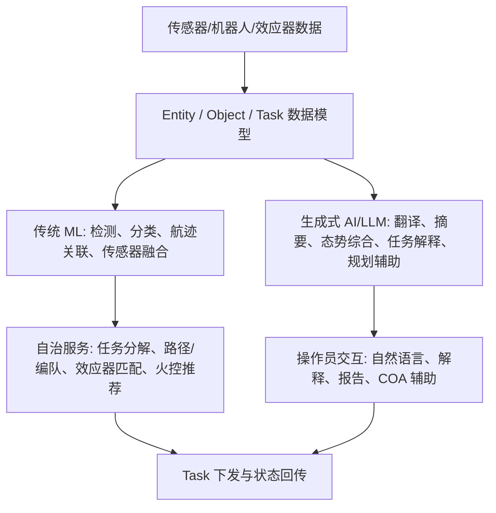
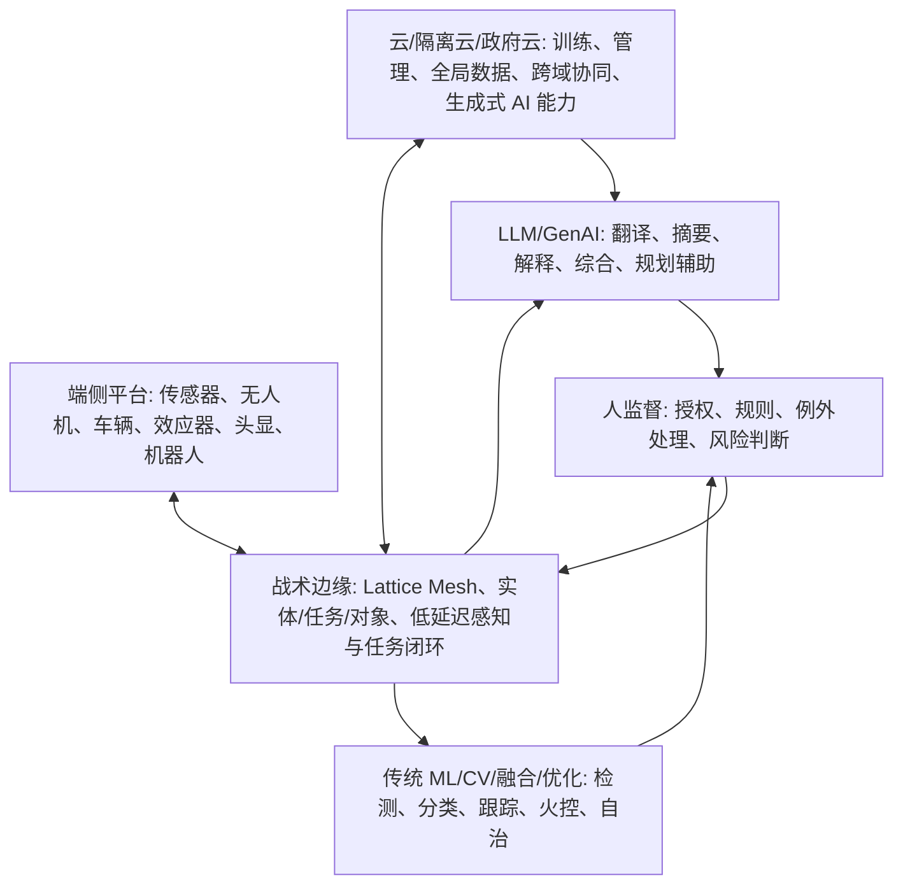

# Anduril Lattice 的 AI 原生与云原生判定分析

调研日期：2026-05-20

资料包：`D:\knowledge\AI 原生 C2架构\参考资料\Anduril_Lattice_IBCSM_20260520`

## 1. 先给判断

Anduril Lattice 可以被认为是“AI 原生 C2”的早期成熟形态，但它不是“LLM 原生 C2”。它的 AI 原生性主要来自三点：

1. 系统的核心作战对象不是报文或页面，而是可被机器持续理解和更新的 `Entity / Task / Object` 数据模型。
2. 关键闭环不是人工填表流转，而是多源感知、航迹关联、目标分类、威胁排序、任务分发、效应器匹配、状态回传的机器处理链。
3. AI/ML 能力被嵌入平台运行时，作为连续运行的数据服务、自治服务和任务编排服务，而不是事后接入的辅助问答模块。

但要准确表达：Lattice 的主干是“边缘 AI + 机器学习感知 + 任务自治 + 分布式数据网 + 人监督火控”，LLM/生成式 AI 是其中一个上层能力，主要用于综合、翻译、解释、规划辅助和操作员交互，不是感知、跟踪、火控和无人系统自治的唯一内核。

云原生方面，Lattice 不是典型互联网意义上的“纯云原生 SaaS”。它更准确是“云-边-端一体的 edge-native / distributed-cloud C2 系统”：可以部署到 Oracle Cloud、隔离云、国家安全区、政府云和 Roving Edge，但公开文档反复强调 local-first、mesh、DDIL、air-gapped、tactical edge。因此，它利用云原生工程能力，但其作战运行设计不是云依赖，而是边缘优先、云可增强。

## 2. 如何定义 AI 原生 C2

本文建议把 AI 原生 C2 定义为：

> 在系统对象模型、数据流、任务流、运行时闭环和人机协同机制中原生嵌入 AI/ML 能力，使机器能够持续理解态势、生成可执行任务、协调传感器与效应器，并在监督边界内压缩作战链路的 C2 系统。

这一定义包含五个判据：

| 判据 | 非 AI 原生系统 | AI 原生 C2 |
|---|---|---|
| 数据对象 | 报文、页面、表格、人工录入为主 | 机器可持续更新的实体、任务、对象、置信度、状态生命周期 |
| 感知处理 | 人看图、人读报文、人筛告警 | ML 自动检测、分类、关联、融合、筛噪 |
| 决策辅助 | 静态规则或人工会商 | AI 推荐、威胁排序、资源匹配、COA/任务建议 |
| 执行闭环 | 人工下令、系统转发 | 任务对象可被 agent/资产/效应器监听、执行、回传状态 |
| 运行约束 | 中心化系统可用时才智能 | 边缘本地推理、断连降级、mesh 同步、人监督授权 |

按这个定义，Lattice 的 AI 原生性较强；但它不是“完全自主交战系统”，也不是“只靠 LLM 运行的 C2”。

## 3. Anduril 是如何搭建 AI native C2 的

### 3.1 第一层：把战场对象抽象成机器可处理的数据模型

Anduril SDK 文档显示，Lattice API 的基础模型是：

- `Entities`：任何对操作员有意义的世界对象，包括资产、航迹、地理实体等；
- `Tasks`：向接入 Lattice 的 agent 发送顺序命令；
- `Objects`：在 Lattice 中存储和分发二进制数据或文件。

这一步非常关键。传统 C2 系统常以“报文格式、地图图层、业务流程”组织软件；Lattice 则把 C2 的核心对象先变成可被机器持续读取、发布、订阅、增强和任务化的数据结构。

专业推断：这就是 AI 原生 C2 的底座。如果没有统一实体和任务模型，LLM 只能做界面问答，无法稳定接入传感器、机器人、效应器和火控链路。

### 3.2 第二层：把传感器和效应器变成平台集成对象

Anduril 文档说明，Lattice integrations 负责在 Lattice 与外部传感器、数据源、机器人、硬件和软件能力之间转移数据。CDAO 的 Edge Data Mesh 资料进一步说明，Lattice Mesh 通过 SDK 和开放 API 集成政府和厂商拥有的数据与系统。

这解决的是“体系集成速度”问题。IBCS-M 的 Yuma 演示中，Lattice 在数小时内集成了未公开传感器和效应器，并完成 4/4 实弹拦截。这个证据比宣传词更重要，因为它说明平台确实在解决“新能力快速接入火控链”的工程问题。

### 3.3 第三层：把 AI/ML 放到数据服务和自治服务中连续运行

Lattice SDK 文档把 `data services` 定义为在 Lattice 内部丰富或修改数据的软件模块，不一定直接面向最终用户。公开示例包括：

- language translation；
- track correlation；
- generative AI synthesis of track pictures。

这表明 Anduril 的 AI 不是只做前端助手，而是作为平台服务持续处理 mesh 数据。CDAO 资料也明确称 Edge Data Mesh 支撑面向作战人员需求的生成式 AI 解决方案，并允许伙伴开发的生成式 AI 能力在边缘接入。

合理架构判断：

### 3.4 第四层：边缘优先的 Lattice Mesh

Anduril SDK Principles 明确强调 local-first：开发者要假设网络会间歇不可用，并关注带宽使用。CDAO 的 Edge Data Mesh 资料也说，现有系统依赖 cloud 或 hub/spoke 连接，未必适合 denied/degraded/intermittent 通信环境；Lattice Mesh 则被设计为去中心化网络能力，在平台、域和伙伴之间分发关键数据，并智能优先选择数据路径。

这意味着 Anduril 的架构不是“云端大脑 + 前端终端”。它更像“分布式边缘节点共同维护任务数据网”，云端用于扩展、训练、跨域汇聚和管理，边缘用于实时态势和作战闭环。

### 3.5 第五层：人监督下的机器速度 C2

Oracle/Anduril 资料称，Lattice 在分布式云上提供 real-time understanding、automated decision advantage、dynamic machine tasking 和 human-on-the-loop automation。

这个表述很重要：Anduril 的方向是 machine-speed，但公开资料仍强调 human-on-the-loop。也就是说，它不是把人彻底移出闭环，而是把人从“手工筛选每条航迹/逐个遥控平台”提升为“监督关键决策点、授权风险动作、处理例外情况”。

## 4. Lattice 哪里用了 LLM

公开证据能确认或较强支持的 LLM/生成式 AI 用途有四类。

### 4.1 数据综合与操作员可用化

Defense One 报道中，Anduril 发言人称 OpenAI 的大语言模型可帮助把战场数据转成操作员和分析员可用的信息，并帮助更快、更准确地评估无人机威胁。

这类 LLM 作用不是直接控制拦截器，而是把复杂、多源、高速数据转成可读、可解释、可行动的信息。

### 4.2 生成式态势综合

Lattice SDK 文档明确提到 `generative AI synthesis of track pictures`。这可以理解为：基于航迹、传感器、对象数据生成态势综合、目标图像/航迹摘要或可视化解释。

这里的关键词是 synthesis，不是 raw detection。也就是说，生成式 AI 更可能处于“态势表达/综合解释层”，而不是低层雷达点迹处理。

### 4.3 翻译、摘要、报告与自然语言交互

SDK 文档把 language translation 放在 data services 示例中。结合通用 LLM 能力，可以合理推断 Lattice 中的 LLM 适合承担：

- 多语种/多盟友协同中的翻译；
- 任务报告自动生成；
- 告警和航迹解释；
- 操作员自然语言查询；
- 任务前简报和任务后复盘摘要。

但这些具体功能是否已经在 IBCS-M 中部署，公开资料没有确认。

### 4.4 任务规划和仿真辅助

公开 LinkedIn 资料显示 Anduril 曾提到将 Scale AI 的 LLM capability 集成到 Lattice advanced modeling and simulation infrastructure 以增强 mission planning。LinkedIn 不是最强证据，但与 LLM 的合理位置一致：规划、仿真、COA 辅助、活动摘要、红蓝推演，而不是底层实时火控。

## 5. Lattice 哪里用了传统 ML / AI

传统 ML/AI 才是 Lattice 的主干能力，尤其在 C-UAS 和自治系统场景中。

### 5.1 计算机视觉与传感器融合

Anduril SDK Principles 写到，早期 Sentry Towers 在边缘本地执行 computer vision 和 sensor fusion，用于自动筛查环境中的疑似威胁，且不依赖人工操作员。

这类能力通常依赖：

- 目标检测；
- 目标分类；
- 多传感器融合；
- 运动估计；
- 置信度评估；
- 误报筛除。

### 5.2 航迹关联与目标分类

SDK 文档直接把 track correlation 作为 data service 示例。对 C-UAS 来说，这是关键 ML/算法能力：雷达、EO/IR、RF、人工标注可能都指向同一个目标，系统必须判断它们是否属于同一实体，并维护目标状态。

### 5.3 自治任务执行

Lattice for Mission Autonomy 面向多域自治资产团队，支持区域搜索、目标跟踪与拦截、信号中继、同时到达、打击等任务。这类能力不可能主要靠 LLM 完成，而更依赖：

- 路径规划；
- 任务分配；
- 编队协同；
- 资源调度；
- 规则约束；
- 实时控制与状态估计。

### 5.4 火控自动化与杀伤链优化

IBCS-M 公开资料称其具备 autonomy-enhanced fire control、distributed tracking、kill-chain optimization。这里的 AI/算法更接近作战管理和优化问题，包括：

- 威胁优先级排序；
- 效应器可用性计算；
- 武器-目标配对；
- 交战窗口估计；
- 拦截资源分配；
- 战果回写和再分配。

未证实：公开资料没有披露这些模块的具体模型类型、训练数据、准确率、实时延迟、认证流程。

## 6. 为什么 LLM 不是系统主干

LLM 擅长语言、综合、解释、规划辅助和人机交互，但 C2/火控的主链路有更强实时性和确定性要求：

| 链路 | 更适合的 AI 类型 | 原因 |
|---|---|---|
| 图像/视频目标检测 | CV/深度学习模型 | 需要像素级/帧级识别 |
| 雷达/RF 航迹关联 | 信号处理 + ML/概率关联 | 需要时序、物理约束和置信度 |
| 多传感器融合 | 贝叶斯/滤波/图优化/ML | 需要可追溯、低延迟、抗噪声 |
| 路径/编队/任务分配 | 优化算法/自治规划/RL 等 | 需要约束求解和实时执行 |
| 效应器匹配/火控推荐 | 规则 + 优化 + ML | 需要可验证、安全边界和交战规则 |
| 摘要/解释/问答/翻译 | LLM/多模态大模型 | 需要语言理解、综合和交互 |

因此，Lattice 更像“ML-first + autonomy-first + LLM-augmented”的系统。

## 7. Lattice 是否 AI 原生

结论：是，但要限定含义。

它是 AI 原生，因为：

- 从一开始就围绕边缘感知、自治系统和机器速度 C2 设计；
- 数据模型是给机器持续处理的，不只是给人看的报文；
- AI/ML 不是孤立模块，而是在传感器融合、目标分类、航迹关联、任务自治、火控优化中持续运行；
- Lattice SDK 和 Edge Data Mesh 允许外部 AI/生成式 AI 能力作为数据服务接入；
- 作战闭环围绕 `sense -> understand -> decide -> task/effect -> update` 的机器处理链设计。

它不是“LLM 原生”，因为：

- 公开资料没有显示 Lattice 的核心实体管理、mesh、火控、自治控制依赖 LLM；
- LLM 更适合放在数据综合、语言交互、规划辅助和分析解释层；
- 反无人机和火控的低层实时处理仍然必须依赖传统 ML、优化算法、规则约束和实时系统工程。

## 8. Lattice 是否云原生

### 8.1 云原生的判据

NIST 对云计算的基本定义强调：按需网络访问、共享资源池、快速弹性、可度量服务等。CNCF/AWS 对 cloud native 的常见表述强调：微服务、容器、服务网格、不可变基础设施、声明式 API、自动化部署和弹性扩展。

### 8.2 Lattice 符合的部分

公开资料能支持 Lattice 具备若干云原生特征：

- API-first：SDK、REST、gRPC、Protobuf、开放数据模型；
- 分布式服务化：Apps / Integrations / Data services 分层；
- 可部署在不同云环境：Oracle Cloud、Isolated/National Security Regions、Government Clouds、Sovereign Cloud；
- 支持边缘云：OCI Roving Edge、Menace expeditionary C4；
- 支持跨密级和 air-gapped 环境；
- 支持分布式数据和对象分发。

### 8.3 Lattice 不等同于纯云原生 SaaS

Lattice 的关键设计又明显不同于典型互联网云原生系统：

- 它强调 local-first，而不是默认中心云可用；
- 它面向 DDIL、断连、低带宽、前沿部署；
- 它运行在传感器、武器、平台、机器人和边缘节点上；
- 它需要 air-gapped、classified、sovereign、field deployment；
- 它的性能目标不是互联网弹性流量，而是作战时效、数据可达和任务连续性。

因此更准确的表述是：

> Lattice 是“云原生工程能力 + 边缘原生作战架构”的结合体。它可以云部署、可利用云 AI/数据/管理能力，但不是云依赖系统；其本质是 distributed edge-native C2。

## 9. 一个更准确的架构定位

这个图体现了一个关键事实：Anduril 的 AI native C2 不是把所有智能都放到云端，也不是把所有决策都交给 LLM，而是把不同 AI 放到不同层：

- 端侧/边缘：视觉、融合、跟踪、局部自治；
- 边缘 mesh：实体、任务、对象、发布订阅、任务状态；
- 云/隔离云：训练、全局管理、大规模数据、复杂生成式 AI；
- 人机界面：LLM 辅助综合与解释；
- 监督层：规则、授权、安全、责任。

## 10. 对我们自己的 AI 原生 C2 架构启示

1. 不要把 AI 原生等同于接入 LLM。LLM 是重要入口，但不是 C2 主干。
2. 必须先设计实体模型、任务模型、对象分发和状态生命周期，否则 AI 没有稳定操作对象。
3. ML/CV/融合/优化要放在实时链路，LLM 放在解释、摘要、规划辅助和复杂人机协同。
4. C2 系统必须 edge-native：断网仍能局部运行，联网后再同步和扩展。
5. 云原生能力要用于交付、弹性、训练、管理和跨域协同，但不能成为战术闭环的单点依赖。
6. AI 原生 C2 必须有置信度、证据链、授权边界、模型评估和回放复盘机制，否则机器速度会放大误判。

## 11. 主要来源

- Anduril Developer Docs, “Building with Lattice,” “Principles,” “Entities,” “Tasks,” “Objects.” https://developer.anduril.com/guides/concepts/overview
- Anduril / ASDNews, “CDAO Awards Anduril Production Agreement to Deliver Edge Data Mesh,” 2024-12-03. https://www.asdnews.com/news/defense/2024/12/03/cdao-awards-anduril-production-agreement-deliver-edge-data-mesh
- Anduril / ASDNews, “Anduril & Oracle Partner to Deliver AI-Powered Defense Solutions from the Datacenter to the Tactical Edge,” 2024-09-11. https://www.asdnews.com/news/defense/2024/09/11/anduril-oracle-partner-deliver-aipowered-defense-solutions-datacenter-tactical-edge
- Defense One, “Can OpenAI power military drone defenses? New partnership with Anduril offers clues,” 2024-12-04. https://www.defenseone.com/business/2024/12/can-openai-power-military-drone-defenses-new-partnership-anduril-offers-clues/401446/
- Breaking Defense, “Anduril, OpenAI enter strategic partnership to use AI against drones,” 2024-12-04. https://breakingdefense.com/2024/12/anduril-openai-enter-strategic-partnership-to-use-ai-against-drones/
- OpenAI, “OpenAI’s approach to AI and national security,” 2024-10-24. https://openai.com/global-affairs/openais-approach-to-ai-and-national-security/
- NIST, “The NIST Definition of Cloud Computing,” SP 800-145. https://csrc.nist.gov/pubs/sp/800/145/final
- AWS, “What is Cloud Native?” https://aws.amazon.com/what-is/cloud-native/
