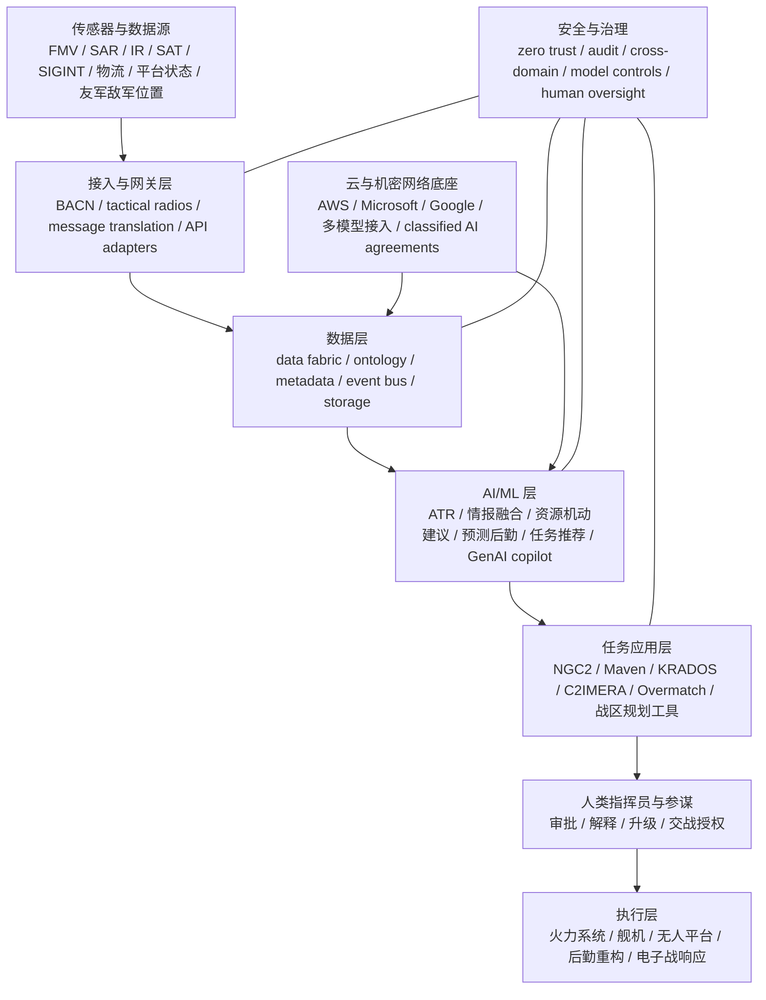

# 美国军方跨军种 AI-native 指挥控制生态深度研究报告

## 执行摘要

截至 2026 年 5 月，公开资料最能支持的判断是：美国军方所谓“AI-native”指挥控制（C2）生态，已经不再只是一个抽象概念，而是在 **DoD 级 JADC2/CJADC2 框架**下，通过 **陆军 NGC2、空军 ABMS/软件工厂体系、海军 Project Overmatch、海军陆战队机动 C4/UAS 平台、天军空间感知与 BMC3 能力**，逐步演化为一个跨军种、跨安全域、数据中心化、软件持续迭代的体系。其共同特征是：把传感器、平台、后勤、情报和火力链条接入统一的数据层，再由 AI/ML、规则引擎和人机协同应用去压缩 OODA 回路。citeturn13search6turn23search8turn23search0turn21academia7

从公开、较高置信的项目进展看，**陆军是当前最“可见”的 AI-native C2 先行军种**：NGC2 已经进入部队原型试验，Anduril 及其团队、Lockheed Martin 相关数据层工作都已被主流防务报道反复指认，系统已在师级演训中用于把无人机、火炮、车辆和 AI 预测模块联到同一作战图景中。与此同时，**Project Maven** 已从 ISR 分析工具演进为更广义的数据融合与作战辅助平台，并在多战区、多演习中扩展。citeturn14news3turn8news0turn6news4turn18search5turn23search9

空军、海军、海军陆战队和天军的公开图景则更不均衡。空军对外最清晰的“实装线索”来自 **Kessel Run / KRADOS / C2IMERA** 这一类云化软件工厂成果，以及 **ABMS** 作为空军对 JADC2 的核心贡献；海军 **Project Overmatch** 已被公开二手汇编材料描述为至少装到三个航母打击群，但细节高度保密；海军陆战队更公开的是 **ARV C4/UAS** 这类“机动指挥节点”能力，以及与 Maven/Scarlet Dragon 类实验的结合；天军则更多通过 **NDSA、Space Systems Command 的 BMC3 体系与系统 Delta** 体现其对全军 C2 的支撑。citeturn25search1turn13search6turn16search0turn18search3turn19search0turn19search4

供应商层面，**Anduril、Palantir、Scale AI** 是当前“AI-native C2”最值得关注的三家新型国防技术公司，但它们位置不同：Anduril 在陆军 NGC2 和反无人机 C2 中最接近“任务级主骨架”；Palantir 在 Maven 和可能的 NGC2 团队角色上最接近“数据层/AI 应用层中枢”；Scale AI 则主要通过 **Thunderforge** 切入“作战规划 AI”而非直接占据 NGC2 主承包位置。与此同时，微软、谷歌、AWS 等超大云与模型供应方，正通过 Thunderforge、Maven 运行环境和 2026 年 DoD 新的机密网络 AI 接入协议，成为整个生态的底层算力与模型底座。citeturn11news0turn23news1turn14search1turn23search9

## 研究边界与证据等级

这类问题的最大难点，不在于“有没有项目”，而在于**公开可见度极不均衡**。陆军 NGC2、DoD 级 AI 采购和部分 Maven 线索，在主流媒体与公开二手汇编中相对清楚；但海军 Overmatch、海军陆战队 Metropolis、天军 BMC3/地面体系的很多关键细节，往往只在预算附件、听证会、合同条目或保密项目叙事中出现。在本轮可访问材料里，**Army/DoD 层结论的置信度显著高于 Navy/Marine/USSF 细节层结论**。citeturn14news3turn11news0turn16search0turn19search0

因此，下面报告采用三层证据标准：**高置信**，指 AP、华盛顿邮报、WSJ、FT、主流防务媒体报道中直接引述军方/承包商声明的事项；**中置信**，指二手汇编材料把多篇原始报道整理在一起、但我在本轮检索中未能直接打开主源原文；**待核验**，指项目名存在、但合同、组织边界、技术栈或负责单位在当前公开材料中无法充分交叉验证的事项。像 **TOC‑L/DAF Battle Network 的最新公开页、Project Trident 的范围、Marine Corps Project Metropolis 的正式项目文书、USSF FORGE 的当前合同与 AI 组件**，都属于本轮研究需要进一步回查主源的领域。citeturn25search1turn16search0turn19search0

## 政策战略与治理框架

DoD 层的主轴仍然是 **JADC2**，而近年的公开叙事越来越多使用 **CJADC2**，强调“combined”——也就是不仅跨军种，而且要纳入盟友、伙伴、不同安全域和不同数据所有权体系。公开二手汇编一致把陆军、空军、海军、天军分别对应到 **Project Convergence / NGC2、ABMS、Project Overmatch、NDSA** 等线条上，这意味着今天美国的 AI-native C2 不是“一个平台”，而是一组可组合的服务、网关、数据层和任务应用。citeturn13search6turn16search0turn19search3

治理中心则在 **CDAO**。公开信息显示，CDAO 在 2022 年整合 JAIC 后，逐步承担 DoD 级数据、AI 与数字化的统一协调角色；Craig Martell 在任内多次把问题表述为“先把数据基础设施做好，再做 AI”，这与今天各军种都在谈数据层、数据标准、任务数据产品和 cloud/edge runtime 的现实吻合。citeturn23search8turn23search0

2025—2026 年的一个新变化，是 DoD 对生成式 AI 与机密网络模型接入的推进明显加速。华盛顿邮报报道，**Thunderforge** 由 DIU 授予 Scale AI，最初面向 EUCOM 和 INDOPACOM，用生成式 AI 做情报摘要、作战方案草拟和资源机动建议，并与 Anduril 系统集成；到 2026 年 5 月，AP 又报道称 DoD 已与 **Google、Microsoft、AWS、Nvidia、OpenAI、Reflection、SpaceX** 达成机密网络 AI 协议，目标是“augment warfighter decision-making”。这说明 DoD 正从“单点 AI 工具”转向“军内模型接入平台 + 多提供商供给”。citeturn11news0turn23news1

治理张力也同步上升。AP 报道的 Anthropic 与 Pentagon 争议说明，**模型供应商的使用边界、政府对模型的可控性、是否允许完全由厂商设定 guardrails**，已经成为军用 AI 采购的新核心问题。换句话说，AI-native C2 的治理问题不只是“人类是否在回路中”，还包括**国家是否保有对模型版本、任务边界、日志审计、降级回退和最终授权链的主权**。这类问题在学术界已被概括为“decision sovereignty”。citeturn23news2turn23news4turn20academia5

## 各军种项目版图

### 陆军

陆军当前最清晰的两条 AI-native C2 主线，是 **Project Convergence** 和 **NGC2**。公开报道显示，NGC2 已在第 4 步兵师进行连续原型试验，把无人机、火炮、车辆、电子战节点等多种要素接到一套共享界面中，并利用 AI 进行目标识别、后勤预测和战场建议。Business Insider 对 2025—2026 年试验的报道尤其清楚地展现了它作为“数据层 + 任务应用 + AI 预测”系统的特征，而不是传统“单一指挥平台”。citeturn8news0turn6news4turn8news8

供应商方面，公开、重复出现且最具可操作价值的结论是：**Anduril 是 NGC2 的显性赢家之一**，而 **Palantir 高概率在其团队中扮演关键软件/AI 角色**；同时，Lockheed Martin 也在 NGC2 相关数据层原型中占有位置。路透转述型报道与多家财经/防务媒体一致指向：Anduril 牵头的团队在 2025 年拿下近 1 亿美元的 NGC2 合同，团队成员包括 Palantir、Microsoft、Striveworks、Govini 等；随后 Lockheed Martin 又拿到约 2,600 万美元的相关原型合同。需要强调的是，这一判断在本轮可见材料中主要依赖**高质量二手报道而非直接读取的 Army 主源公告**。citeturn14news3

陆军还在把 AI-native C2 从“火力与态势”扩展到“保障与预测”。公开报道显示，NGC2 可以用实时数据推演不同敌情下的弹药、燃料和维修需求，从而把后勤由被动补给改为前置预测。这是 AI-native C2 很关键的一步，因为它意味着 C2 的对象不再只是“谁打谁”，而是“谁还打得动、多久会失效、如何提前重构部队节奏”。citeturn6news4

### 空军

空军公开可见的 AI-native C2 版图，当前最容易实证的不是 TOC‑L 文案，而是 **ABMS + Kessel Run 软件工厂 + 云化空中任务规划/执行** 这条线。二手汇编一致把 **ABMS** 视为空军对 JADC2 的主要贡献；而在更具体的软件层面，Kessel Run 的 **KRADOS** 已用于替代老旧 TBMCS，在 609th AOC 实现基于云的数据共享、任务流组织和空中任务令生成，**C2IMERA** 也在 ACC 和 AMC 范围内扩展为基地级 C2 工具。citeturn13search6turn25search1

这说明空军的 AI-native C2 演化方向，至少在公开面上，是把 **传统空中作战中心的任务计划、加油、排序、资源分配与态势显示** 做成可快速迭代的软件产品，而不是继续深度依赖大而慢的单体系统。其方法论与陆军 NGC2 的“持续演训—持续修补—持续交付”高度一致。citeturn25search1

在通信互联层，**BACN** 仍是理解空军为什么能成为多域 C2“中介层”的关键抓手。公开材料显示，BACN 的价值在于实时转发、桥接和翻译异构战术链路，并同时覆盖 **LOS 与 BLOS** 场景，让原本彼此不兼容的网络与语音/数据链能交互。对整个 AI-native C2 生态而言，这类“网关/翻译器”并不起眼，却往往比单个 AI 模型更决定系统是否可用。citeturn25search0

不过也必须直说：**TOC‑L / DAF Battle Network 的最新主源页面，在本轮检索中未能稳定直接抓取**。因此，本报告对空军部分的最稳妥表述，是“ABMS 与软件工厂生态已形成明显 AI-native C2 方向；TOC‑L/DAF Battle Network 很可能是这一路径向更正式战役级 C2 组织形态收敛的名称”，但其最新版本、合同与接口细节需要回查空军官方项目页和预算说明书。citeturn25search1turn13search6

### 海军

海军 **Project Overmatch** 是全军最重要、但公开透明度最低的 AI-native C2 项目之一。当前公开二手材料显示，Overmatch 已被安装到 **三个航母打击群**，并在 **Large Scale Exercise 2023** 及 **Project Convergence Capstone 4** 相关环境中出现。另有公开人物材料指出，Michael Roberts 曾任 Overmatch 执行负责人。总体上，这些线索支持一个中高置信判断：**海军已经把 Overmatch 从概念推进到舰队级实装试用阶段**。citeturn16search0turn26search5

但海军部分也是本报告信息缺口最大的区域之一。今天公开面上很难清楚地区分 **Project Overmatch、Project Trident、舰队级 LVC、NAVWAR/C4I 现代化** 之间的边界。与陆军 NGC2 那样的高可见部队试验不同，海军更多以“全球演习、压力测试、保密网络整合”方式推进，因此对外披露更碎片、更少。最稳妥的说法是：**海军已在航母打击群和大规模演习层面推进 AI-native / data-native C2，但其具体中间件、数据层和 AI 角色公开度不足。** citeturn16search0

### 海军陆战队

海军陆战队部分，公开可见的“AI-native C2”更像是**若干能力块**，而不是一条像 NGC2 那样高度品牌化的主线。最直接的公开证据有两类：一类是与 **Project Maven / Scarlet Dragon** 结合的实验，海军陆战队单位参与了 AI 辅助目标发现与火力链条压缩；另一类是 **ARV C4/UAS** 这种把车体本身做成多域侦察与指挥节点的平台，其公开描述明确写到该车要作为“战场四通八达的数据/控制中枢”，并采用开放架构以便后续快速集成传感器、无人系统和 AI 功能。citeturn18search5turn18search3

至于你特别点名的 **Project Metropolis**，我在本轮可访问资料里**没有拿到足够强的一手或高质量二手证据**去说明它的正式组织地位、预算线、合同归属和当前成熟度。因此，在严谨意义上，本报告只能把它列入“待主源核验”的 Marine Corps 高优先级问题，而不能把它与 NGC2、Overmatch 置于同等已证实层级。citeturn18search3turn18search5

### 天军

天军对 AI-native C2 的贡献，公开面上更多体现在 **空间数据、战场管理指挥通信（BMC3）、感知/目标信息支撑** 上，而不是一个面向地面部队可直观看见的“作战应用界面”。二手汇编普遍把 **NDSA** 视为天军对 JADC2 的主要贡献之一；而组织层面，Space Systems Command 已把 **BMC3 Directorate** 放在显著位置，2025 年以后设立的 System Delta 也在沿着“空间态势感知—感知与目标支撑—地面与网络持续保障”的逻辑重整。citeturn19search3turn19search0turn19search4

但和海军类似，天军的公开细节也不足以让我可靠还原 **FORGE、地面任务系统、数据层、具体 AI 模块与跨域共享机制** 的最新状态。因此对 USSF 的判断应保持克制：**它显然是 AI-native C2 生态不可或缺的“上游传感与太空支撑层”，但公开材料不足以证明它已经形成一个像陆军 NGC2 那样清晰对外叙述的 AI-native C2 产品族。** citeturn19search0turn19search4

## 采购机制与供应商生态

从采购逻辑看，美国军方的 AI-native C2 已明显偏向**快速原型、持续交付、多供应商并行**，而不是传统单一主承包、完整需求冻结后再多年量产。陆军 NGC2 的近亿美元原型合同、DIU 的 Thunderforge、空军 Kessel Run 的软件工厂模式，以及 2026 年 DoD 同时接入多家模型供应商进入机密网络，都说明采购对象正从“平台硬件”转向“数据层、应用层、模型层、网关层与基础设施层的组合”。citeturn14news3turn11news0turn25search1turn23news1

| 厂商 | 当前公开可见角色 | 已见合同/选择信号 | 关键技术组件 | 证据层级 |
|---|---|---|---|---|
| **Anduril** | 陆军 NGC2 关键承包团队；反无人机统一 C2 骨干 | 2025 年近 1 亿美元 NGC2 合同；2026 年 JIATF‑401 选择其 **Lattice** 做 C-UAS C2 | Lattice、传感器—射手整合、实时共享态势 | 高；但本轮多为二手高质量报道 citeturn14news3turn14news2 |
| **Palantir** | Maven 核心软件/数据融合平台；高概率参与 NGC2 团队 | Maven 已成为更广泛 C2/ISR/规划体系；公开报道反复把其列入 NGC2 团队 | Maven Smart System、数据标准化、COP、AI辅助分析 | 中高；Maven更强，NGC2 团队角色仍待主源确认 citeturn18search5turn23search9turn14news3 |
| **Scale AI** | DoD/战区规划 AI 供应商，而非当前公开确认的 NGC2 主承包方 | **Thunderforge** 由 DIU 授予，最初部署 EUCOM/INDOPACOM，并与 Anduril 系统集成 | GenAI 计划生成、情报摘要、资源机动建议 | 高 citeturn11news0 |
| **Microsoft** | 模型、云和开发底座 | 为 Thunderforge 提供 AI 工具；进入 2026 DoD 机密网络 AI 协议名单 | 模型接入、云、企业平台 | 高 citeturn11news0turn23news1 |
| **Google** | 模型与云生态供应方 | 为 Thunderforge 提供 AI 工具；进入 2026 DoD 机密网络 AI 协议名单 | 模型、云、推理服务 | 高 citeturn11news0turn23news1 |
| **AWS** | 机密域与作战 AI 运行底座 | AP 报道列为 DoD 机密网络 AI 协议方；二手材料称 Maven 运行在 AWS 上 | 云基础设施、数据湖/推理运行环境 | 中高；Maven-on-AWS 为二手汇编，需要回查主源 citeturn23news1turn14search1 |
| **Lockheed Martin** | NGC2 相关数据层/集成方；也出现在海军/天军关键岗位周边 | 公开报道将其列为 NGC2 相关 2,600 万美元合同承包方 | 集成数据层、任务系统集成 | 中高；需回查官方授奖文书 citeturn14news3 |
| **Northrop Grumman** | 更像“传感器—集成—防空 C2”强者，而非当前 AI-native C2 新范式主承包方 | 在 Golden Dome 软件联盟中作为技术分包方出现；IBCS 仍是其 C2 强项 | IBCS、传感器/拦截器整合、系统集成 | 中；更多是相邻项目证据 citeturn19news7turn20search11 |
| **RTX / Raytheon** | 互联互通与网关层供应商 | JADC2 二手汇编提到 Raytheon BBN 的 RIPL 连接遗留链路至 ABMS；Golden Dome 软件联盟亦有其名 | 网关/翻译、legacy-to-cloud 互联 | 中 citeturn13search6turn19news7 |
| **Leidos** | 应用层软件开发与交付 | C2IMERA 由 Leidos 编码、Kessel Run 管理 | 基地级 C2 应用、软件工厂交付 | 中高；属空军软件生态，不是 DoD 级主骨干 citeturn15search3 |
| **L3Harris** | 更偏通信/EW/C5ISRT 邻接层 | 公开可见证据不足以确认其为 AI-native C2 主承包赢家；但其 EA‑37B 面向 Counter‑C5ISRT | EW、通信压制、战术链路环境塑形 | 中低；应进一步回查主源 citeturn25search5 |

这张表的核心含义，不是哪家厂商“包打天下”，而是美国军方正在形成一个**分层供应商格局**：Anduril 更像“全局感知与 C2 骨架”，Palantir 更像“数据与 AI 中枢”，Scale AI 更像“规划与 GenAI copilots”，微软/谷歌/AWS 更像“模型与云底座”，老牌 primes 则更多扮演**集成、传感器、拦截器、网关、战术通信和 legacy system 接口**角色。citeturn11news0turn23news1turn19news7turn15search3

## 架构与技术栈研判

从公开材料最能推导出的整体架构，不是“一个大系统”，而是一个由 **数据接入 → 数据标准化/融合 → AI/ML 分析与规划 → 任务应用 → 人类授权执行** 构成的作战软件栈。Project Maven 的二手汇编尤其值得注意，因为它明确把 Maven 描述成：从图像识别出发，逐步扩展到多源数据融合、统一 ontology/data management、向不同应用和战区提供同一数据基础的系统。Thunderforge 则把这个思路推进到生成式规划；KRADOS 把它推进到空中作战任务管理；NGC2 把它推进到旅师级陆战术指挥与保障。citeturn23search9turn11news0turn25search1turn8news0

在**数据摄取**层，公开资料反复出现的视频/图像、卫星、地理位置、战场传感器、友军/敌军位置、物流与平台状态数据，说明 AI-native C2 的原料已经远超传统 ISR。Project Maven 的数据输入覆盖影像、合成孔径雷达、红外、地理元数据等；Thunderforge 则进一步把情报、战场传感和兵力机动数据放在同一规划上下文里。citeturn23search9turn11news0

在**互操作与数据融合**层，最关键的不是单个 AI 模型，而是“翻译”和“标准化”。BACN 的公开描述就是典型例子：它通过在 **LOS/BLOS** 场景下桥接、转译不同链路，让原本互不兼容的系统交换信息。KRADOS 又显示，应用层可以通过共享云数据把九个不同工具联到一起。综合这些公开信号，最合理的技术推断是：美国军方 AI-native C2 的中间层会越来越像 **data fabric / ontology layer + API gateway + message translation + event routing**。citeturn25search0turn25search1

在**AI/ML**层，用途已不局限于目标识别。当前公开材料已能确认至少四类功能：其一，Maven 类系统做自动目标识别与多源分析；其二，NGC2 做后勤预测、态势推演和建议生成；其三，Thunderforge 做行动方案草拟与资源配置建议；其四，DoD 2026 年新的机密网络多模型接入协议，为更广义的战场 AI copilot 奠定条件。AP 还特别提到，这些工具用于目标识别、维护预测和后勤组织。citeturn23search9turn6news4turn11news0turn23news1

在**边缘/云基础设施**层，公开图景倾向于“云训练/编排 + 边缘执行/缓存”。Kessel Run 的 KRADOS 已经把空中任务令搬上云；Maven 公开二手材料称其运行在 AWS；而 2026 年 DoD 对机密网络 AI 的多厂商接入，则说明模型和推理服务也在向更平台化的机密域基础设施移动。与此同时，战术侧又必须依赖车载节点、机载网关、前沿终端和战术无线电，以适应 DDIL 环境。citeturn25search1turn14search1turn23news1turn21academia7

在**通信**层，公开资料最清楚地指向一个混合网络现实：一部分是战术无线电、数据链和 SATCOM/BLOS；另一部分是宽带、云和 5G 式环境。关于这一点，一篇 2025 年的相关研究虽非美国军方官方项目文书，但它很好地说明了技术约束：与 Wi‑Fi 或 5G 级宽带相比，战术无线电延迟会显著更高，因此军用 AI-native C2 几乎必然需要本地缓存、异步更新、断连容忍与权限分层。citeturn22academia5turn25search0

在**安全与 IA**层，当前最合理而且最保守的结论是：目标架构一定朝着 **零信任、审计日志、跨域控制、人机授权链** 前进，但公开材料也同时显示，军方与模型供应商之间对 guardrails、使用边界和机密网络接入的争执正在变成新的系统风险。Thunderforge 报道明确提到审计轨迹；AP 报道明确提到 human oversight；Anthropic 争议则暴露了“厂商边界”与“国家边界”之间的矛盾。citeturn11news0turn23news1turn23news2turn23news4

上图不是任何单一项目的官方图，而是依据公开材料抽象出来的“最可能的共性栈”。如果必须用一句话概括：**美国军方的 AI-native C2 正在从“平台中心”转向“数据层中心”，再由 AI 和应用层去服务不同军种的执行形态。** citeturn23search9turn11news0turn25search1turn25search0

## 跨军种关键时间线

| 时间 | 关键事件 | 研判 |
|---|---|---|
| **2017** | Project Maven 启动 | AI 首先从 ISR/视频识别切入军方核心任务链。citeturn18search5turn23search9 |
| **2020** | Scarlet Dragon / Project Convergence 等实验引入 AI 辅助火力链；Maven 进入更多演训 | AI 开始从情报分析走向战术闭环。citeturn18search5 |
| **2021** | Kessel Run 的 **KRADOS** 在 609th AOC 上线，云化生成空中任务令 | 空军把 AOC 的任务规划流程软件化、云化。citeturn25search1 |
| **2023** | Project Maven 成为 Program of Record；C2IMERA 扩展；ABMS 继续作为空军对 JADC2 主线 | DoD 从实验 AI 进入更制度化采办。citeturn18search5turn25search1turn13search6 |
| **2024** | Overmatch 被公开二手材料描述为已装上 3 个航母打击群；JADC2/CJADC2 强调 combined 与 interdependence | 海军开始走向舰队级部署；联合互操作成为核心叙事。citeturn16search0turn13search6 |
| **2025** | 陆军 NGC2 近亿美元合同落地；Scale AI 的 Thunderforge 获 DIU 合同；Project Convergence Capstone 5 进入 NGC2 阶段 | 规划 AI 与战术 C2 原型开始并行推进。citeturn14news3turn11news0turn17search2 |
| **2026** | DoD 与 7 家 AI 公司达成机密网络协议；陆军继续 NGC2 师级试验 | DoD 开始把“模型接入”平台化，AI-native C2 进入更广泛推广阶段。citeturn23news1turn8news0 |

## 信息缺口与建议优先核验的主源

最重要的未决问题有五类。第一，**空军 TOC‑L / DAF Battle Network 的最新项目页、预算线和合同族谱**，本轮检索没有拿到足够强的直达主源。第二，**海军 Project Overmatch 与 Project Trident 的边界**仍不清楚。第三，**Marine Corps Project Metropolis** 的正式项目文书没有被本轮可访问资料充分佐证。第四，**USSF FORGE、SSC/BMC3 与 NDSA 的具体 AI/数据层接口**仍需预算书和项目页核验。第五，**具体 STANAG、跨域网闸产品、API 标准、消息总线和数据模型**，当前公开资料几乎都不足以支持确定性判断。citeturn16search0turn19search0turn18search3

如果继续做下一轮更“投资级/竞标级”的核验，我建议优先回查以下主源，而不是继续依赖二手报道：

| 优先级 | 建议回查主源 | 目的 |
|---|---|---|
| 高 | DoD《JADC2 Strategy》、CDAO 年度/听证材料、Task Force Lima / genAI.mil 公开文件 | 确认 DoD 级治理与 AI 规则 |
| 高 | Army NGC2 官方授奖公告、SAM.gov 草案、Project Convergence 新闻稿 | 确认 Army 的合同号、采购路径、团队成员 |
| 高 | AFLCMC / C3BM / DAF Battle Network / TOC‑L 官方页面与预算书 | 确认 Air Force 的 TOC‑L、ABMS DI、CBC2 关系 |
| 高 | NAVWAR、PEO Digital、CNO 导航计划、国会预算解释文本 | 确认 Overmatch / Trident 的正式边界 |
| 中高 | Marine Corps Warfighting Lab、Force Design 2030 附件、ARV C4/UAS 测试文件 | 确认 Metropolis/Advanced C2 的组织地位 |
| 中高 | SSC BMC3、FORGE、NDSA、System Delta 预算说明书 | 确认 USSF 的 AI-native C2 支撑层 |
| 中高 | DIU Thunderforge solicitation / award notice | 确认 Scale AI 合同类型、期限与任务书 |
| 中 | Palantir、Anduril、Microsoft、Google、AWS 的政府版技术白皮书 | 补齐接口、部署模型、安全架构 |

归根结底，美国军方的“AI-native”C2 生态已经初步成形，但它不是一个统一品牌，而是一个**由 DoD 数据/AI 治理、各军种任务系统、云与机密网络底座、战术网关、模型供应商和快速原型采购组合而成的联盟式体系**。在这个体系里，**Anduril—Palantir—Scale AI—微软/谷歌/AWS** 代表的是新一代“软件与模型层”力量，而 Lockheed、Northrop、RTX、L3Harris、Leidos 等传统/混合型承包商则更多承担集成、网关、传感器、通信和 legacy bridge 角色。高置信结论是：**未来三到五年美国军方最关键的 C2 竞争，不只是算法竞争，而是谁能控制数据层、跨域网关、审计链和模型替换权。** citeturn14news3turn11news0turn23news1turn20academia5

navlist近期关键进展阅读turn11news0,turn23news1,turn14news2,turn14news3,turn19news7,turn14news0