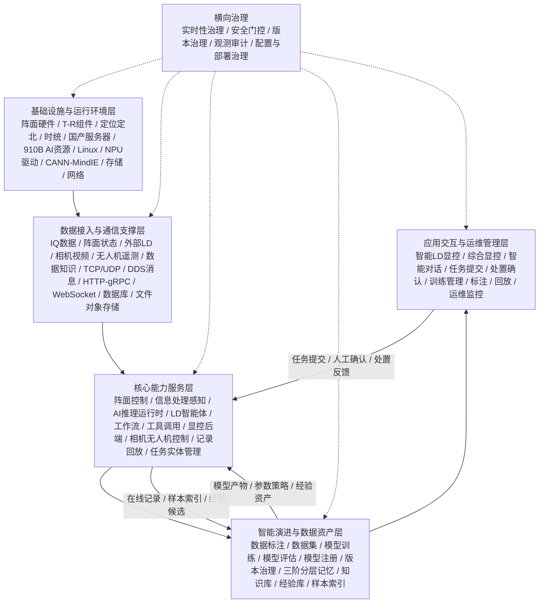

# 4.3.1 软件组成与总体架构设计

系统软件围绕多功能智能 LD 系统的在线运行、智能处理、智能研判、人机协同和能力持续演进进行总体设计。系统软件由阵面控制分系统软件、智能处理分系统软件、LD 智能体子系统软件、智能 LD 显控分系统软件、多功能智能 LD 能力生成演进工具链分系统软件、多功能智能 LD 能力生成演进基础平台分系统软件以及配套开发部署环境组成。

总体架构按照“软件五层、两条链路、横向治理”的思路组织。五层架构从软件工程承载关系出发，依次包括基础设施与运行环境层、数据接入与通信支撑层、核心能力服务层、智能演进与数据资产层、应用交互与运维管理层；两条链路分别支撑在线运行闭环和能力演进闭环；横向治理机制贯穿各层，保证实时性、安全门控、版本管理、观测审计和部署运维要求在系统全流程中得到落实。

## 一、软件总体组成

系统软件总体组成包括以下部分：

（1）阵面控制分系统软件。该部分面向阵面采集、波形产生、阵面监控、BIT 状态采集、TAS/TWS 调度和阵面参数控制，承担 IQ 数据打包下传、阵面状态上报、控制参数接收和阵面执行状态反馈等功能，是雷达在线运行链路的前端控制与数据采集基础。

（2）智能处理分系统软件。该部分面向 LD 数据处理、AI 检测跟踪、目标识别、标准对象生成、运行状态发布和诊断记录，承担主实时处理链路中的感知与标准结果输出功能。其内部包括信息处理感知子系统和 LD 智能体子系统，其中信息处理感知子系统负责目标感知与标准结果发布，LD 智能体子系统负责目标研判、参数建议、任务编排、工具调用、工作流触发和经验沉淀。

（3）智能 LD 显控分系统软件。该部分面向操作员提供态势显示、目标选择、告警处置、智能对话、任务提交、参数面板、处置方案确认、工作流状态展示和人工确认能力，是人机协同和受控执行的重要入口。

（4）能力生成演进工具链分系统软件。该部分面向数据导入、样本标注、数据集管理、模型训练、模型评估、模型注册、模型版本治理和能力演进记录，支撑智能处理模型和智能体经验资产的持续迭代。

（5）能力生成演进基础平台分系统软件。该部分面向训练算力、模型仓库、数据知识、对象存储、任务管理、实体管理、相机控制、无人机控制、记录回放、权限审计、日志监控和外部系统接入提供基础支撑，为在线运行和能力演进提供可复用的平台能力。

## 二、软件五层架构

### 1. 基础设施与运行环境层

基础设施与运行环境层是系统软件运行的底座，主要包括阵面硬件、T/R 组件、有源模块、定位定北设备、惯导授时设备、相机、无人机、国产服务器、910B AI 计算资源、CPU/内存/存储资源、网络资源、时统资源、Linux 操作系统、NPU 驱动、CANN/MindIE 推理环境、数据库环境、文件/对象存储环境以及服务部署运行环境。

该层为上层软件提供物理设备、计算资源、AI 加速资源、数据存储资源、网络通信资源和基础运行环境。系统设计时应保证主实时处理链路所需的计算资源、网络资源和时序资源优先可用，智能研判、模型训练、诊断回放和经验抽取等非主实时任务按资源隔离、异步执行或后台运行方式组织，避免影响雷达在线任务。

### 2. 数据接入与通信支撑层

数据接入与通信支撑层负责屏蔽设备协议、外部数据源、通信方式和存储访问差异，为上层业务服务提供统一的数据接入、消息发布、接口调用、状态同步和数据持久化能力。

该层包括 IQ 数据接入、阵面状态接入、定位定北接入、姿态信息接入、时间/秒脉冲接入、外部 LD 数据接入、光电/无线电/第三方增强结果接入、相机视频接入、无人机遥测接入、环境与航运信息接入、数据知识访问、外部归档访问等能力；同时包括 TCP/UDP 网络通信、DDS/消息总线、HTTP/gRPC、WebSocket、串口通信、数据库接口、文件/对象存储接口、配置管理、权限认证、日志采集和时间同步等支撑机制。

通过该层，阵面控制、信息处理感知、LD 智能体、显控、记录回放和能力演进工具链能够在统一接口语义下交换数据、状态、任务和诊断信息，减少各分系统之间对底层协议和设备细节的直接耦合。

### 3. 核心能力服务层

核心能力服务层是系统主要业务能力的承载层，负责组织雷达在线任务、智能处理任务、智能研判任务、显控交互任务、查证处置任务和诊断回放任务。

该层主要包括阵面控制服务、AI 推理运行时服务、信息处理感知服务、标准对象生成服务、LD 智能体服务、任务运行管理服务、工作流服务、工具调用服务、显控后端服务、相机控制服务、无人机控制服务、任务管理服务、实体管理服务、记录回放服务和系统配置监控服务。

阵面控制服务负责阵面参数控制、TAS/TWS 调度、波形参数设置、BIT 监测和执行状态反馈；信息处理感知服务负责 LD 数据处理、目标检测、目标识别、目标跟踪、定位结果生成和标准对象发布；LD 智能体服务负责上下文组织、目标研判、参数候选方案生成、自然语言交互、工具调用、工作流触发和追溯记录；显控后端服务负责面向界面的实时数据汇聚、状态同步、任务提交和结果分发；相机、无人机和记录回放服务为查证、处置和复盘提供平台能力。

该层的设计重点是将实时处理、智能研判和控制执行保持清晰分工。实时处理链路优先保证确定性和低时延，LD 智能体输出研判结论、参数建议、处置建议和工作流请求，高风险动作通过工作流、安全门控和人工确认后进入控制链路。

### 4. 智能演进与数据资产层

智能演进与数据资产层负责承载系统智能能力持续提升所需的数据、模型、知识、经验和版本资产。该层不直接承担主实时处理任务，而是面向模型能力建设、智能体经验沉淀和在线能力受控反馈提供支撑。

该层主要包括数据导入、数据标注、样本管理、数据集构建、模型训练、模型评估、模型注册、模型版本治理、训练结果管理、在线记录索引、回放数据复用、三阶分层记忆、知识库、经验库、参数策略库和追溯记录库等能力。

在线运行过程中形成的感知结果、任务上下文、工具调用结果、工作流状态、人工确认记录、处置结果和效果指标，可按规则进入短期上下文、中期任务链和长期经验资产。经验资产进入长期复用前应经过评价、归档和版本治理，避免将一次性任务记录直接作为稳定经验使用。模型和经验的上线应保留来源、版本、评估结果、审批记录和回退路径。

### 5. 应用交互与运维管理层

应用交互与运维管理层面向操作员、试验人员、算法人员和运维人员提供系统使用入口。该层将下层能力组织为可操作、可展示、可确认、可追溯的业务界面。

该层主要包括智能 LD 显控界面、综合显控界面、智能对话界面、态势显示界面、任务提交界面、目标与告警处置界面、参数设置与审批界面、处置方案确认界面、数据标注界面、训练管理界面、记录回放界面、模型管理界面和运维监控界面。

通过该层，操作员能够查看点迹、航迹、目标属性、告警信息、雷达状态、智能研判结果、参数建议、处置方案和工作流状态，并对关键任务进行人工确认。算法和试验人员能够完成样本构建、模型训练、模型评估和回放分析。运维人员能够查看服务状态、资源状态、接口状态、异常事件、日志记录和审计信息。

## 三、两条核心运行链路

### 1. 在线运行链路

在线运行链路面向雷达任务执行过程，形成从阵面采集、智能处理、智能研判、显控确认到控制反馈的闭环。

在线运行链路的基本过程为：阵面控制分系统完成阵面采集、波形产生和状态监测，将 IQ 数据、阵面状态和控制参数相关信息提供给信息处理感知子系统；信息处理感知子系统完成 AI 推理、目标检测、目标识别、目标跟踪、定位结果生成和标准对象转换，并向智能 LD 显控分系统、LD 智能体子系统和上层业务系统发布点迹、航迹、目标属性、运行状态和异常事件；LD 智能体子系统结合感知结果、雷达状态、历史任务、知识经验和显控上下文，形成目标研判、参数候选方案、处置建议和工作流触发请求；智能 LD 显控分系统完成态势展示、任务交互、人工确认和状态展示；经安全门控、流程审批和人工确认后的控制请求进入阵面控制链路，并通过执行状态、BIT 状态和任务状态反馈完成闭环。

该链路是系统在线运行的主链路，应保证实时处理优先、状态反馈及时、控制请求受控、关键过程可追溯。

### 2. 能力演进链路

能力演进链路面向模型、知识和经验的持续建设，形成从在线记录、样本沉淀、训练评估、模型注册到受控上线的闭环。

能力演进链路的基本过程为：系统在线运行、联调试验和记录回放过程中产生原始数据、标准结果、任务上下文、操作记录、处置结果和效果指标；能力生成演进工具链对相关数据进行导入、清洗、标注、数据集构建和样本管理；训练与评估环境完成模型训练、指标评估、对比分析和模型产物管理；模型产物经注册、校验、版本治理和审批后进入可用模型资源；LD 智能体相关的任务经验、参数策略、案例知识和工具执行效果经评价后沉淀为长期经验资产，并在受控条件下反馈到在线运行链路。

该链路应避免离线演进过程直接影响在线实时处理。模型、配置、参数策略、工作流模板和经验资产进入在线运行前，应完成版本记录、效果评估、适用范围说明、审批确认和回退路径配置。

## 四、横向治理机制

横向治理机制贯穿软件五层和两条核心链路，用于保证系统在实时性、安全性、可演进性、可观测性和可部署性方面满足工程运行要求。

实时性治理保证主实时处理链路优先运行。IQ 数据处理、目标检测跟踪、标准结果发布和关键状态反馈应避免被智能研判、诊断回放、模型训练、经验抽取等非主实时任务阻塞；非主实时任务应按异步、限流、隔离或后台方式运行。

安全门控治理保证高风险控制动作受控执行。波形参数设置、工作模式切换、阵面调度、处置方案执行和回滚恢复等任务，应携带任务编号、参数版本、审批状态、检查点和回滚条件，并经过权限校验、参数边界校验、雷达状态校验、工作流审批和人工确认后执行。

版本治理保证数据集、模型、配置、参数、工作流模板和经验资产具备来源、版本、评估结果、适用范围和回退路径。系统应支持模型注册、模型启用、模型回退、配置回退、经验归档和能力演进记录管理。

观测审计治理保证任务、接口、模型推理、工具调用、工作流节点、控制动作、人工确认、数据导出和模型上线具备必要日志、指标和追溯记录。相关记录可用于运行监控、问题复现、试验评估、安全审计和经验回流。

配置与部署治理保证系统能够在国产服务器、910B AI 计算环境、Linux 操作系统、Python 后端、Next.js 前端、数据库、对象存储和外部服务之间稳定部署。部署环境应支持服务启动停止、健康检查、日志轮转、资源监控、配置注入、密钥管理和异常告警。

## 五、架构与接口设计关系

总体架构为后续接口设计提供分层依据。基础设施与运行环境层主要对应设备、时统、存储、算力和外部服务接入接口；数据接入与通信支撑层主要对应网络通信、DDS/消息、HTTP/gRPC、WebSocket、串口、数据库和文件/对象存储接口；核心能力服务层主要对应阵面控制、信息处理感知、LD 智能体、显控、相机/无人机、记录回放和任务实体管理之间的内部接口；智能演进与数据资产层主要对应数据集、模型产物、样本索引、训练结果、记忆检索和经验沉淀接口；应用交互与运维管理层主要对应任务提交、智能对话、研判结果、状态反馈、处置确认、运维监控和审计接口。

通过上述软件分层，系统软件能够以清晰的工程结构承载实时探测处理、智能研判决策、人机协同控制、能力持续演进和平台运行保障。该架构避免将业务范围简单划分为若干“域”，而是从软件运行、数据通信、核心服务、智能演进和应用交互五个层级说明系统如何建设、如何协同和如何受控运行。

## 六、总体架构示意

