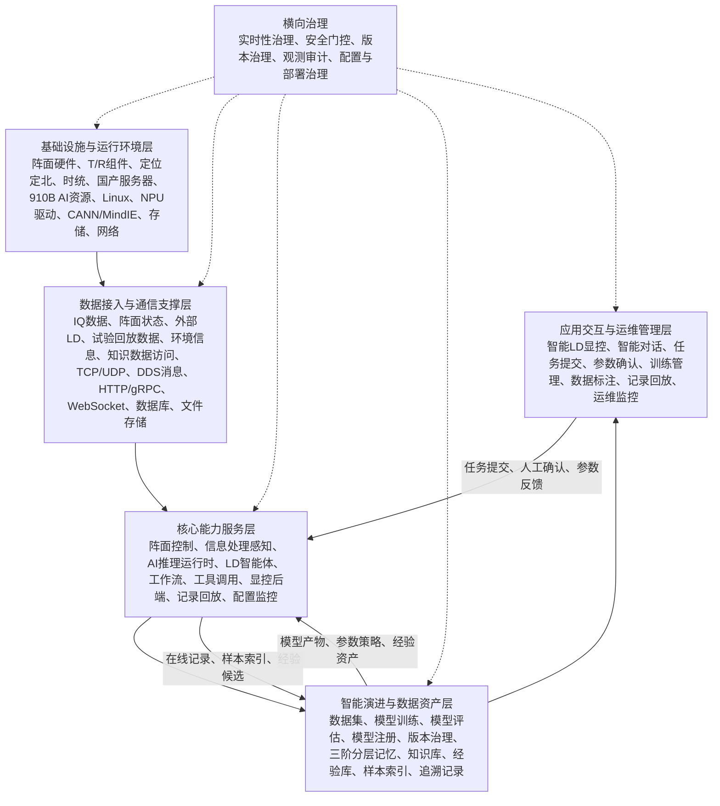
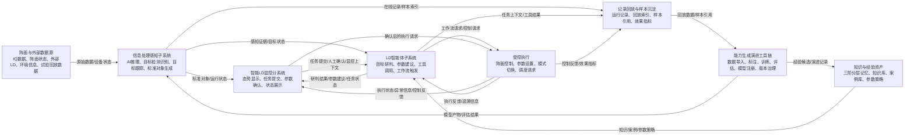

# 4.3.1 软件组成与总体架构设计

系统软件围绕多功能智能 LD 系统的在线运行、智能处理、智能研判、人机协同和能力持续演进进行总体设计。总体上，本节从两个方面说明系统软件方案：一是说明系统软件由哪些分系统和软件层级组成，以及总体架构如何承载各类能力；二是说明系统运行时的工作原理、工作模式、核心链路和数据信息流转关系。

## 4.3.1.1 软件组成与总体架构

系统软件由阵面控制分系统软件、智能处理分系统软件、智能 LD 显控分系统软件、多功能智能 LD 能力生成演进工具链分系统软件、多功能智能 LD 能力生成演进基础平台分系统软件以及配套开发部署环境组成。各分系统围绕雷达在线探测、智能感知、智能研判、显控交互、记录回放、数据标注、模型训练和能力演进等任务协同运行。

阵面控制分系统软件面向阵面采集、波形产生、阵面监控、BIT 状态采集、TAS/TWS 调度和阵面参数控制，承担 IQ 数据打包下传、阵面状态上报、控制参数接收和阵面执行状态反馈等功能，是雷达在线运行链路的前端控制与数据采集基础。

智能处理分系统软件面向 LD 数据处理、AI 检测跟踪、目标识别、标准对象生成、运行状态发布和诊断记录，承担主实时处理链路中的感知与标准结果输出功能。智能处理分系统内部包括信息处理感知子系统和 LD 智能体子系统，其中信息处理感知子系统负责目标感知与标准结果发布，LD 智能体子系统负责目标研判、参数建议、任务编排、工具调用、工作流触发和经验沉淀。

智能 LD 显控分系统软件面向操作员提供态势显示、目标选择、告警提示、智能对话、任务提交、参数面板、工作流状态展示和人工确认能力，是人机协同和受控执行的重要入口。

多功能智能 LD 能力生成演进工具链分系统软件面向数据导入、样本标注、数据集管理、模型训练、模型评估、模型注册、模型版本治理和能力演进记录，支撑智能处理模型和智能体经验资产持续迭代。

多功能智能 LD 能力生成演进基础平台分系统软件主要面向研制、试验和能力生成阶段提供支撑，包括综合显控、相机控制管理、无人机控制管理和记录回放等辅助软件能力，用于多源数据采集、查证样本沉淀、检索回放、数据转发导出和模型算法质量提升。上述平台支撑能力主要服务于前期数据积累、模型训练验证和能力演进，不作为最终交付用户部署时在线运行链路的必需组成。

从软件工程承载关系看，系统总体架构采用五层软件架构组织，依次为基础设施与运行环境层、数据接入与通信支撑层、核心能力服务层、智能演进与数据资产层、应用交互与运维管理层。

基础设施与运行环境层是系统软件运行底座，包括阵面硬件、T/R 组件、有源模块、定位定北设备、惯导授时设备、国产服务器、910B AI 计算资源、CPU/内存/存储资源、网络资源、时统资源、Linux 操作系统、NPU 驱动、CANN/MindIE 推理环境、数据库环境、文件存储环境以及服务部署运行环境。该层为上层软件提供设备、算力、存储、网络、时序和基础运行环境。

数据接入与通信支撑层负责屏蔽设备协议、外部数据源、通信方式和存储访问差异，为上层业务服务提供统一的数据接入、消息发布、接口调用、状态同步和数据持久化能力。该层包括 IQ 数据接入、阵面状态接入、定位定北接入、姿态信息接入、时间/秒脉冲接入、外部 LD 数据接入、试验与回放数据接入、环境信息接入、知识数据访问，以及 TCP/UDP、DDS/消息、HTTP/gRPC、WebSocket、串口、数据库、文件存储等接口支撑。

核心能力服务层是系统主要业务能力的承载层，包括阵面控制服务、AI 推理运行时服务、信息处理感知服务、标准对象生成服务、LD 智能体服务、智能体任务运行管理能力、工作流服务、工具调用服务、显控后端服务、记录回放服务和系统配置监控服务。该层负责组织雷达在线任务、智能处理任务、智能研判任务、显控交互任务、记录回放任务和运行诊断任务。

智能演进与数据资产层负责承载系统智能能力持续提升所需的数据、模型、知识、经验和版本资产，包括数据导入、数据标注、样本管理、数据集构建、模型训练、模型评估、模型注册、模型版本治理、训练结果管理、在线记录索引、回放数据复用、三阶分层记忆、知识库、经验库、参数策略库和追溯记录库等能力。

应用交互与运维管理层面向操作员、试验人员、算法人员和运维人员提供系统使用入口，包括智能 LD 显控界面、智能对话界面、态势显示界面、任务提交界面、目标与告警查看界面、参数设置与审批界面、数据标注界面、训练管理界面、记录回放界面、模型管理界面和运维监控界面。

图 4.3.1-1 给出了系统软件总体架构示意。

## 4.3.1.2 工作原理、运行时链路与信息流转

系统软件运行时以雷达在线任务为主线，以智能处理感知结果为数据基础，以 LD 智能体为智能研判和流程编排核心，以显控分系统为人机协同入口，以能力生成演进工具链为持续优化支撑。系统通过“实时处理优先、智能研判辅助、受控流程执行、数据经验回流”的机制，将雷达探测处理、目标研判、参数建议、人工确认、控制反馈和能力演进组织为连续闭环。相机、无人机等平台支撑软件主要用于研制试验阶段的数据采集、查证样本沉淀和模型算法质量提升，不进入最终交付部署时的在线运行链路。

系统运行过程中形成三类主要工作模式。

第一类为在线探测处理模式。该模式面向雷达任务执行过程，阵面控制分系统完成阵面采集、波形产生、阵面监控和状态上报，信息处理感知子系统完成 LD 数据处理、AI 推理、目标检测、目标识别、目标跟踪、定位结果生成和标准对象发布。该模式重点保证主实时链路稳定运行，诊断记录、样本沉淀和模型对比等任务以异步方式进行。

第二类为智能研判与受控执行模式。该模式面向目标理解、告警解释、态势研判和参数建议生成。LD 智能体子系统接收感知结果、雷达状态、显控上下文、历史任务链、知识经验和外部增强信息，完成目标研判、证据组织、参数候选方案生成和结果解释，并通过智能对话、任务状态和研判结果接口反馈给显控分系统。对于波形参数设置、工作模式切换和阵面调度等高风险或流程化任务，LD 智能体生成的建议进入工作流、安全门控和人工确认链路，通过权限校验、参数边界校验、雷达状态校验、审批确认和检查点控制后，再进入阵面控制链路。

第三类为能力演进与复盘模式。该模式面向模型、知识、经验和数据资产的持续建设。系统在线运行、试验联调、平台辅助采集和记录回放过程中形成的原始数据、标准结果、任务上下文、操作记录、查证样本和效果指标，经数据导入、标注、数据集构建、模型训练、模型评估、模型注册、经验评价和版本治理后，形成可受控反馈到在线运行链路的模型能力、参数策略和经验资产。

从运行时链路看，系统主要包括在线运行主链路、智能研判与受控执行链路、能力演进与复盘链路。

在线运行主链路为：阵面控制分系统通过 IQ 数据打包下传接口输出标准 IQ 数据帧，信息处理感知子系统完成 AI 推理、输出解析和标准对象转换后，通过标准结果发布接口向智能 LD 显控分系统、LD 智能体子系统和上层业务系统发布点迹、航迹、目标属性、质量标识和运行状态。显控分系统完成态势呈现和任务交互，LD 智能体基于感知结果和雷达状态进行必要研判，满足门控条件的参数设置、模式切换和调度请求经人工确认后反馈到阵面控制链路。该链路是系统最关键的低时延链路，应避免被训练评估、诊断回放等非主实时任务阻塞。

智能研判与受控执行链路为：信息处理感知子系统、阵面控制分系统、记录回放子系统和知识数据资源向 LD 智能体子系统提供感知结果、雷达状态、历史数据引用、专业知识和历史案例。LD 智能体完成上下文装载、任务理解、能力包调度、工具调用、推理规划和结果组织后，将目标研判结果、参数候选方案、证据链和风险提示返回显控分系统。涉及控制执行的任务经工作流、安全门控和人工确认后，进入阵面控制链路，执行状态和异常信息再回传至显控和智能体。

能力演进与复盘链路为：记录回放子系统、信息处理感知子系统和外部归档系统提供在线记录、回放索引、样本数据和质量标识，能力生成演进工具链完成数据导入、标注、数据集构建、模型训练、指标评估和模型注册后，通过模型产物注册接口和数据集与训练结果共享接口向信息处理感知子系统、LD 智能体子系统提供模型产物、评估结果、样本引用和能力演进记录。能力演进结果进入在线运行前，应完成版本记录、效果评估、适用范围说明、审批确认和回退路径配置。

从数据信息流转看，系统形成“原始数据—标准对象—智能上下文—受控任务—执行状态—经验资产”的逐级转化关系。阵面和外部数据源提供原始观测与状态数据；信息处理感知子系统将其转换为点迹、航迹、目标属性、识别结果和运行状态等标准对象；LD 智能体将标准对象、雷达状态、历史案例和显控输入组织为智能上下文；工作流和工具调用机制将智能上下文转化为受控任务；阵面控制相关软件产生执行状态和控制反馈；能力演进工具链和记忆管理机制将运行记录、样本索引、操作反馈和效果指标沉淀为模型、知识、案例和经验资产。诊断审计、版本治理和运行监控作为横向治理机制贯穿上述链路，不再作为独立业务链路展开。

图 4.3.1-2 给出了系统工作原理与运行时信息流转示意。

