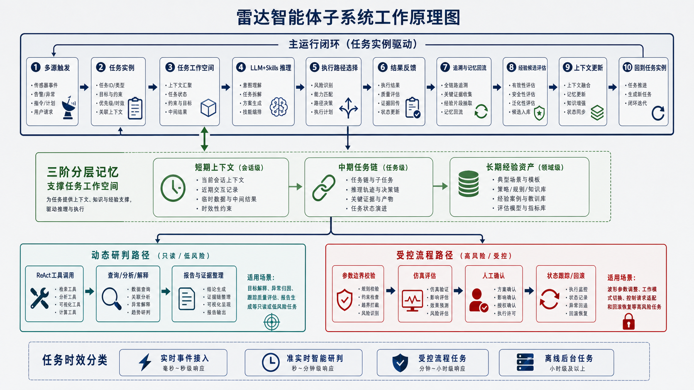
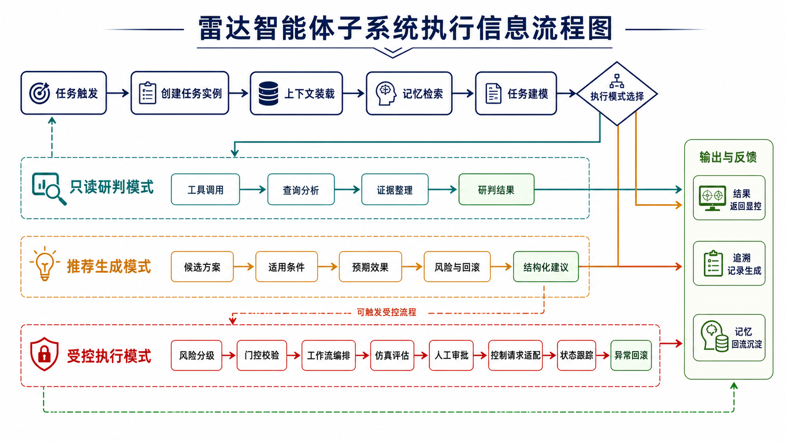
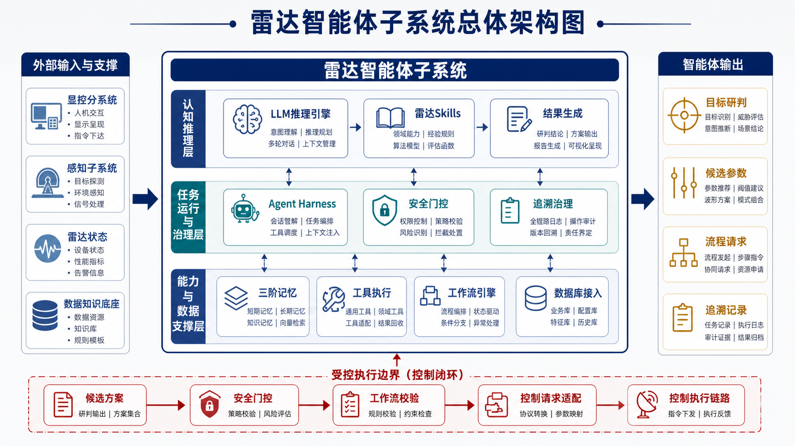
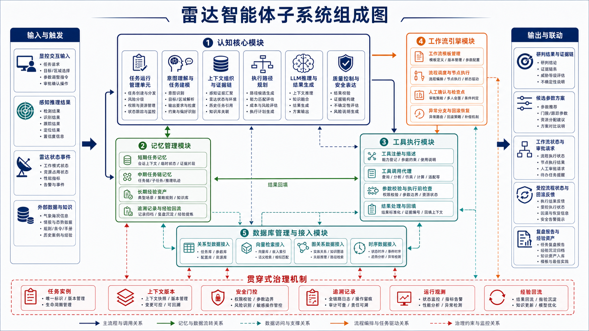
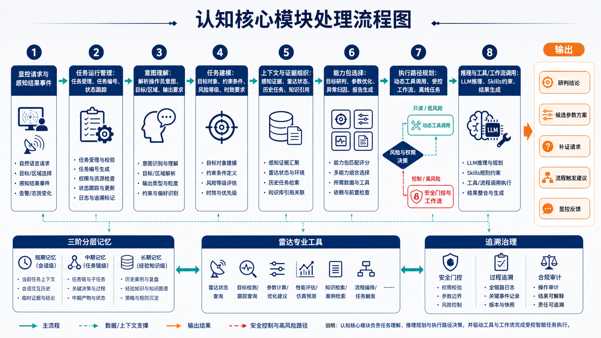
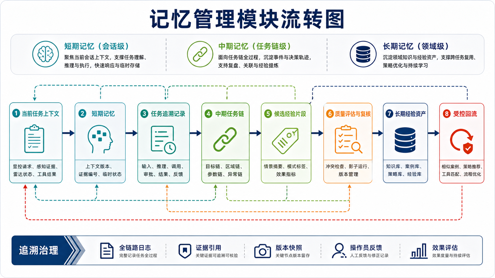
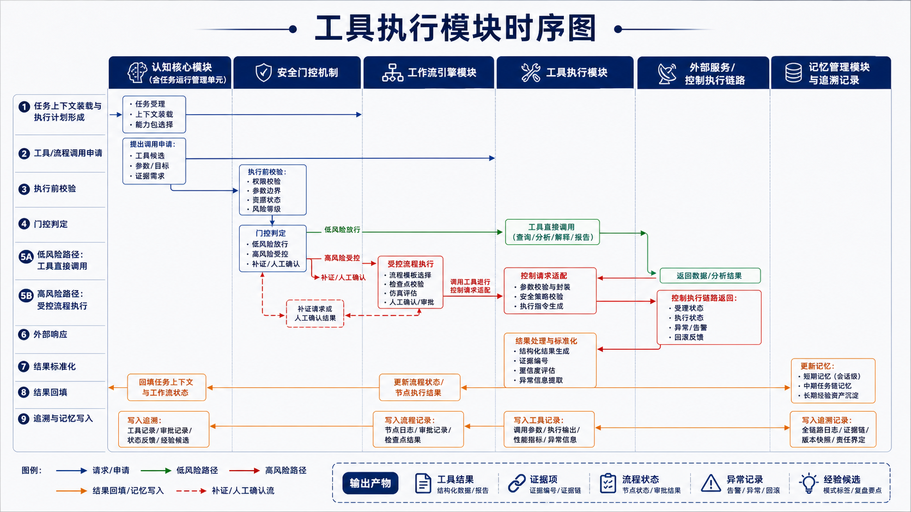
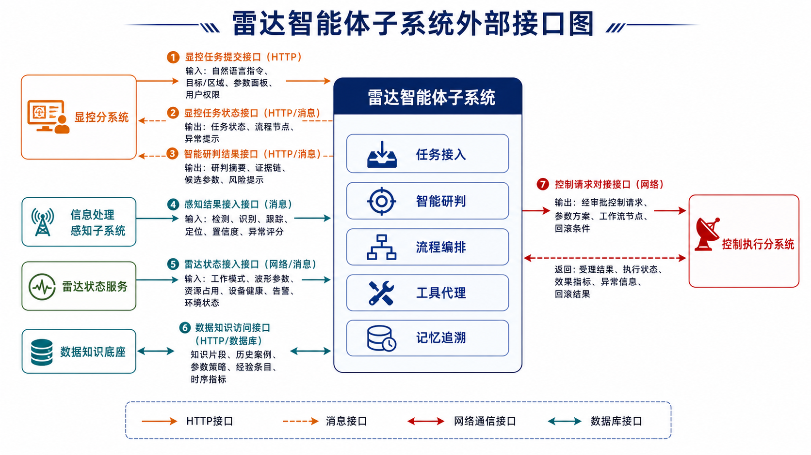
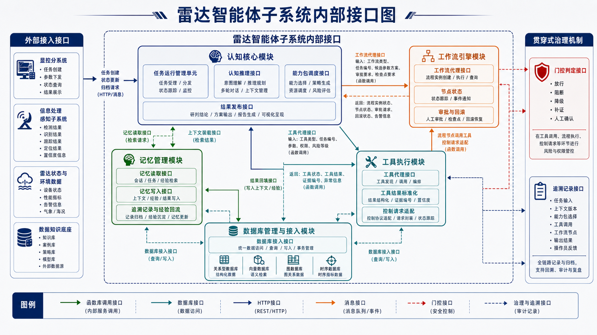

# 4.3.3.2 雷达智能体子系统

## 4.3.3.2.1 概述

雷达智能体子系统是多功能智能雷达系统中的智能决策与人机协同子系统，对应智能信息处理分系统中的智能决策中枢，面向显控分系统、信息处理感知子系统（基于分布协同智能基础模型）、雷达状态数据、控制执行链路和数据知识底座提供统一的任务理解、智能研判、参数建议、流程编排、工具调用和经验沉淀能力。子系统在现有雷达处理、控制和显控体系之上增加受控的认知增强能力，支撑雷达系统由“被动感知、人工配置”向“主动理解、智能协同、受控执行、持续进化”升级。

子系统以大语言模型推理引擎为认知核心，在认知核心模块内设置任务运行管理单元，协同雷达专业能力包、三阶分层记忆、工具执行模块和工作流引擎，形成从任务触发、上下文组织、推理规划、工具执行、结果反馈到经验回流的闭环。其核心设计原则包括：一是智能推理与控制链路解耦，认知核心负责分析、规划和建议生成，高风险任务进入受控流程，由工作流引擎完成校验和审批，并触发控制请求适配；二是开放式研判与标准流程分治，探索性任务由大语言模型推理引擎结合工具动态处理，标准化、高风险和可复用流程由工作流引擎模板化执行；三是短期上下文、中期任务链和长期经验资产分层管理，避免将一次性任务记录直接作为长期经验复用；四是全流程证据化和可追溯，任务输入、感知证据、工具结果、工作流节点、审批动作和输出结论均应保留追溯引用。

从业务能力看，雷达智能体子系统主要支撑五类场景。第一类是当前环境目标研判，综合雷达观测、信息处理感知结果、航迹状态、环境信息、历史案例和专业知识，对目标类别、行为特征、异常程度、威胁等级、证据缺口和处置建议进行分析。第二类是智能雷达调度与波形参数设置，根据任务目标、目标状态、雷达资源、环境条件、当前工作模式和历史执行效果，形成工作模式、波形参数、波束资源、检测门限和跟踪参数的候选优化方案。第三类是自然语言交互与显控协同，将操作员自然语言、目标选择、区域选择、告警卡片、参数面板和审批回调统一转换为结构化任务，并向显控分系统返回摘要、证据、建议、风险和流程状态。第四类是工具统一调用与标准流程执行，通过工具执行模块封装感知结果解释、数据查询、目标分析、参数仿真、控制请求适配和报告生成等能力，对标准化或高风险任务通过工作流模板进行受控编排。第五类是三阶分层记忆与经验演进，围绕当前任务、近期任务链和长期经验资产沉淀上下文、工具结果、工作流状态、操作员反馈和效果指标。

从功能结构看，雷达智能体子系统由认知核心模块、记忆管理模块、工具执行模块、工作流引擎模块、数据库管理与接入模块五大核心功能模块构成。认知核心模块内的任务运行管理单元负责组织任务生命周期、上下文装载、能力调度、执行路径流转和安全门控机制，追溯记录形成贯穿式治理机制，共同支撑权限校验、参数边界校验、运行观测、审计回放和经验回流。

## 4.3.3.2.2 工作原理

雷达智能体子系统采用“感知-理解-行动认知循环 + 推理-行动-观察式工具调用 + 工作流受控执行 + 三阶分层记忆”的工作机制。认知循环包括感知、语言理解和行动执行三个阶段：感知阶段接收显控输入、信息处理感知结果、雷达状态、历史任务和环境数据；语言理解阶段由认知核心模块完成意图解析、上下文组织、能力包选择、任务建模和执行路径规划；行动执行阶段根据任务风险和标准化程度选择推理-行动-观察式动态工具调用或工作流模板执行，并将结果反馈至显控、追溯和记忆管理链路。

子系统的技术关键不在于简单接入大语言模型，而在于将大语言模型推理纳入雷达工程约束。每次显控请求、感知结果事件或雷达状态告警触发后，任务运行管理单元首先创建任务实例，绑定任务标识、触发来源、目标或区域引用、任务类型、风险等级、上下文版本和追溯编号。随后，记忆管理模块装载短期任务上下文，检索中期任务链和长期经验资产，数据库管理与接入模块提供关系、向量、图和时序数据支撑，形成可供认知核心推理的任务工作空间。认知核心在能力包约束下生成执行计划，并根据任务特征选择动态研判路径或受控流程路径。工具执行模块负责原子工具调用和结果标准化，工作流引擎负责标准流程、审批节点、检查点和回滚控制。任务结束后，系统将上下文快照、研判结论、候选参数方案、工具调用记录、审批记录、执行效果和操作员反馈写入追溯记录与记忆管理模块，形成可复盘、可评估、可复用的经验候选。

### 子系统工作原理图

图 4.3.3.2-1 雷达智能体子系统工作原理图

### 系统执行信息流程图

图 4.3.3.2-2 雷达智能体子系统执行信息流程图

上述流程体现了雷达智能体子系统的三类执行模式。只读研判模式面向目标解释、状态理解、异常归因和报告生成，由认知核心在上下文和能力包约束下通过推理-行动-观察式方式调用查询、分析、感知结果解释和报告工具，形成带证据链的研判结果。推荐生成模式面向波形参数建议、门限调整建议和资源调度建议，由认知核心生成候选方案、适用条件、预期效果、风险点和回滚条件，并向显控和工作流链路提供结构化输入。受控执行模式面向波形参数设置、工作模式切换、控制请求适配和参数回滚，由任务运行管理单元组织风险分级并提交门控校验请求，安全门控机制依据权限、参数边界、雷达状态和审批状态给出放行、阻断、补证或人工确认结果，工作流引擎按照模板完成参数边界校验、仿真评估、人工审批、控制请求适配、状态跟踪和异常回滚处理。

从处理节奏看，雷达智能体子系统将任务按时效性分为四类：实时事件接入包括雷达状态告警、感知结果事件、控制执行回传和显控审批回调，要求快速接收、记录、分发和状态同步；准实时智能研判包括目标研判、异常解释、跟踪质量评估和参数建议生成，允许调用记忆检索和分析工具，并通过任务状态向显控反馈进度；受控流程任务包括参数仿真、波形参数调整、工作模式切换和回滚恢复，进入工作流引擎并通过检查点、人工确认和状态回传保障过程可控；离线后台任务包括复盘学习、经验抽取、样本沉淀、试验评估导出和长期知识更新，用于持续完善知识、案例和策略资产。该分级机制使不同任务按照实时接入、智能研判、受控流程和离线演进四条路径有序运行。

## 4.3.3.2.3 功能组成

雷达智能体子系统由五大核心功能模块组成，包括认知核心模块、记忆管理模块、工具执行模块、工作流引擎模块、数据库管理与接入模块。五大模块共同构成从任务理解、智能研判、参数建议、流程执行到经验沉淀的完整闭环。本技术方案围绕模块功能、执行路径、数据承载关系、接口交互和追溯治理机制进行工程化细化。

从总体架构看，雷达智能体子系统位于显控分系统、信息处理感知子系统、雷达状态数据、数据知识底座和控制执行链路之间，形成面向雷达任务的智能决策中枢。外部输入与支撑侧提供人机交互、感知结果、设备状态、环境信息和知识数据；智能体内部按认知推理层、任务运行与治理层、能力与数据支撑层组织能力；输出侧面向显控和工程流程形成目标研判、候选参数、流程请求和追溯记录。涉及控制或高风险动作时，候选方案进入受控执行边界，经安全门控、工作流校验和控制请求适配后，再与控制执行链路衔接。

该总体架构视角用于说明智能体子系统在雷达系统中的位置、核心能力和受控执行关系。五大核心功能模块用于说明功能组成和任务协同关系：认知核心模块对应认知推理层和任务运行管理，记忆管理模块、工具执行模块、工作流引擎模块和数据库管理与接入模块构成能力与数据支撑，安全门控机制和追溯记录贯穿任务运行、流程执行、工具调用和数据访问过程，支撑高风险任务受控推进和任务过程可审计。

图 4.3.3.2-3 雷达智能体子系统总体架构图

五大模块的功能设计如下。

| 模块 | 功能定位 | 主要功能 | 流程作用 |
| --- | --- | --- | --- |
| 认知核心模块 | 智能推理、任务规划与运行协调中心 | 任务实例管理、意图理解、任务建模、上下文组织、能力包选择、执行路径规划、研判结论、候选方案生成和结果发布 | 将显控请求、感知结果事件和状态告警转换为结构化任务，组织上下文装载、风险分级和执行路径流转，生成研判结果、参数候选方案和后续流程触发建议 |
| 记忆管理模块 | 面向智能体任务的上下文与经验管理中心 | 管理短期任务记忆、中期任务链、长期知识/案例/策略/经验，支撑检索增强、连续任务和经验回流 | 为当前任务装载上下文，为连续任务提供对象关联，为复盘学习沉淀候选经验 |
| 工具执行模块 | 雷达专业能力的统一执行代理 | 封装感知结果解释、数据查询、目标分析、参数仿真、控制请求适配和报告生成工具，完成执行前检查、调用代理、结果标准化和回填 | 为认知推理和工作流节点提供可调用的专业工具能力，并将执行结果转化为证据项和追溯记录 |
| 工作流引擎模块 | 标准流程与高风险动作的受控执行引擎 | 管理流程模板、节点执行、状态机、审批、检查点、回滚和流程追溯，承接参数设置、控制请求和回滚恢复等受控任务 | 将参数调整、模式切换、回滚恢复等任务纳入模板化流程，按节点完成校验、仿真、确认、请求适配和状态反馈 |
| 数据库管理与接入模块 | 智能体侧数据访问、记忆支撑和追溯写入适配中心 | 提供关系数据、向量检索、图关系数据和时序数据的访问适配、检索路由、质量标识、追溯写入和评估导出支撑 | 为上下文装载、知识召回、关系推理、时序分析、追溯记录和试验评估提供统一数据支撑 |

五大模块围绕统一任务实例协同运行。任务实例由显控请求、感知结果事件或状态告警触发创建，绑定触发来源、任务类型、目标/区域引用、时间窗口、风险等级、上下文版本和执行状态；工作流在既有任务实例下创建流程实例，必要时派生子任务。认知核心模块围绕任务实例进行任务理解、运行管理和推理规划；记忆管理模块围绕任务实例装载和更新上下文；工具执行模块围绕任务实例记录工具调用；工作流引擎模块围绕任务实例管理流程状态、检查点和审批确认；数据库管理与接入模块围绕任务实例保存结构化记录、时序数据、知识检索结果和追溯记录。认知核心模块通过任务运行管理单元组织任务实例管理、上下文装载、能力包调度、风险分级、运行观测和结果发布。后续软件需求规格说明、概要设计和接口控制文档均应以任务实例作为贯穿对象展开。

图 4.3.3.2-4 雷达智能体子系统组成图

### （1）认知核心模块

认知核心模块是雷达智能体子系统的任务理解、推理规划和结果生成中心，负责把操作员意图、信息处理感知结果、雷达状态和历史经验转化为可处理、可解释、可追溯的智能体任务。该模块在本阶段重点明确功能单元、处理流程和协同关系，具体函数、算法参数和实现细节在后续详细设计中展开。

认知核心模块主要包括以下功能单元：

1. 任务运行管理单元。统一承接显控请求、感知结果事件和雷达状态告警，创建并维护任务实例，绑定任务编号、触发来源、目标/区域引用、时间窗口、风险等级、上下文版本和追溯编号。该单元根据任务类型组织上下文装载、能力包选择、执行路径调度和风险分级，将只读研判和推荐生成任务交由认知核心推理与工具调用处理，将标准化或高风险任务转入工作流引擎，并协调安全门控机制、追溯记录和结果发布。
2. 意图理解与任务建模单元。接收显控分系统提交的自然语言指令、目标选择、区域选择、告警卡片和参数面板状态，识别任务类型、目标对象、时间窗口、约束条件、期望输出和风险等级，形成结构化任务描述。该单元支持多轮上下文关联，能够解析“这个目标”“上次方案”“继续刚才研判”等指代关系，并将连续交互绑定到任务编号、目标编号、区域编号和时间窗口，保证后续推理、工具调用和结果反馈指向同一任务对象。
3. 上下文组织与证据链单元。根据任务实例装载信息处理感知结果、雷达状态、显控上下文、历史任务、相似案例和专业知识，对输入信息进行上下文投影和证据编号，形成当前任务工作空间。该单元负责区分观测事实、感知模型判断、历史经验、推理结论和人工反馈，避免证据来源混淆。研判结论和参数建议应保留感知结果、工具结果、历史案例或专业知识引用，便于显控展示、任务复盘和后续追溯。
4. 执行路径规划单元。根据任务复杂度、标准化程度、实时性要求和风险等级选择执行路径。只读研判类任务优先采用动态推理与工具调用；标准流程类任务调用工作流模板；涉及控制请求的任务进入受控工作流，并经过安全门控机制、参数边界校验和人工确认。
5. 大语言模型推理与结果生成单元。基于大语言模型和雷达能力包开展任务推理，生成目标研判、参数候选方案、异常原因分析、证据缺口提示、风险说明和后续动作建议。输出结果采用结构化表达，包含事实依据、支撑证据、置信度、不确定性、适用边界和追溯引用；面向显控展示时区分事实、判断、建议、风险和待确认事项，避免将推理假设表述为确定事实。
6. 质量控制与安全表达单元。对推理输出进行格式校验、证据一致性校验、风险提示和权限适配。对于证据不足、工具失败、感知置信度低、参数越界或雷达状态异常的情况，系统降低结论置信度、触发补证或返回人工复核提示；涉及雷达控制、参数设置和回滚恢复的内容形成候选建议和工作流触发请求，由工作流引擎、安全门控机制和人工确认机制完成后续处理。

认知核心模块的输入输出关系如下。

| 输入类别 | 输入内容 | 来源模块/系统 | 输出内容 | 输出去向 |
| --- | --- | --- | --- | --- |
| 显控交互输入 | 自然语言指令、目标选择、区域选择、参数面板状态、审批反馈 | 显控分系统 | 任务受理状态、结构化任务描述、澄清问题 | 认知核心内部推理链路、显控分系统 |
| 感知与状态输入 | 目标检测、识别、跟踪、定位、置信度、雷达工作状态、环境状态 | 信息处理感知子系统、雷达状态服务 | 当前态势摘要、证据链、证据缺口 | 记忆管理模块、显控分系统 |
| 记忆与知识输入 | 当前任务上下文、近期任务链、相似案例、参数策略、专业知识 | 记忆管理模块、数据库管理与接入模块 | 任务推理依据、经验引用、候选策略 | 认知核心内部推理链路 |
| 工具与工作流反馈 | 工具执行结果、仿真结果、工作流节点状态、控制请求受理与执行反馈 | 工具执行模块、工作流引擎模块 | 下一步工具调用建议、结果修正、风险说明 | 工具执行模块、工作流引擎模块、显控分系统 |

认知核心模块面向三类任务组织处理策略。第一类为只读研判任务，包括目标解释、异常原因分析、跟踪质量评估和报告生成，系统通过记忆检索和工具调用形成结论。第二类为推荐生成任务，包括波形参数建议、门限调整建议和资源调度建议，系统输出候选方案、推荐依据、适用条件和风险提示。第三类为受控执行任务，包括参数设置、工作模式切换、回滚恢复等，认知核心生成候选方案和工作流触发请求，工作流引擎推进流程校验、审批确认、请求适配和状态反馈，安全门控机制给出放行、阻断、补证或人工确认结果。

认知核心模块应覆盖当前环境目标研判、智能调度与波形参数设置、异常事件处置和复盘学习四类典型任务。在目标研判任务中，模块需要将目标检测、识别、跟踪、定位、置信度、异常评分、环境状态和历史案例组织为可解释结论；在参数设置任务中，模块需要生成候选参数方案、推荐依据、适用条件、风险点和回滚条件；在异常事件处置任务中，模块需要区分目标异常、感知异常、参数异常、设备异常、环境异常和数据异常，并输出可能原因、证据链和补证建议；在复盘学习任务中，模块需要辅助生成复盘摘要、经验标签和候选经验说明。

认知核心模块的异常降级策略应在任务处理过程中显式体现。上下文缺失时，模块应返回澄清问题或补证请求，不生成确定结论；感知结果低置信或冲突时，应降低结论置信度并调用补充工具；工具失败时，应标注证据缺口并尝试备用工具或人工复核；雷达状态异常时，应阻断控制类建议进入执行流程，仅保留研判和风险提示；长期经验与当前状态冲突时，应停止采用该经验并标记冲突原因。

#### 1）任务运行管理单元设计

任务运行管理单元是认知核心模块内的运行协调环节，负责把显控请求、感知结果事件、雷达状态告警和工作流回调统一组织为任务实例。任务实例记录任务编号、触发来源、目标/区域引用、时间窗口、风险等级、上下文版本、执行状态和追溯编号，是认知推理、记忆检索、工具调用、工作流执行和结果发布共同使用的贯穿对象。

在任务受理阶段，该单元完成任务创建、初始风险分级、上下文装载请求和能力包选择；在任务执行阶段，负责将结构化任务送入认知推理链路，接收执行计划、工具调用建议和工作流触发建议，并根据任务风险组织安全门控机制和流程转派；在任务结束阶段，负责汇聚研判结果、工作流状态、工具结果和操作员反馈，形成显控发布内容、追溯记录和记忆回流输入。通过该单元，认知核心既能保持开放式推理能力，又能把任务状态、风险处理和结果发布纳入统一运行秩序。

安全门控机制作为任务运行管理单元组织的治理能力展开，围绕任务实例对高风险动作进行门控判定。其输入包括用户权限、任务风险等级、候选参数方案、参数边界、雷达当前状态、工作流审批状态和历史经验冲突情况；输出包括放行、阻断、降级、补证和人工确认结果。任务运行管理单元负责发起门控校验、接收门控结果并写入任务状态和追溯记录；工作流引擎依据门控结果推进仿真、审批、控制请求适配或回滚恢复；工具执行模块只在受控流程节点中调用相应控制请求适配工具。通过这种设计，安全门控机制被纳入任务运行、工作流执行和追溯记录的统一链路中，支撑控制类任务的受控推进，并保持五大核心模块划分稳定。

#### 2）意图理解单元设计

意图理解单元是认知推理链路的语义入口，负责将操作员的自然语言输入、显控界面操作和系统事件转化为智能体可处理的任务意图。该单元面向雷达任务语义建立“指令理解、对象绑定、约束抽取、任务建模”的完整处理链路。

在指令理解方面，单元需要识别操作员表达中的任务动作、目标对象、区域范围、时间范围、期望结果和隐含约束。例如“分析东南方向最近出现的异常目标”需要解析为目标研判任务，绑定区域方向、时间窗口、异常目标筛选条件和输出形式；“把刚才那个方案再保守一点”需要解析为参数方案调整任务，并从中期记忆中找到“刚才那个方案”的具体参数集合和来源任务。

在对象绑定方面，单元需要结合显控系统传入的目标选择、区域选择、告警卡片、参数面板状态和当前任务上下文，完成指代消解和上下文绑定。对于“这个目标”“上次那片区域”“刚才的参数方案”等表达，系统优先使用显 控上下文和中期任务链索引进行绑定；当存在多个候选对象或对象过期时，应向显控分系统返回澄清请求。

在任务建模方面，单元将自然语言和界面事件统一转化为结构化任务描述，至少明确任务类型、触发来源、目标/区域引用、时间窗口、风险等级、期望输出、上下文需求和可调用资源。任务类型可初步划分为状态理解、目标研判、异常归因、跟踪评估、参数推荐、控制请求、复盘学习和报告生成等。该任务描述作为后续执行路径选择、记忆检索、工具调用和工作流触发的共同输入。

#### 3）执行路径规划单元设计

执行路径规划单元负责根据任务特征决定任务由认知核心直接推理、调用工具执行、调用工作流模板，还是进入人工确认流程。该单元是原方案中“智能路由器”的工程化落点，核心作用是把开放式研判、工具调用和受控流程分流到合适路径。

该单元首先评估任务的标准化程度。对于目标研判、异常解释、相似案例检索等探索性任务，可由大语言模型推理能力结合工具调用进行动态处理；对于设备巡检、参数调整、回滚恢复等流程明确、风险较高的任务，优先进入工作流引擎；对于既包含开放式研判又包含标准执行步骤的混合任务，则由认知核心先完成分析和候选方案生成，再将标准化执行片段交给工作流引擎。

该单元其次评估任务风险等级。只读查询和研判输出属于低风险任务，重点进行权限和证据校验；推荐生成任务属于中风险任务，需要输出适用条件、不确定性和风险提示；涉及雷达控制、参数设置和回滚恢复的任务属于高风险任务，经过安全门控机制、参数边界校验和人工确认后进入执行流程。执行路径规划结果写入追溯记录，作为后续审计和效果评估的依据。

该单元还结合系统运行状态和资源负载进行路径调整。当大语言模型推理资源紧张、工具服务不可用、数据证据不足或雷达状态异常时，可采用缩小任务范围、延后长耗时分析、仅输出证据缺口、转人工复核或进入等待补证状态等降级策略，使智能体在非理想条件下仍能保持可控输出。

#### 4）大语言模型推理与结果生成单元设计

大语言模型推理与结果生成单元是认知核心模块处理复杂语义理解、专业推理和动态任务规划的核心能力。该单元采用推理-行动-观察式推理模式，通过“推理、行动、观察、再推理”的循环机制，在任务执行过程中动态选择工具、分析反馈并调整策略。

在目标研判场景中，该单元首先读取任务上下文和感知证据，形成初始判断；当证据不足时，调用目标查询、航迹查询、感知结果解释、相似案例检索等工具补充信息；在观察工具返回结果后，重新评估目标类别、行为特征、异常程度和威胁等级，最终输出包含事实依据、证据编号、置信度和不确定性的研判结果。

在参数推荐场景中，该单元综合当前工作模式、任务目标、目标状态、环境条件、感知置信度、历史参数效果和设备约束，生成候选参数方案。该方案包括推荐参数集合、推荐原因、适用条件、预期效果、风险点和回滚条件。涉及执行时，候选方案进入工作流引擎，由流程节点完成仿真评估、参数边界校验和人工确认。

在复杂异常归因场景中，该单元结合时序数据、图谱关系和历史案例进行多步推理。系统区分“已观测事实”“感知模型判断”“经验推断”和“待验证假设”，避免将推测直接作为结论。对于无法确认的原因，输出证据缺口和建议补充的数据，并保留待验证假设状态。

#### 5）响应生成与质量控制单元设计

响应生成与质量控制单元负责将认知核心内部推理结果转化为显控系统、工作流引擎和数据归档可以使用的输出内容，并在输出前完成格式、证据、风险和权限适配检查。输出形态支持分层展示和结构化表达。

面向显控分系统时，响应生成与质量控制单元支持摘要层、证据层、建议层和风险层。摘要层给出简短研判结论或参数建议；证据层列出感知结果、工具结果、历史案例和专业知识来源；建议层给出后续观察、补证、参数调整或人工确认动作；风险层说明不确定性、适用边界和可能影响。这样可以支撑操作员快速浏览，也可以逐层展开查看依据。

面向工作流引擎时，响应生成与质量控制单元输出可被流程模板消费的候选参数方案、目标/区域引用、审批要求、检查点建议和回滚条件。该输出比面向人的报告更结构化，本阶段明确对象范围和流转关系，字段格式在后续软件需求规格说明和接口控制文档中细化。

面向记忆管理和追溯记录时，响应生成与质量控制单元输出可归档的任务结论、证据引用、工具调用摘要、经验候选和反馈入口。系统保留同一结论面向不同对象的不同表达形态，保证显控报告、工作流输入和经验归档之间语义一致。

认知核心模块的典型处理流程如下。

图 4.3.3.2-5 认知核心模块处理流程图

### （2）记忆管理模块

记忆管理模块是雷达智能体子系统实现连续任务协同和经验演进的核心支撑。该模块采用三阶分层记忆架构，将记忆划分为短期记忆、中期记忆和长期记忆，并通过统一追溯记录贯通三层记忆。记忆管理模块面向智能体任务运行、上下文恢复、证据复用、经验沉淀和安全回流组织任务语义对象、检索策略和经验治理流程。

三阶记忆的作用划分如下。

| 记忆层级 | 作用对象 | 核心内容 | 主要用途 |
| --- | --- | --- | --- |
| 短期记忆 | 当前任务 | 任务上下文、当前目标、感知证据、工具结果、候选方案、工作流检查点、上下文版本 | 支撑一次目标研判、参数调度或流程执行过程中的上下文连续和异常恢复 |
| 中期记忆 | 近期任务链 | 目标研判链、区域任务链、参数调整链、异常事件链、操作员反馈、待处理动作 | 支撑多轮对话、连续指代、近期状态回看和跨任务协同 |
| 长期记忆 | 经验资产 | 雷达知识、历史案例、参数策略、异常模式、工作流经验、复盘结论 | 支撑相似案例检索、策略推荐、工具匹配和经验复用 |

记忆管理模块主要包括以下功能单元：

1. 短期任务记忆单元。面向当前任务生命周期，保存任务目标、目标或区域引用、时间窗口、显控上下文、感知证据、雷达状态、工具结果、候选参数方案和工作流检查点。短期记忆保证任务执行中多轮推理、多工具调用和显控交互的上下文一致性。
2. 中期任务链记忆单元。围绕目标、区域、参数和异常事件建立任务链索引，记录近期目标研判变化、区域关注对象、参数调整历史、审批状态、执行效果和操作员反馈。中期记忆支撑“刚才”“上次”“继续前一次”等自然语言指代绑定到明确对象。
3. 长期经验资产单元。以知识库、案例库、策略库和经验库组织长期记忆。知识库保存雷达专业文档、设备约束和操作规程；案例库保存目标研判、参数调整和异常处置案例；策略库保存波形参数、资源调度和门限调整策略；经验库保存经过评估和发布的复盘经验。
4. 追溯记录与经验回流单元。每次任务完成后固化任务输入、上下文快照、能力包选择、工具调用、工作流节点、审批确认、输出结果、效果指标和操作员反馈。追溯记录经过候选经验抽取、质量评估、冲突检查和专家复核后，才能进入长期经验资产。
5. 记忆治理与版本管理单元。对长期经验资产进行质量状态、版本状态、适用边界和回滚标识管理，避免错误研判、偶然成功案例或不完整经验直接影响后续任务。经验回流只能作为相似案例依据、候选策略建议、工具匹配信号和工作流优化建议，不绕过参数边界、工作流审批和人工确认。

记忆管理模块的工程化设计重点如下。

| 设计对象 | 主要内容 | 写入时机 | 使用方式 |
| --- | --- | --- | --- |
| 任务上下文 | 任务目标、目标/区域引用、时间窗口、显控状态、感知证据、雷达状态、工具结果、候选方案 | 任务创建、上下文装载、工具返回、工作流节点变化 | 支撑当前任务推理、工具调用、异常恢复和显控展示 |
| 目标研判链 | 目标状态变化、感知识别变化、航迹变化、异常评分、研判结论、证据变化 | 目标研判任务完成或目标状态发生显著变化 | 支撑连续目标分析和多轮指代 |
| 区域任务链 | 区域范围、关注目标、环境状态、参数方案、执行效果、操作员反馈 | 区域分析、参数调整和复盘任务完成后 | 支撑区域态势回看和相似区域策略复用 |
| 参数调整链 | 调整前参数、候选方案、仿真结果、审批结果、请求适配时间、效果指标、回滚情况 | 参数推荐、审批、执行和回滚节点完成后 | 支撑参数效果评估、回滚判断和后续策略优化 |
| 经验候选 | 任务场景、处置过程、使用工具、效果指标、失败原因、适用条件 | 任务完成、复盘完成、操作员确认后 | 经治理后进入长期案例库、策略库或经验库 |

记忆管理模块应采用“当前任务优先、近期任务补充、长期经验参考”的检索策略。当前任务执行过程中优先读取短期任务上下文，保证实时推理不丢失状态；当用户出现连续指代、任务复用和区域回看时，读取中期任务链；当需要相似案例、参数策略或专业知识时，再调用长期记忆和数据库管理与接入模块。长期经验用于提供推荐依据、策略参考和相似案例支撑。

记忆治理需要形成经验从“记录”到“资产”的转化流程。任务追溯记录可以自动生成，候选经验可以自动抽取，进入长期经验资产前经过质量评估、冲突检查、适用条件标注和必要的人工复核。对于参数策略类经验，还应保留来源任务、执行环境、效果指标和回滚情况，避免偶然成功案例被错误复用。

记忆管理模块应围绕若干关键数据对象组织记忆内容。任务实例用于统一标识一次智能体任务；任务上下文用于保存当前任务可用的显控状态、感知证据、雷达状态、工具结果和约束条件；证据项用于支撑研判结论和参数建议；候选参数方案用于支撑推荐生成和工作流执行；追溯记录用于支撑审计、回放、复盘和经验抽取；经验资产用于支撑长期学习和策略复用。上述对象在本阶段明确内容范围，具体字段、索引和表结构在后续详细设计中细化。

#### 1）短期记忆层设计

短期记忆层面向当前任务执行周期，主要解决“当前任务如何不断裂”的问题。该层保存任务执行过程中需要高频访问且生命周期较短的信息，包括任务目标、显控上下文、当前目标或区域引用、信息处理感知结果、雷达状态摘要、已调用工具结果、候选假设、候选参数方案、工作流检查点和待处理动作。

短期记忆应围绕任务实例组织。一个任务实例可以包含多轮对话、多次工具调用和多个工作流节点，短期记忆需要持续维护这些状态，使认知核心在每一步推理时都能看到一致的任务工作空间。对于长任务，短期记忆应支持上下文版本管理，记录关键状态变化，避免工具返回结果覆盖或污染前一轮上下文。

短期记忆还需要支持上下文投影机制。大语言模型推理并不需要读取全部原始数据，而是需要经过筛选后的任务相关摘要。上下文投影应根据任务类型选择必要信息，例如目标研判任务重点投影感知结果、航迹变化、异常评分和历史案例；参数优化任务重点投影当前参数、资源占用、环境条件、参数边界和历史效果。这样可以控制推理输入规模，提高输出稳定性。

短期记忆中的工具结果应形成证据编号。工具返回的原始结果、摘要结果和质量标识应被绑定到同一任务上下文中，供认知核心引用。对于失败、超时或数据质量不足的工具结果，也应进入短期记忆，作为后续降级推理、补证和问题追溯的依据。

#### 2）中期记忆层设计

中期记忆层面向近期任务连续性，主要解决“近期任务如何连续”的问题。该层按照雷达业务对象建立任务链，包括目标研判链、区域任务链、参数调整链和异常事件链。

目标研判链记录某一目标在近期任务中的检测、识别、跟踪、定位、异常评分、研判结论和证据变化。该任务链用于支撑操作员连续追问，例如“它刚才为什么被判为异常”“这个目标跟上次那个是不是相似”“继续观察这个目标”。系统应能够把这些表达绑定到明确目标编号和时间窗口。

区域任务链记录某一区域内的关注目标、环境状态、任务目标、参数方案、执行效果和操作员反馈。该任务链用于支撑区域态势回看和区域级策略复用，例如“沿用上次A区域的策略”“看看这片区域最近是否变复杂了”。区域任务链应与目标研判链互相引用，保证从区域能追到目标，从目标能追到区域背景。

参数调整链记录每次参数变化的调整前状态、候选方案、仿真结果、审批结果、请求适配时间、执行效果、异常情况和回滚状态。该任务链是智能调度和波形参数设置闭环的关键依据，用于回答“为什么调这个参数”“调完效果如何”“是否需要回滚”“类似场景以前怎么设置”。

异常事件链记录异常发现、证据收集、原因分析、人工确认、处置动作、持续观察和复盘结论。该任务链支撑复杂异常处置的全过程管理，避免异常事件在多轮任务和多模块流转中丢失上下文。

#### 3）长期记忆层设计

长期记忆层面向知识和经验复用，主要解决“长期经验如何沉淀并安全回流”的问题。该层按照知识库、案例库、策略库和经验库组织内容。

知识库保存相对稳定的雷达专业知识，包括雷达原理、波形参数含义、设备约束、操作规程、专业术语、感知模型说明和安全边界。知识库主要服务于认知核心的检索增强推理和响应生成，使输出符合雷达专业语义。

案例库保存历史任务案例，包括目标研判案例、参数调整案例、异常处置案例、跟踪质量下降案例和回滚恢复案例。案例条目应包含任务背景、输入证据、处置过程、使用工具、输出结论、执行效果和复盘评价。案例库主要服务于相似场景检索和操作员复盘。

策略库保存可复用的参数策略和流程策略，包括波形参数策略、资源调度策略、门限调整策略、跟踪参数优化策略和复杂环境应对策略。策略库中的内容应明确适用条件、风险边界和验证状态，并为候选方案生成、流程模板选择和复盘评估提供参考。

经验库保存经过复盘、评估和发布的经验资产。经验资产应从追溯记录和候选经验中产生，经过质量评分、冲突检查、人工复核或影子运行验证后再发布。经验库的回流方式应限定为相似案例推荐、候选策略提示、工具匹配建议和工作流模板优化建议。

记忆流转机制如下。

图 4.3.3.2-6 记忆管理模块流转图

### （3）工具执行模块

工具执行模块是雷达智能体子系统连接认知推理与雷达专业能力的执行代理，负责对各类雷达工具、感知结果解释服务、数据查询、参数仿真、控制请求适配和报告生成工具进行统一封装、调用、监控和结果处理。该模块沿用原方案中“工具封装与注册、参数校验与执行前检查、执行代理与监控、结果处理与回填”的设计，与工作流引擎形成协同关系：工作流引擎负责任务流程、检查点、审批和回滚编排，工具执行模块负责提供可被流程节点调用的原子工具能力。

工具执行模块主要包括以下功能单元：

1. 工具注册与能力描述单元。对数据查询、感知结果解释、目标分析、航迹分析、参数仿真、控制请求适配、报告生成、记录回放等工具建立统一能力描述，明确工具名称、输入对象、输出对象、权限要求、风险等级、调用超时、失败处理和追溯要求。
2. 工具调用代理单元。接收认知核心或工作流引擎发起的工具调用请求，完成输入检查、权限校验、调用执行、结果标准化和异常处理。工具返回结果应包含结果状态、证据编号、耗时、异常信息和追溯引用。
3. 参数校验与执行前检查单元。对工具调用请求进行参数格式、取值范围、权限范围和风险等级校验。只读查询和分析工具主要校验引用对象、时间窗口和访问权限；涉及控制请求适配的工具接受工作流引擎和安全门控机制约束。
4. 执行代理与监控单元。屏蔽不同工具的实现差异，提供统一调用入口，记录工具执行开始时间、执行状态、执行耗时、异常信息和基本资源占用情况。
5. 结果处理与回填单元。将不同工具返回结果转换为统一可用的结果摘要和证据项，并将有价值的执行信息回填至记忆管理模块和追溯记录。

工具类型及作用如下。

| 工具类别 | 典型工具 | 主要作用 | 风险控制要求 |
| --- | --- | --- | --- |
| 数据查询工具 | 目标查询、航迹查询、历史任务查询、环境数据查询 | 为目标研判和参数优化提供事实数据 | 校验目标/区域引用和时间窗口，记录数据版本 |
| 感知结果解释工具 | 检测结果解释、识别置信度分析、异常评分解释 | 对信息处理感知结果进行解释和补证 | 记录感知模型版本、置信度和证据编号 |
| 分析算法工具 | 目标行为分析、跟踪质量评估、异常归因 | 提供专业分析和辅助推理结果 | 输出适用边界、不确定性和异常状态 |
| 参数仿真工具 | 波形参数仿真、门限调整评估、资源调度评估 | 对候选参数方案进行执行前评估 | 记录仿真假设、输入参数和效果指标 |
| 控制请求适配工具 | 工作模式切换请求、参数设置请求、回滚恢复请求 | 将经确认的控制请求转换为控制执行链路可接收的请求，并接收受理和执行状态 | 经过参数边界校验、审批确认、检查点和审计 |
| 报告生成工具 | 研判报告、复盘报告、执行记录导出 | 生成显控展示和评估归档材料 | 输出引用追溯记录，不暴露未授权信息 |

工具执行模块对工具接入进行分级管理。

| 工具风险等级 | 工具范围 | 调用要求 | 输出要求 |
| --- | --- | --- | --- |
| 只读工具 | 数据查询、历史案例检索、状态查询、报告查询 | 校验调用权限、目标/区域引用和时间窗口 | 返回数据来源、时间范围和质量标识 |
| 分析工具 | 目标分析、异常归因、跟踪质量评估、感知结果解释 | 校验输入完整性和感知模型/算法版本 | 返回分析结果、适用条件、不确定性和证据编号 |
| 仿真评估工具 | 参数仿真、门限评估、资源调度评估 | 校验候选参数范围、仿真场景和假设条件 | 返回仿真结果、效果指标、风险点和适用边界 |
| 控制请求适配工具 | 参数设置请求、工作模式切换请求、回滚恢复请求 | 由工作流引擎触发，并通过安全门控机制和人工确认 | 返回请求受理状态、执行后状态、异常信息和回滚结果 |

工具执行模块应提供统一的工具注册信息，包括工具类别、能力说明、适用任务、输入要求、输出内容、风险等级、权限要求、版本信息和异常处理方式。该注册信息供认知核心模块进行工具选择，也供工作流引擎进行节点配置。对于外部算法服务和感知结果解释服务，工具执行模块还应记录感知模型或算法版本，保证后续追溯和试验评估能够复现结果来源。

工具执行模块与工作流引擎通过任务实例和工作流节点协同运行。工具执行模块完成单个工具的调用、校验、执行和结果返回；工作流引擎按照流程模板组织多个工具的执行顺序、条件判断、审批确认和回滚策略。因此，参数设置请求适配工具由工具执行模块统一封装，参数设置流程由工作流引擎按照模板完成前置校验、人工确认、请求适配、状态跟踪和回滚管理。

工具执行模块应支持典型业务闭环中的工具组合。在目标研判闭环中，主要调用目标查询、航迹分析、感知结果解释、异常归因和报告生成工具；在参数设置闭环中，主要调用当前参数查询、历史策略检索、参数仿真、效果评估和控制请求适配工具；在异常事件处置闭环中，主要调用环境分析、目标行为分析、设备状态查询和异常归因工具；在复盘学习闭环中，主要调用追溯查询、效果统计、报告生成和样本导出工具。工具组合关系应写入工具调用记录，支持后续效果评估和工具匹配优化。

#### 1）工具封装与注册单元设计

工具封装与注册单元负责将雷达系统中的分散能力转化为智能体可发现、可调用、可治理的工具资源。工具资源包括数据查询工具、感知结果解释工具、目标分析工具、参数仿真工具、控制请求适配工具和报告生成工具等。该单元的设计重点是屏蔽底层工具实现差异，为认知核心和工作流引擎提供统一的工具描述和调用入口，使开放式研判和标准流程节点都能够按一致方式调用专业能力。

工具注册信息应包含工具名称、工具类别、能力说明、适用任务、输入内容、输出内容、风险等级、权限要求、调用方式、版本信息和异常处理方式。对于感知结果解释和分析算法类工具，还应登记感知模型或算法版本、适用数据范围和结果质量标识；对于控制请求适配类工具，还应登记控制对象、参数边界、审批要求和回滚条件；对于数据查询类工具，还应登记数据来源、时间窗口和数据质量要求。

工具封装应遵循最小必要封装原则。对于已有成熟工具，通过适配层完成输入输出标准化、权限校验、日志记录和结果摘要，复用原有算法和专业工具能力。这样可以降低系统改造风险，保持原雷达处理链路和专业工具的稳定性。

#### 2）参数校验与执行前检查单元设计

参数校验与执行前检查单元负责在工具执行前进行必要的输入合法性、参数边界和权限检查。该单元承担工具执行模块内部的本地检查能力，用于在工具调用前识别错误输入、高风险操作和条件不满足的调用请求。

对于数据查询类工具，校验重点是目标编号、区域编号、时间窗口、用户权限和数据密级，避免越权访问或错误查询。对于分析算法类工具，校验重点是输入数据完整性、感知模型或算法版本、适用场景和参数取值范围。对于参数仿真类工具，校验重点是候选参数是否在设备允许范围内、仿真假设是否明确、输入场景是否与任务目标一致。对于控制请求适配类工具，校验重点是审批状态、工作流检查点、设备当前状态、参数边界和回滚条件。

执行前检查单元支持分级处理。低风险工具校验通过后可直接执行；中风险工具返回风险提示和适用条件；高风险工具在任务运行管理单元组织下进入受控工作流，由工作流引擎触发工具调用，并通过安全门控机制和人工确认。对于无法确定风险等级、参数边界缺失或设备状态异常的调用请求，系统进入阻断、补证或人工复核状态。

#### 3）执行代理与监控单元设计

执行代理与监控单元负责实际工具调用、执行状态跟踪和结果返回。该单元通过统一执行代理机制，使认知核心和工作流引擎按照标准工具描述发起调用，并接收统一格式的执行结果。

执行代理接收工具调用请求后，根据工具标识查找注册信息，完成参数转换、调用路由和执行调度。对于本地工具，可采用函数库调用方式；对于外部算法服务，可采用HTTP接口或网络通信方式；对于控制请求适配工具，可通过专用网络通信接口与控制执行链路对接。执行代理需要记录调用开始时间、调用来源、工具版本、输入摘要、执行状态、执行耗时和异常信息。

监控单元提供工具执行过程的可见性。对于长耗时工具，如参数仿真、复杂目标分析和报告生成，支持执行状态查询或事件推送；对于高风险工具，将执行状态同步给工作流引擎和显控系统；对于失败工具，返回明确失败原因，并支持按策略重试、切换备用工具或进入人工处置。

#### 4）结果处理与回填单元设计

结果处理与回填单元负责将不同工具的原始结果转化为认知核心、工作流引擎和记忆管理模块可使用的标准化结果。不同工具输出差异较大，例如感知结果解释服务可能返回置信度和类别，仿真工具可能返回多项效果指标，控制请求适配工具可能返回请求受理状态、执行状态和设备状态。该单元对结果进行摘要、分类和证据化处理。

结果处理应保留三类信息：一是原始结果引用，用于追溯和复现；二是标准化摘要，用于认知核心推理和显控展示；三是质量标识，用于判断结果是否可信、是否需要补证、是否存在适用边界。对研判和推荐有支撑作用的工具结果应生成证据编号，纳入任务上下文和追溯记录。

经验回填将有价值的工具执行信息整理为候选经验或统计信息。例如某类参数在特定环境下仿真效果较好，可以进入参数策略候选；某类工具在特定场景下失败率较高，可以进入工具匹配优化依据；某次控制请求执行后产生异常回滚，可以进入异常案例候选。回填结果应由记忆管理模块进行后续治理。

工具执行模块流程如下。

图 4.3.3.2-7 工具执行模块时序图

### （4）工作流引擎模块

工作流引擎模块沿用原方案中“专业标准流程执行引擎”的定位，负责预定义规范化业务流程的可靠执行和过程监控。工作流引擎经任务运行管理单元统一接收认知核心提出的流程触发建议、显控事件或系统事件，将雷达领域中成熟、可复用、需要过程控制的业务操作固化为模板，重点保证流程一致性、执行可靠性、安全可控性和过程可追溯性。

工作流引擎模块主要包括以下功能单元：

1. 工作流模板管理单元。管理波形参数调整、目标研判支撑、跟踪质量评估、复杂环境应对、设备健康检查、参数回滚恢复等标准流程模板，支持模板版本、适用条件和参数化配置管理。
2. 流程调度与节点执行单元。根据任务类型和输入参数启动工作流实例，按照节点顺序调用工具执行模块、数据知识底座和控制执行链路适配能力，记录节点状态和执行结果。
3. 人工确认与检查点单元。对涉及参数设置、控制请求、回滚恢复等高风险节点设置人工确认、参数边界校验和执行前检查点，保证控制请求可确认、可暂停、可回滚。
4. 异常分支与回滚恢复单元。当工具调用失败、设备状态异常、仿真不通过或审批不完整时，进入异常分支，必要时依据检查点执行参数回滚、安全恢复或人工处置。
5. 状态反馈与过程追溯单元。向显控分系统和任务运行管理单元反馈工作流状态、待处理事项、节点结果和异常原因，并将流程执行过程写入追溯记录。

通过工作流引擎模块，雷达智能体子系统将参数调整、控制请求和回滚恢复等任务纳入标准流程。认知核心模块提出候选方案、证据依据和流程触发建议，工作流引擎将候选方案转化为流程实例，按模板完成校验、仿真、审批、请求适配、监测和回滚，并持续维护流程状态。

工作流引擎模块内置以下典型流程模板。对于目标研判类流程，工作流主要承担证据汇聚、相似案例检索、状态记录和结果发布等标准化支撑环节，认知核心负责复杂、不确定问题的开放式研判。

| 工作流模板 | 触发来源 | 主要节点 | 输出结果 |
| --- | --- | --- | --- |
| 标准目标研判支撑流程 | 显控目标选择、异常告警、感知结果事件 | 上下文装载、目标状态汇聚、感知结果解释、相似案例检索、证据链整理、研判结果发布 | 目标研判结论、证据链、置信度、推荐动作 |
| 波形参数调整工作流 | 操作员请求、认知核心参数建议、任务模式变化 | 当前参数读取、候选方案生成、参数边界校验、仿真评估、人工确认、控制请求适配、效果监控 | 参数调整结果、效果指标、风险记录、回滚条件 |
| 跟踪质量评估工作流 | 跟踪质量下降、目标状态变化、人工触发 | 航迹数据读取、跟踪稳定性分析、异常原因分析、参数建议、结果展示 | 跟踪质量评分、异常原因、优化建议 |
| 异常目标处置工作流 | 异常评分升高、告警触发、人工确认 | 异常证据收集、环境因素分析、历史案例比对、处置建议生成、后续观察计划 | 异常研判结果、处置建议、观察任务 |
| 参数回滚恢复工作流 | 控制执行异常、效果不达标、人工回滚 | 检查点读取、回滚条件确认、回滚动作执行、状态复核、结果记录 | 回滚结果、恢复后状态、异常原因记录 |

工作流实例运行过程中应至少维护“已创建、执行中、等待工具、等待确认、已阻断、回滚中、已完成、失败、已归档”等状态。状态变化需要同步给显控分系统，用于界面展示和人工确认；同时需要写入追溯记录，用于后续审计、复盘和试验评估。

工作流引擎的设计重点是固化可靠流程。流程节点可以包含条件判断和轻量策略选择；对于标准化、重复性、高风险任务，优先通过工作流模板执行；对于探索性、证据不完整、需要多轮推理的任务，由认知核心模块完成研判和候选方案生成，再按需要调用工作流片段。

工作流引擎的安全控制应覆盖参数边界校验、人工确认、检查点保存、执行状态回传和异常回滚。参数边界校验用于保证候选方案不超出设备能力和任务模式约束；人工确认用于保证操作员明确知晓控制请求及风险；检查点用于保存执行前状态；状态回传用于显控展示和执行监控；异常回滚用于在控制失败、效果不达标或设备异常时恢复到安全状态。上述控制点均应进入追溯记录。

#### 1）工作流模板管理单元设计

工作流模板管理单元负责标准业务流程的创建、分类、版本和参数化管理。模板以雷达任务为中心组织，典型模板包括目标研判支撑、波形参数调整、跟踪质量评估、异常目标处置、设备健康检查和参数回滚恢复等。

每个工作流模板明确适用场景、触发条件、输入内容、输出内容、节点序列、审批要求、检查点策略、异常分支和回滚动作。模板中的节点可分为任务节点、判断节点、并行节点、同步节点、人工确认节点和控制请求节点。任务节点一般调用工具执行模块；判断节点基于工具结果、雷达状态或审批状态进行分支；人工确认节点与显控系统联动；控制请求节点调用安全门控机制完成判定。

模板管理应支持版本控制。对于参数调整、回滚恢复等高风险流程，模板变化可能直接影响运行安全，因此需要保留模板版本、发布状态、适用范围和变更记录。新模板或重大变更模板应先用于试验或影子运行，再进入正式调度范围。

#### 2）模板执行引擎单元设计

模板执行引擎单元负责将工作流模板实例化并驱动节点执行。执行引擎接收任务运行管理单元转发的任务参数，根据模板匹配规则选择模板，将运行时参数注入模板节点，生成工作流实例并开始执行。

执行引擎应严格按照模板定义推进流程，运行时保持安全节点和审批节点稳定。对于可并行执行的查询、分析和仿真节点，执行引擎可以进行并行调度，提高任务效率；对于必须串行的控制、检查点和回滚节点，应按模板顺序执行，避免状态不一致。

执行过程中，模板执行引擎需要持续接收工具执行结果、雷达状态变化和显控审批反馈，并据此推进节点状态。对于节点超时、工具失败、审批拒绝、设备异常等情况，执行引擎进入模板预定义的异常分支，并生成相应的状态反馈和追溯记录。

#### 3）状态管理与检查点单元设计

状态管理与检查点单元负责维护工作流实例的完整运行状态。工作流状态包含实例标识、模板版本、当前节点、节点状态、中间结果、审批状态、异常信息、检查点和执行历史。该状态既服务于系统内部调度，也服务于显控系统展示。

检查点用于支持参数调整和控制执行场景下的安全恢复。检查点应保存控制执行前的关键状态，包括调整前参数、设备状态、任务模式、相关上下文和回滚条件。当控制执行失败、效果不达标或操作员要求恢复时，工作流引擎可以基于检查点触发回滚恢复流程。

对于长时间运行工作流，状态管理与检查点单元支持状态持久化，保证服务重启或异常中断后能够恢复任务。恢复时根据节点类型和检查点判断是继续执行、重新执行、进入人工确认还是终止任务。

#### 4）异常处理与降级单元设计

异常处理与降级单元负责处理工作流执行中的工具失败、数据缺失、设备异常、审批拒绝和控制失败等情况。异常处理按类型分级，不同等级采用不同策略。

轻微异常可以通过重试、切换备用工具或延长等待时间处理；数据缺失类异常应返回补证请求或降低结论置信度；审批拒绝类异常应终止控制请求节点并保留候选方案；设备状态异常应阻断控制请求适配流程，并通知显控系统；控制失败或效果异常时，应触发回滚恢复或人工处置流程。

降级策略由模板显式定义。对于无法处理的异常，工作流应进入失败或人工介入状态，并保留完整追溯记录。

### （5）数据库管理与接入模块

数据库管理与接入模块定位为智能体侧的数据访问、记忆支撑和追溯写入适配中心，依托智能信息处理分系统的数据知识底座，把关系数据、向量数据、图关系数据和时序数据组织为智能体任务可使用的上下文、证据和经验对象，重点解决认知核心、记忆管理、工具执行和工作流引擎如何稳定、可追溯地访问数据资源。

数据库管理与接入模块主要包括以下功能单元：

1. 关系型数据接入单元。围绕任务实例、审批记录、工具调用记录、工作流实例、追溯记录和操作审计等结构化对象提供查询、写入和状态一致性支撑。
2. 向量检索接入单元。面向雷达专业文档、历史案例、复盘摘要和经验片段提供语义检索能力，支撑相似案例召回、知识召回和检索增强推理。
3. 图关系数据接入单元。围绕目标、航迹、设备、参数、环境、异常、策略之间的关系提供查询和关联分析能力，支撑异常归因、影响链分析和知识关联推理。
4. 时序数据接入单元。围绕雷达状态、航迹变化、感知置信度、参数效果、设备健康和性能指标提供时间窗口查询，支撑趋势分析、效果评估和回滚判断。
5. 统一数据接入单元。为上层模块提供结构化查询、语义检索、关系查询、时序查询和追溯写入能力，并在返回结果中保留数据来源、时间窗口、版本和质量标识。

数据库管理与接入模块与记忆管理模块协同运行。记忆管理模块面向智能体任务组织短期记忆、中期任务链和长期经验资产；数据库管理与接入模块负责将底层数据存储、检索和索引能力适配为智能体可使用的数据访问能力，为记忆管理和其他模块提供数据支撑。

数据库管理与接入模块对数据知识底座的使用关系如下。

| 数据类别 | 使用的数据资源 | 主要内容 | 服务对象 |
| --- | --- | --- | --- |
| 结构化业务数据 | 关系型数据库 | 任务实例、用户权限、参数模板、审批记录、工具调用记录、工作流实例、追溯记录 | 任务运行管理单元、工作流引擎、运维审计 |
| 非结构化知识数据 | 向量数据库 | 雷达专业文档、操作规程、历史案例摘要、复盘材料、经验片段 | 认知核心模块、记忆管理模块 |
| 复杂关系数据 | 图数据库 | 目标、航迹、环境、设备、参数、异常、策略之间的关联关系 | 异常归因、知识推理、影响链分析 |
| 时序运行数据 | 时序数据库 | 雷达状态、航迹变化、感知置信度、参数效果、设备健康、性能指标 | 状态评估、效果监控、回滚判断 |
| 离线归档数据 | 文件存储/对象存储 | 试验评估数据包、样本片段、报告文件、回放数据 | 试验评估、样本管理、复盘归档 |

数据库管理与接入模块应提供统一的数据访问适配层，避免认知核心、工具执行和工作流引擎直接依赖不同数据底座的实现细节。上层模块只关注查询目标、时间窗口、目标/区域引用、知识类型和数据质量，具体的数据路由、检索方式、索引命中、结果合并由数据库管理与接入模块完成。

在数据质量控制方面，数据库管理与接入模块应对返回数据标注来源、时间、版本、质量状态和适用范围。对于感知模型版本变化、参数版本变化、数据缺失、时间窗口不一致等情况，应向上层返回明确的数据质量提示，供认知核心降低结论置信度或触发补证流程。

#### 1）关系型数据接入单元设计

关系型数据接入单元面向任务实例、用户权限、设备配置、参数模板、审批记录、工具调用记录、工作流实例、追溯记录和操作审计等结构化对象，提供稳定的查询、写入和状态更新能力。

关系型数据接入应重点保持数据一致性和可审计性。任务实例状态、审批记录、控制请求记录和追溯记录具有明确的状态流转关系，需要保持状态一致。对于控制相关记录，应保证任务编号、工作流实例、审批状态、参数版本和执行结果之间能够相互关联。

该单元还支撑当前任务状态、工作流节点状态和显控展示状态等高频查询，并支持按任务、目标、区域、时间窗口和操作员检索审计类数据。

#### 2）向量检索接入单元设计

向量检索接入单元提供语义检索和相似案例召回功能。该单元面向雷达专业文档、操作规程、历史案例、复盘材料和经验片段，将非结构化文本或摘要转化为可检索对象，供认知核心和记忆管理模块进行语义检索。

向量数据接入时，应保留文本来源、文档版本、生成时间、适用范围和质量状态。对于历史案例，应将任务背景、关键证据、处置过程和结果评价整理为可检索摘要，再进入检索系统。对于参数策略和经验片段，应明确适用场景和风险边界，避免语义相似但工程条件不同的经验被误用。

向量检索结果应与关系型数据和图数据结合使用。语义相似度用于召回候选内容，最终推荐还需要结合目标类型、环境条件、参数范围、设备状态和历史效果进行过滤。数据库管理与接入模块应支持“向量召回 + 结构化过滤 + 质量排序”的组合检索方式。

#### 3）图关系数据接入单元设计

图关系数据接入单元提供复杂关系查询和关系推理支撑。雷达系统中的目标、航迹、区域、环境、设备、参数、异常、策略和处置动作之间存在大量关联关系，适合通过图结构进行组织。

图关系数据接入应重点支撑异常归因、影响链分析和知识关联。例如，当跟踪质量下降时，系统可以沿着“目标机动、环境变化、参数设置、感知置信度、设备状态”的关系链查找可能原因；当推荐参数策略时，系统可以分析某类环境、某类目标和历史参数效果之间的关系；当发生设备异常时，系统可以追溯相关参数调整、控制请求和执行反馈。

图数据的建设应从关键实体和关键关系开始，不追求一次性构建完整知识图谱。初期可围绕目标、区域、参数、设备状态和异常事件建立核心关系，后续通过复盘和经验沉淀逐步扩展。图谱更新应保留来源和版本，避免未经验证的关系影响推理结果。

#### 4）时序数据接入单元设计

时序数据接入单元提供连续运行数据的查询和趋势分析支撑。雷达状态、航迹变化、感知置信度、参数效果、设备健康和性能指标都具有明显时间属性，适合按时间窗口进行统一访问。

时序数据接入应支持高频运行数据的时间窗口查询和关键事件写入。系统需要能够快速回答“某目标在最近一段时间的航迹变化”“某次参数调整前后效果如何”“某设备状态是否持续异常”“感知置信度是否出现趋势性下降”等问题。时序查询结果是目标研判、参数效果评估和回滚判断的重要依据。

时序数据还需要关注冷热分层使用。近期热数据用于实时任务和显控展示，应保持较高查询性能；历史冷数据用于复盘、试验评估和经验沉淀，可由数据知识底座按系统统一策略归档。智能体侧主要保留关键事件、异常点和控制前后状态的追溯引用。

#### 5）统一数据接入单元设计

统一数据接入单元负责屏蔽不同数据资源之间的访问差异。认知核心、记忆管理、工具执行和工作流引擎通过统一数据接入单元提交查询需求，由统一数据接入单元完成数据类型选择、查询路由、结果规整和质量标识回填。

统一数据接入单元支持按任务编号、目标编号、区域编号、时间窗口、数据类型和质量要求进行组合查询。对于复杂任务，该单元能够将结构化数据、语义检索结果、图关系结果和时序指标进行合并，返回带有来源和质量标识的结果集合。

该单元还支撑追溯写入和试验评估导出。追溯写入用于记录任务过程、工具调用、工作流节点和输出结果；试验评估导出用于按任务、目标、区域和时间窗口生成评估数据包。导出数据应包含必要的版本和来源信息，便于后续复现和评估。

数据库管理与接入模块还应承接技术方案到后续详细设计的数据对象定义。后续设计应围绕任务实例、任务上下文、证据项、候选参数方案、工具调用记录、工作流实例、追溯记录和经验资产展开，明确这些对象与关系数据、向量数据、图关系数据和时序数据之间的映射关系。各类数据之间应通过任务编号、目标编号、区域编号、时间窗口和追溯引用保持关联。

## 4.3.3.2.4 接口设计

雷达智能体子系统接口设计遵循“统一任务标识、统一目标/区域引用、统一证据引用、统一追溯引用”的原则。接口划分分为两层：外部接口描述雷达智能体子系统与显控分系统、信息处理感知子系统、雷达状态服务、控制执行链路、数据知识底座和保障系统之间的交互关系；内部接口描述五大核心模块内部及其与任务运行管理、安全门控机制、追溯记录之间的调用关系。任务运行管理单元属于认知核心模块内部的运行协调能力，安全门控机制由任务运行管理单元组织并供工作流引擎调用，追溯记录贯穿任务过程，整体保持认知核心模块、记忆管理模块、工具执行模块、工作流引擎模块、数据库管理与接入模块的五大核心功能模块划分。技术方案阶段重点确定接口名称、接口类型、提供方、调用方、主要输入和主要输出；端口、报文、完整字段、错误码、鉴权和重试策略在软件需求规格说明和接口控制文档中细化。

接口类型按软件实现形态描述，主要包括HTTP接口、消息接口、网络通信接口、数据库接口、文件接口和函数库调用接口。对于雷达状态接入和控制执行等需要与既有雷达链路对接的接口，本阶段只明确为网络通信接口，TCP或UDP以及具体报文格式应服从系统总体通信协议和控制链路接口控制文件。

### 外部接口图

图 4.3.3.2-8 雷达智能体子系统外部接口图

### 外部接口表

外部接口主要描述雷达智能体子系统与显控分系统、信息处理感知子系统、雷达状态服务、控制执行链路、数据知识底座和外部保障系统之间的交互关系。接口类型用于说明软件通信或调用形态，本阶段不固化具体协议细节和完整字段。

| 接口名称     | 接口类型                          | 提供方                   | 调用方                | 接口输入                                                                        | 接口输出                                        |
| -------- | ----------------------------- | --------------------- | ------------------ | --------------------------------------------------------------------------- | ------------------------------------------- |
| 显控任务提交接口 | HTTP接口                        | 雷达智能体子系统              | 显控分系统              | 操作员自然语言指令、目标选择、区域选择、告警卡片、参数面板状态、用户权限信息；可确定字段包括任务来源、用户标识、目标编号、区域编号、时间窗口、任务类型 | 任务受理结果、任务编号、初始任务状态、是否需要补充信息、是否涉及人工确认        |
| 显控任务状态接口 | HTTP接口/消息接口                   | 雷达智能体子系统              | 显控分系统              | 任务编号、查询范围、显控订阅状态                                                            | 任务状态、当前执行阶段、工作流节点状态、待确认事项、异常提示、结果可用状态       |
| 智能研判结果接口 | HTTP接口/消息接口                   | 雷达智能体子系统              | 显控分系统              | 任务编号、目标编号、区域编号、结果类型、显示粒度                                                    | 目标研判摘要、观测事实、证据链、置信度、不确定性说明、推荐动作、候选参数方案、风险提示 |
| 感知结果接入接口 | 消息接口                          | 信息处理感知子系统（分布协同智能基础模型） | 雷达智能体子系统           | 目标检测、目标识别、目标跟踪、定位结果、置信度、异常评分；可确定字段包括目标编号、航迹编号、感知模型版本、时间戳、数据质量标识             | 接收状态、证据编号、感知结果入库状态、是否触发智能体任务                |
| 雷达状态接入接口 | 网络通信接口（TCP/UDP按系统通信协议确定）/消息接口 | 雷达状态服务                | 雷达智能体子系统           | 雷达工作模式、当前波形参数、波束资源占用、设备健康状态、告警状态、环境状态；可确定字段包括设备编号、状态时间、参数版本                 | 雷达状态摘要、可用资源约束、参数边界、异常状态标识、是否允许进入控制流程        |
| 数据知识访问接口 | HTTP接口/数据库接口                  | 数据知识底座                | 雷达智能体子系统           | 任务编号、目标编号、区域编号、时间窗口、检索条件、知识类型、案例类型                                          | 专业知识片段、历史案例、参数策略、经验条目、时序指标、数据来源和质量标识        |
| 控制请求对接接口 | 网络通信接口（TCP/UDP按控制链路协议确定）      | 控制执行链路                | 雷达智能体子系统（控制请求适配工具） | 经审批的控制请求、参数方案、工作流节点信息、检查点信息、回滚条件；可确定字段包括任务编号、参数版本、审批状态、控制请求类型               | 控制请求受理结果、执行状态、执行后雷达状态、效果指标、异常信息、回滚结果        |
| 运维保障接口   | HTTP接口/文件接口                   | 雷达智能体子系统              | 运维监控系统             | 服务状态查询、任务运行记录查询、接口调用记录查询、告警订阅信息                                             | 服务健康状态、接口耗时、任务失败原因、资源占用、异常告警、审计记录           |

### 内部接口图

图 4.3.3.2-9 雷达智能体子系统内部接口图

### 内部接口表

内部接口主要描述雷达智能体子系统内部模块与任务运行管理、安全门控机制、追溯记录之间的调用关系。内部模块部署在同一进程或同一服务内时优先采用函数库调用接口；涉及记忆、追溯和知识底座存取时，可进一步落为数据库接口；涉及外部工具服务时，可落为HTTP接口或网络通信接口。能力包是面向雷达任务的方法约束和资源使用配置，由任务运行管理单元调度并供认知核心使用，作为认知核心模块内部的任务执行依据。

| 接口名称 | 接口类型 | 提供方 | 调用方 | 接口输入 | 接口输出 |
| --- | --- | --- | --- | --- | --- |
| 任务运行管理接口 | 函数库调用接口 | 认知核心模块（任务运行管理单元） | 外部接入接口、认知核心模块、工作流引擎、记忆管理模块 | 任务创建、任务状态更新、任务归档请求；可确定字段包括任务编号、任务类型、触发来源、风险等级、目标/区域引用、当前状态 | 任务实例状态、状态变更结果、上下文版本、归档状态 |
| 上下文装载接口 | 函数库调用接口/数据库接口 | 记忆管理模块/数据库管理与接入模块 | 任务运行管理单元、认知核心模块 | 任务编号、目标编号、区域编号、时间窗口、上下文范围、证据需求 | 当前任务上下文、显控上下文、感知证据、雷达状态摘要、历史任务链、相关知识和案例 |
| 认知推理接口 | 函数库调用接口 | 认知核心模块 | 任务运行管理单元 | 结构化任务描述、上下文摘要、可用工具清单、能力包约束、输出要求 | 执行计划、工具调用建议、工作流触发建议、研判结论、参数候选方案、结果说明 |
| 能力包调度接口 | 函数库调用接口 | 认知核心模块（任务运行管理单元） | 认知核心模块 | 任务类型、风险等级、上下文摘要、可用工具、可用工作流 | 匹配的能力包、能力包版本、执行步骤、可调用资源、记忆读写规则 |
| 记忆读取接口 | 函数库调用接口/数据库接口 | 记忆管理模块 | 认知核心模块、任务运行管理单元 | 任务编号、目标/区域/参数索引、记忆层级、检索条件、召回范围 | 短期任务上下文、中期任务链、长期知识、历史案例、参数策略、经验片段 |
| 记忆写入接口 | 函数库调用接口/数据库接口 | 记忆管理模块 | 任务运行管理单元、工具执行模块、工作流引擎 | 上下文快照、证据项、工具结果、工作流节点状态、审批记录、操作员反馈、效果指标 | 记忆写入状态、任务链更新状态、经验候选编号、追溯引用 |
| 工具代理接口 | 函数库调用接口/HTTP接口 | 工具执行模块 | 认知核心模块、工作流引擎 | 工具名称或工具类型、任务编号、输入参数、目标/区域引用、权限信息、风险等级 | 工具执行状态、工具结果、证据编号、异常信息、耗时信息、追溯引用 |
| 工作流代理接口 | 函数库调用接口 | 工作流引擎 | 任务运行管理单元 | 工作流类型、任务编号、认知核心流程触发建议、候选参数方案、目标/区域引用、审批要求、检查点要求 | 工作流实例状态、节点执行状态、审批请求、执行结果、回滚状态 |
| 数据库接入接口 | 函数库调用接口/数据库接口 | 数据库管理与接入模块 | 认知核心模块、记忆管理模块、工具执行模块、工作流引擎 | 任务编号、目标编号、区域编号、时间窗口、数据类型、查询条件、写入内容 | 结构化数据、语义检索结果、图关系结果、时序指标、写入状态、数据质量标识 |
| 门控判定接口 | 函数库调用接口 | 认知核心模块（任务运行管理单元组织的安全门控机制） | 任务运行管理单元、工作流引擎 | 用户权限、风险等级、参数边界、雷达状态、审批状态、经验冲突情况 | 放行、阻断、降级、补证或人工确认结果，以及阻断原因 |
| 追溯记录接口 | 函数库调用接口/数据库接口 | 记忆管理模块（追溯记录与经验回流单元）/数据库管理与接入模块 | 任务运行管理单元、认知核心模块、记忆管理模块、工具执行模块、工作流引擎 | 任务输入、上下文版本、能力包选择、工具调用记录、工作流节点、输出结果、操作员反馈 | 追溯记录编号、记录写入状态、回放索引、经验候选引用 |
| 结果发布接口 | 函数库调用接口/消息接口 | 认知核心模块（任务运行管理单元） | 认知核心模块、工作流引擎 | 研判结果、参数方案、工作流状态、风险提示、证据编号、显示级别 | 显控发布状态、结果展示内容、待确认事项、追溯引用 |

上述接口表用于描述子系统级和模块级交互关系。接口类型在本阶段用于标识HTTP、网络通信、消息、数据库、文件或函数库调用等技术形态；具体通信协议、端口、字段格式、错误码、超时重试、鉴权方式和报文结构可在软件需求规格说明及接口控制文档中进一步细化。
