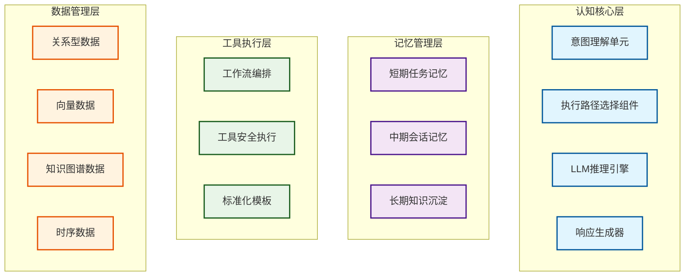
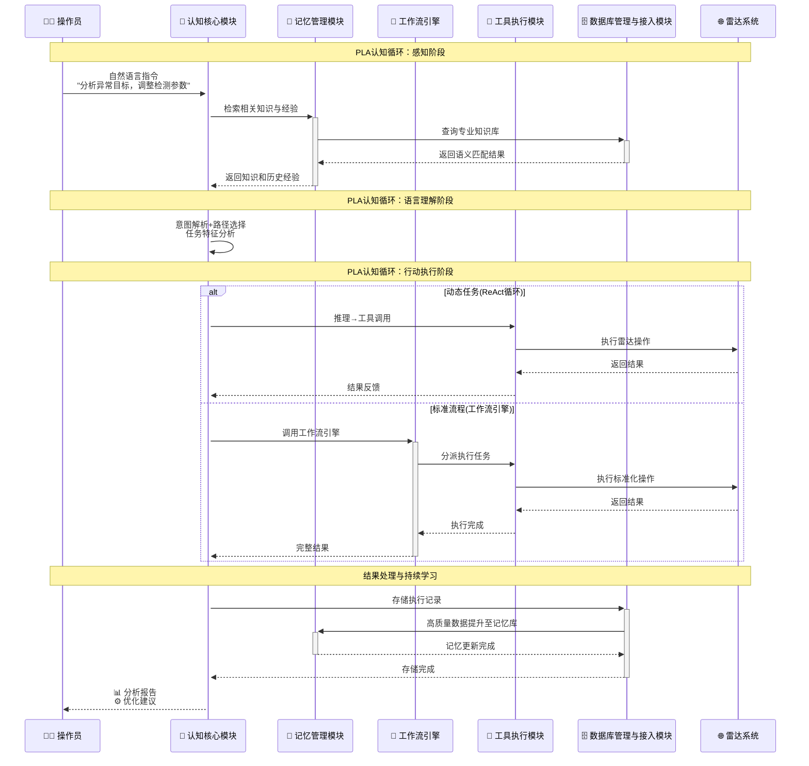

# 雷达智能体研究

## （1）设计要素

雷达智能体的核心价值在于为现代雷达系统提供前所未有的认知增强能力，发挥着"智能决策中枢"与"AI增强副驾"的双重关键作用。这一创新性技术方案致力于推动传统雷达系统实现从"被动感知"向"主动认知"的根本性范式转型。传统雷达系统如同一位技艺精湛但思维固化的老工匠，能够熟练完成标准化操作，却难以应对复杂多变的现实场景。而雷达智能体则如同一位既有丰富经验又具备学习能力的智能专家，不仅能够完成所有传统功能，更能够在面对未知情况时进行智能分析、创新思考和持续进化。这种技术革命的意义不仅体现在功能的提升，更重要的是代表了雷达技术发展的新方向：从硬件驱动向软件定义转变，从人工操作向智能协作演进，从经验传承向知识固化升级。

雷达智能体系统的主要特色和设计要点体现在四个核心技术创新维度上，每个维度都承载着突破性的技术革新和应用价值。

1）具备深度场景理解与主动认知功能，能够实现从表层数据感知到深层语义理解的认知跃迁，支撑智能化决策的全过程，验证从感知到认知、从分析到预测的完整智能链条。系统通过先进的多模态感知融合技术，将雷达回波信号与光学、红外、电子侦察等多源信息进行深度整合，形成立体化的目标认知体系。更为重要的是，系统不仅能识别"目标是什么"，更能理解"目标为什么出现"，具备了场景智能理解和态势预测能力。这种认知能力通过PLA认知循环机制的持续运作，当面对复杂的电磁环境和多样化的威胁态势时，系统能够自主分析环境特征、识别异常模式、评估威胁等级，并基于深度理解生成最优的应对策略。

2）具备自然语言交互与智能协作功能，能够将专业的雷达操作转化为直观自然的对话交互体验，支撑真正的人机协作模式，验证从复杂操作到自然交互的根本性转变。系统通过大语言模型的强大自然语言理解能力，能够准确解析操作员的复杂指令意图，支持多轮对话的上下文关联，处理指代关系和隐含需求。操作员无需再记忆繁琐的命令格式和参数配置，只需用自然语言表达需求，如"分析东南方向的可疑目标"或"优化恶劣天气下的检测参数"，系统就能智能理解并执行相应操作。这种交互革命不仅大幅降低了操作门槛和学习成本，更重要的是系统在承担大部分标准分析任务的同时，能够为操作员提供专家级的决策支持和智能建议，让人类专家能够专注于更具创造性的高价值决策工作。

3）具备持续学习与自我进化功能，能够实现真正的"越用越聪明"特性，支撑系统智能水平的持续提升，验证从静态算法到动态学习的技术突破。系统建立了从短期工作记忆到长期专业知识的完整记忆体系，能够自动提取和固化每一次成功操作的关键经验，将操作模式、决策逻辑和应急预案系统化地沉淀为可复用的知识资产。更为重要的是，系统通过机器学习算法能够从海量历史数据中挖掘出隐藏的最优实践模式，识别成功操作的共同特征，发现不同场景下的规律性模式，并将这些洞察转化为指导未来决策的智慧。这种自我完善机制让智能体具备了真正的成长能力，能够适应不断变化的作战环境和任务需求，通过持续的学习优化实现系统性能的螺旋式上升。

4）具备多模态融合与统一调用功能，能够实现对各种雷达硬件设备和分析软件的统一管理和协同控制，支撑灵活的架构扩展，验证从点对点集成到标准化生态的架构革新。系统采用MCP协议构建了开放式的工具生态，彻底解决了传统点对点集成方式带来的开发复杂性和维护成本问题。每个专业工具都通过标准化接口接入系统，形成了功能丰富、可扩展的能力矩阵。系统能够根据具体任务需求，智能调用最适合的工具组合，实现波形优化、参数调整、信号处理、目标识别等复杂操作的自动化执行。这种统一调用能力不仅提升了系统的执行效率，更重要的是为雷达系统的功能扩展和技术升级提供了灵活的架构基础。新的分析算法和处理工具可以快速接入现有系统，无需重新开发适配程序，大大降低了系统演进的技术门槛和成本投入。

## （2）架构功能

雷达智能体系统采用五大核心功能模块的协同架构设计，构建了从认知决策到物理执行的完整技术闭环。其核心创新在于以LLM推理引擎为主导的智能执行架构：LLM推理引擎承担系统的核心推理和动态任务执行职责，工作流引擎作为专业化的标准流程执行引擎，可被LLM推理引擎在ReAct循环中调用来处理复杂任务中的标准化业务流程片段。执行路径选择组件负责智能判断任务类型，为LLM推理引擎规划执行策略：纯探索性任务由LLM推理引擎独立处理，纯标准化任务由LLM推理引擎直接调用工作流引擎执行，而复杂混合任务则由LLM推理引擎在执行过程中灵活调用工作流引擎。这种模块化架构设计确保了各个功能单元的内聚性和专业化，同时通过标准化的接口协议实现模块间的高效协同，最终形成一个有机统一的智能雷达认知系统。整个架构体现了现代AI Agent的技术特征和设计理念，兼顾了智能推理的灵活性和标准流程的可靠性，为雷达智能化升级提供了坚实的技术基础。

认知核心模块承担着整个智能体的指挥与决策中心职责，是系统智能能力的根本来源。该模块基于先进的大语言模型技术构建，具备强大的自然语言理解、多轮对话管理、动态推理和复杂任务执行能力。模块的核心价值在于智能分析任务特征，选择最优的执行策略：对于纯探索性任务，LLM推理引擎独立进行动态推理和工具调用；对于包含标准化流程片段的复杂任务，LLM推理引擎在ReAct循环中可以调用工作流引擎来处理这些标准化片段。认知核心模块通过意图理解单元处理各种复杂的用户输入，支持多轮对话的上下文关联和指代关系解析，确保交互的自然流畅。执行路径选择组件作为智能路由器，能够识别任务的复杂度和标准化程度，为LLM推理引擎提供执行策略建议。LLM推理引擎作为系统的核心大脑，采用ReAct推理模式（推理→行动→观察→推理循环），能够在任务执行过程中实时调用各种工具（包括工作流引擎）、观察反馈、动态调整策略，具备完整的上下文感知和多轮推理能力。响应生成器则负责将LLM推理引擎的执行结果转化为不同格式的输出，既能生成供专业人员审阅的结构化分析报告，也能生成标准化的操作总结。

记忆管理模块是智能体实现持续学习和经验积累的核心基础设施，模拟人类大脑的分层记忆机制，为系统提供了从瞬时工作记忆到永久知识存储的完整认知支撑。该模块的设计理念是实现"越用越聪明"的智能进化，通过系统化的经验沉淀和知识管理，让每一次操作都成为系统能力提升的宝贵资源。

模块采用三级记忆协同架构，短期记忆作为任务执行期间的高速缓存，保存当前任务的上下文信息、工具调用的中间结果和实时计算数据，确保复杂分析任务的高效流畅执行。中期记忆专注于维护用户级的交互连贯性，持久化存储完整的对话历史、任务执行记录和用户操作偏好，使系统能够提供个性化的智能服务。长期记忆作为系统的核心知识宝库，不仅存储固化的专业知识和技术文档，更重要的是具备经验自动沉淀功能，能够从成功和失败的操作案例中提炼可复用的处理模式和决策逻辑。

工具执行模块发挥着连接认知决策与物理执行的关键桥梁作用，负责为各类雷达工具（包括工作流引擎）提供统一的封装和执行服务。该模块的设计目标是构建简洁、安全、可扩展的工具服务提供者，通过MCP协议实现各类工具的标准化接入和统一管理。模块专注于工具的封装、校验、执行、监控等核心职能，为LLM推理引擎提供可靠的工具调用服务。具体调用方式包括：LLM推理引擎根据ReAct循环直接调用各种雷达专业工具，以及调用工作流引擎来执行标准化的业务流程片段。模块将工作流引擎与其他雷达专业工具统一管理，为LLM推理引擎提供一致的工具调用体验，确保了系统的简洁性和灵活性。

工作流引擎是雷达智能体的专业标准流程执行引擎，专门负责预定义的规范化业务流程的可靠执行。该工具支持两种使用模式：一是作为专业工具被LLM推理引擎在ReAct循环中调用来处理复杂任务中的标准化片段；二是作为独立的服务接口，可通过用户界面点击、定时任务、系统事件等方式直接触发执行标准化业务流程。该工具的设计理念是通过成熟验证的工作流模板，为标准化业务操作提供一致性、可靠性和可追溯性保障。在工具调用模式下，LLM推理引擎可以在执行复杂任务时识别出标准化片段并调用工作流引擎处理，然后继续其ReAct推理循环；在独立服务模式下，用户可以直接触发预定义的标准流程（如定期设备巡检、系统维护等），无需通过LLM推理引擎。工具的核心价值在于将雷达领域的最佳实践固化为可复用的工作流模板，通过参数化配置和执行监控，确保标准操作的执行质量和过程透明度。工具具备完善的异常处理和状态恢复机制，既能为LLM推理引擎提供可靠的工具调用服务，也能为用户和系统提供直接的标准化流程执行服务。

数据库管理与接入模块是整个智能体系统的数据基础设施管理中心，遵循"专业化管理，简化运维"的核心设计原则，为不同类型的数据存储需求提供对应的数据库管理服务。该模块通过标准化的管理框架为四类数据库提供专业化运维管理，实现了数据库资源的高效配置、连接的可靠管理和系统运维的简化。关系型数据库管理服务负责管理需要强一致性保障的核心结构化数据，如用户权限、设备配置、操作日志等，是系统安全稳定运行的基础。向量数据库管理服务提供语义检索和知识匹配的管理能力，将海量非结构化专业文档和历史案例转化为机器可理解的语义向量，为认知核心的检索增强生成功能提供高速精准的语义匹配。

图数据库管理服务提供关系推理和知识发现的管理能力，存储雷达领域实体间的复杂逻辑关系，使智能体能够进行深层次的根因分析和知识挖掘。时序数据库管理服务专门管理带有时间戳的连续数据流，为实时性能监控、异常检测和趋势预测提供强大的数据分析基础。

## （3）工作原理

雷达智能体的工作原理基于五大核心功能模块的精密协同机制，通过标准化的信息传递和控制流程，实现从用户自然语言输入到具体雷达操作执行的完整智能化转换。整个工作流程的核心是PLA认知循环机制，这是一个模拟人类专家思维过程的智能决策框架。

PLA认知循环是雷达智能体实现"主动认知"的理论基础和技术核心，代表了感知（Perception）、语言理解（Language）、行动执行（Action）三个相互关联的认知阶段。这种循环机制借鉴了认知科学中人类专家处理复杂问题的思维模式，通过人工智能技术的数字化实现，让雷达系统具备了类似人类专家的认知能力。

感知阶段（Perception）中，系统通过多模态感知能力，全面收集和分析来自不同信息源的数据。这不仅包括传统的雷达回波信号，还涵盖光学图像、红外特征、电子侦察信息、环境参数等多维度数据。感知阶段的核心价值在于构建对当前态势的全面认知图景，为后续的智能分析提供丰富的信息基础。系统在这一阶段还会处理用户的自然语言输入，将其作为任务导向的重要感知信息。

语言理解阶段（Language）基于大语言模型的强大推理能力，系统将感知到的原始数据转化为有意义的语义信息。这个阶段包括自然语言指令的深度解析、多源数据的智能融合分析、专业知识的检索整合、以及基于历史经验的智能推理。语言理解阶段的独特之处在于它不仅处理文本信息，更重要的是将各种感知数据转化为结构化的"语言化表示"，使系统能够进行类似人类的抽象思维和逻辑推理。

行动执行阶段（Action）以LLM推理引擎为主导，根据任务特征智能选择合适的工具将决策转化为具体的雷达操作行动。对于纯探索性任务，LLM推理引擎采用ReAct循环模式直接调用各种雷达专业工具进行实时执行和策略调整；对于纯标准化任务，LLM推理引擎直接调用工作流引擎进行模板化执行；对于复杂混合任务，LLM推理引擎在ReAct循环中识别出标准化片段时，调用工作流引擎处理这些片段，然后继续推理循环处理其他部分。行动执行阶段还包括工具执行过程的实时监控、异常处理和效果评估，确保不同工具调用都能得到准确的实施和验证。

反思学习机制贯穿整个PLA认知循环，每一次完整运作都会产生新的经验和知识，系统通过自动化的反思学习机制，将成功的操作模式、有效的决策逻辑和宝贵的失败经验沉淀为可复用的知识资产。这种持续学习能力确保了雷达智能体能够在每一次循环中都得到能力提升，实现真正的"越用越聪明"。

PLA认知循环与传统雷达系统的根本区别在于其"主动性"和"适应性"。传统系统采用固化的"输入-处理-输出"线性模式，而PLA循环则是一个动态的、自适应的、持续优化的智能认知过程。每一次循环都不是简单的重复，而是在前一次循环经验基础上的智能演进。

下图展示了雷达智能体基于PLA认知循环的完整工作流程，通过8个具体阶段实现了从感知到行动的智能化转换：

上述工作流程清晰展示了PLA认知循环三大阶段的核心特征，体现了以LLM推理引擎为主导的智能执行架构。**感知阶段（Perception）**包含用户指令输入和知识检索过程，系统不仅感知用户的自然语言输入，还通过记忆管理模块从数据库管理与接入模块中检索相关专业知识，形成对任务需求和执行环境的全面感知。**语言理解阶段（Language）**对应意图解析和路径选择过程，认知核心模块基于获得的知识背景，智能分析任务特征并为LLM推理引擎规划最优执行策略。**行动执行阶段（Action）**展现了两种核心执行模式：动态任务采用ReAct循环模式直接调用雷达专业工具进行实时执行和策略调整；标准流程通过工作流引擎进行模板化的可靠执行。**持续学习机制**贯穿整个流程，系统将执行结果存储到数据库管理与接入模块，同时将高质量的经验数据提升到记忆管理模块，实现知识的持续积累和能力的螺旋式提升。这种架构确保了雷达智能体既能处理需要灵活推理的复杂任务，又能高效执行标准化的业务流程，达到智能化与规范化的最佳平衡。

工作流程的起始阶段从用户的自然语言输入开始，认知核心模块率先启动其强大的语言理解能力。当操作员输入类似"分析最近这个区域的异常目标情况，需要调整哪些参数"这样的复杂指令时，认知核心模块的意图理解单元首先对指令进行深度语义解析，准确识别关键信息要素包括时间范围、地理区域、分析目标和期望输出等。系统不仅理解指令的字面含义，更重要的是通过上下文关联和知识推理，洞察用户的深层需求和隐含约束。这一阶段的核心价值在于将模糊的自然语言转化为精确的任务定义，为后续的智能处理奠定坚实基础。

任务理解完成后，记忆管理模块立即启动其多层次的知识检索机制，并与数据库管理与接入模块协同工作。系统首先激活短期记忆中的当前对话上下文和任务状态信息，确保处理过程的连贯性。随后，中期记忆提供用户的历史操作偏好和相似任务的处理记录，为个性化服务提供依据。最关键的是长期记忆的专业知识检索，记忆管理模块通过数据库管理与接入模块的向量数据库和知识图谱，运用先进的语义搜索技术，从庞大的专业知识库中快速定位与当前任务高度相关的雷达原理、分析方法和成功案例。这种记忆管理模块与数据库管理与接入模块的深度协同，确保了认知核心在进行推理决策时拥有充分的知识支撑和经验借鉴。

在获得充足的背景信息后，认知核心模块进入关键的执行路径选择阶段。系统首先分析任务的复杂度特征、标准化程度和实时性要求，为LLM推理引擎规划最优的工具调用策略。对于"分析区域异常目标情况"这类探索性分析任务，系统会建议LLM推理引擎采用ReAct循环直接调用各种雷达专业工具进行动态执行；而对于"执行标准设备巡检"这类规范化操作，则会建议LLM推理引擎直接调用工作流引擎进行模板化执行。

**动态任务执行路径（ReAct模式）**：当选择LLM推理引擎时，系统采用推理→行动→观察→推理的循环模式。推理引擎首先基于任务需求和背景知识进行初步分析，然后直接调用相关工具（如雷达数据查询工具）获取实时信息。观察工具执行结果后，推理引擎会分析数据特征，识别异常模式，再决定下一步行动（可能是调用不同的分析工具或参数计算工具）。这个循环持续进行，直到获得完整的分析结果。整个过程体现了AI Agent的本质特征：基于实时反馈的动态决策和适应性调整。

**标准流程执行路径（工作流调用模式）**：当LLM推理引擎需要执行标准化业务流程时，首先识别需要调用的具体工作流类型，然后调用对应工作流的启动接口，将任务参数传递给工作流代码。工作流作为一段预定义的Python代码开始执行，根据传入的参数进行参数化配置，按照既定的执行序列系统化地调用其他雷达专业工具完成标准化操作，在关键节点进行检查点保存和状态监控，最终将完整的执行结果返回给LLM推理引擎，确保标准业务流程的可靠执行和状态反馈。

任务执行阶段由工具执行模块提供各种专业工具的调用服务。模块首先进行执行前的参数校验，确保工具调用的安全性和有效性。在实际执行过程中，模块专注于工具的标准化调用和执行监控，确保工具能够按预期运行并返回准确结果。每个工具的执行结果都会被模块收集和标准化处理，重要的执行信息会被反馈给调用方，形成完整的信息闭环。

在整个工作流程的结果处理阶段，数据库管理与接入模块与记忆管理模块协同完成数据管理和知识沉淀工作。认知核心模块将执行结果发送到数据库管理与接入模块，该模块根据不同数据的特性选择最适合的存储系统：结构化的执行记录存入关系型数据库，语义化的分析结果向量化后存入向量数据库，复杂的关系信息更新到知识图谱，时序性的监控数据则进入时序数据库。更重要的是，数据库管理与接入模块会自动评估本次任务执行的成功程度和创新价值，将高质量的处理模式和决策逻辑提炼为可复用的知识资产，通过标准化接口提升到记忆管理模块的长期记忆中，供未来类似任务参考使用。这种双模块协同的数据处理机制确保了系统的持续学习和智能进化。

整个工作原理的精髓在于五大模块的有机协同和持续优化。每一次完整的任务执行不仅解决了当前的具体问题，更重要的是为系统的知识库增添了新的经验财富。通过这种持续的学习和沉淀机制，雷达智能体实现了真正的"越用越聪明"，系统的智能水平随着使用时间的积累而不断提升，最终成长为一个具备专家级水平的智能雷达助手。

## （4）认知核心模块的详细设计

### 1）概述

认知核心模块是雷达智能体的"智慧大脑"和"决策指挥中心"，承载着系统最核心的认知智能功能。该模块的设计理念是构建一个能够理解、推理、决策的人工智能认知系统，将人类专家的思维过程和决策逻辑通过先进的大语言模型技术进行数字化建模和实现。模块的核心价值不仅在于处理复杂的自然语言交互，更重要的是具备了深度的专业推理能力和智能决策生成能力。

认知核心模块突破了传统雷达系统被动响应的工作模式，实现了从"信号处理工具"向"认知智能系统"的根本性跃迁。相比传统系统按照预设程序进行信号处理和目标检测，认知核心模块能够主动理解任务背景、分析环境特征、评估多种方案并生成最优决策。这种认知能力提升使得雷达系统具备了类似人类专家的智能水平，能够在复杂多变的实际环境中进行自主决策和灵活应对。

模块的另一个重要特征是其强大的学习和适应能力。通过与记忆管理模块的深度集成，认知核心能够从每一次决策和执行中学习经验，不断完善自身的推理逻辑和决策模式。这种持续学习机制确保了系统能够适应不断变化的任务需求和环境条件，实现智能水平的螺旋式提升。

### 2）总体组成

认知核心模块采用四层递进式架构设计，每一层都承担着特定的认知功能，通过层间的紧密协作实现从自然语言理解、执行路径决策到智能任务处理的完整认知链条。该架构的核心创新在于增加了执行路径选择层，实现了以LLM推理引擎为主导的智能工具调用路由功能。

意图理解单元是认知核心的"语言大门"，负责处理和解析所有来自用户的自然语言输入。该单元不仅要理解指令的字面含义，更重要的是要洞察用户的真实意图和深层需求。单元通过先进的自然语言处理技术，能够处理各种复杂的语言现象，包括多轮对话中的上下文关联、指代关系的准确解析、隐含需求的智能推断等。例如，当用户说"刚才那个目标的跟踪效果怎么样"时，系统能够准确识别"刚才那个目标"的具体指向，并理解用户期望获得跟踪性能评估的需求。意图理解单元还具备多模态信息融合能力，不仅能处理文本输入，还能理解语音指令和图像信息，为用户提供更加自然便捷的交互体验。

执行路径选择组件是认知核心的"智能路由器"，承担着智能工具调用路由的核心决策职责。该组件接收来自意图理解单元的结构化任务需求和背景信息，通过智能分析任务特征为LLM推理引擎规划最优的执行策略。组件具备强大的任务特征识别能力，能够准确评估任务的复杂度、标准化程度、实时性要求和创新性需求等关键维度。对于纯探索性任务，建议LLM推理引擎采用ReAct循环直接调用各种雷达专业工具；对于纯标准化任务，建议LLM推理引擎直接调用工作流引擎；对于复杂混合任务，建议LLM推理引擎在执行过程中灵活调用工作流引擎处理标准化片段。这种智能路由机制确保了不同类型任务都能够通过最适合的工具调用策略得到最优处理。

LLM推理引擎是认知核心的"动态执行大脑"，专门负责处理需要实时推理和适应性调整的复杂任务。该引擎采用ReAct推理模式，通过推理→行动→观察→推理的循环执行，实现真正的智能化任务处理。引擎的核心特征是能够在任务执行过程中实时分析情况变化，动态调整执行策略，直接调用工具获取信息，并基于反馈结果进行下一步决策。推理过程具备强大的上下文感知能力，能够将当前观察结果与任务目标、历史经验和专业知识进行综合分析，生成最适合当前情境的行动方案。引擎特别适用于探索性分析、异常诊断、复杂推理等需要灵活应对的动态任务场景。

响应生成器是认知核心的"表达器官"，负责将推理引擎的内部思维过程转化为不同格式和风格的外部输出。该生成器具备多样化的输出能力，既能生成面向专业人员的详细技术报告，包含数据分析、态势评估、方案对比和风险警告等完整信息，也能生成面向操作人员的简洁操作指导，提供清晰的步骤说明和注意事项。生成器还能根据不同用户的专业水平和权限等级，自动调整输出内容的详细程度和技术深度。对于需要下游模块执行的任务，生成器会将决策结果转化为标准化的结构化指令，确保其他模块能够准确理解和执行。

### 3）意图理解单元功能设计

意图理解单元是认知核心模块的入口处理器，专职负责用户自然语言输入的深度理解和意图解析。该单元是整个认知链条的起点，其设计目标是将复杂多样的自然语言表达精准转化为系统可处理的结构化意图信息。单元通过多层次的语言处理技术，实现从表层语法分析到深层语义理解的完整转换。

多轮对话管理机制是该功能的核心技术特色。系统维护着完整的对话上下文状态，能够准确跟踪对话历史和主题演进。当用户在多轮对话中使用"它"、"那个"、"前面提到的"等指代词时，系统能够准确解析其具体指向。对话管理机制还具备主题切换检测能力，当用户从一个技术话题转向另一个话题时，系统能够及时识别并相应调整上下文焦点。这种智能的对话管理让人机交互变得如同与经验丰富的同事对话一样自然流畅。

上下文关联解析技术确保系统能够理解复杂指令中的隐含信息和约束条件。系统不仅分析当前指令的直接含义，还会综合考虑历史对话、当前任务状态、用户偏好等多维度上下文信息。例如，当用户说"优化一下检测参数"时，系统会根据当前的雷达工作模式、环境条件、用户的历史偏好等信息，智能推断出具体需要优化的参数类型和方向。

意图解析机制采用多层次的语义分析方法，不仅识别用户的明确需求，还能挖掘深层的隐含意图。系统通过意图分类、实体抽取、关系识别等技术手段，将自然语言指令解构为结构化的任务描述。对于模糊或不完整的指令，系统具备主动澄清能力，能够通过智能提问的方式获取缺失信息，确保任务理解的准确性和完整性。

### 4）执行路径选择组件功能设计

执行路径选择组件是智能工具调用路由的核心决策模块，承担着为LLM推理引擎规划最优执行策略的关键职责。该组件通过分析任务特征，为LLM推理引擎提供精准的工具调用路由建议。

任务特征智能识别功能是组件的核心能力。系统通过多维度分析评估任务的复杂度、标准化程度和实时性要求等关键指标：对于探索性分析任务，建议LLM推理引擎采用ReAct循环直接调用雷达专业工具；对于标准化任务，建议调用工作流引擎；对于复杂混合任务，建议在ReAct循环中灵活调用工作流引擎处理标准化片段。

系统负载均衡功能确保资源的最优配置。组件实时监控LLM推理引擎和各种工具的负载状况，动态调整任务分配策略和调用时机，避免系统资源过载。

路由决策优化功能实现组件的持续改进。系统追踪每次路由决策的执行效果，通过机器学习算法不断优化决策模型，提升路由决策的准确性和效率。

### 5）LLM推理引擎功能设计

LLM推理引擎是认知核心模块的"动态任务执行核心"，专门负责需要实时推理和灵活应对的复杂任务处理。该引擎采用ReAct（推理-行动-观察）循环模式，实现从任务理解、工具调用、结果分析到策略调整的完整动态执行流程，是系统处理探索性和创新性任务的关键引擎。

ReAct推理循环执行能力是引擎的核心功能特征。引擎遵循“推理→行动→观察→推理”的循环模式，在每个循环中都能够根据当前情况进行智能分析，选择最适合的工具进行调用，观察执行结果，然后基于反馈信息调整下一步策略。这种动态执行模式确保了系统能够在任务执行过程中实时适应情况变化，实现真正的智能化任务处理。

实时工具调用与结果分析机制是引擎的核心操作能力。不同于传统的“先计划后执行”模式，该引擎能够在推理过程中直接调用需要的工具获取实时信息，然后基于工具返回的结果进行深入分析。例如，在分析异常目标时，引擎可能先调用数据查询工具获取目标信息，观察结果后发现需要更多背景数据，又继续调用历史数据分析工具，最终得出综合分析结论。

上下文保持与状态管理机制确保了循环执行过程的连贯性和一致性。引擎能够在整个执行过程中维持任务上下文，包括任务目标、已执行步骤、中间结果、当前状态等关键信息。这使得系统在每个决策点都能够充分考虑当前情况和历史信息，做出更加精准和有针对性的决策。同时，引擎还具备异常检测和恢复能力，在发现执行路径错误时能够快速调整策略。

动态策略调整与适应能力是引擎的高级特色。引擎能够根据执行过程中的反馈信息实时调整执行策略，在发现原定方案不可行或效果不佳时，能够迅速转换思路和方法。这种适应性使得系统能够处理遇到意外情况的复杂任务，体现了AI Agent的智能特征。同时，引擎还具备学习能力，能够从每次执行过程中积累经验，不断优化后续的决策质量。

### 6）响应生成器功能设计

响应生成器是认知核心模块的"表达器官"，承担着将LLM推理引擎的内部思维过程转化为用户可理解、系统可执行的多样化输出的重要职责。该生成器位于认知链条的终端，是连接内部智能推理与外部交互呈现的关键桥梁，其设计目标是实现智能决策结果的精准传达和高效执行。

多格式输出适配能力是响应生成器的核心技术特色。生成器具备强大的输出格式转换能力，能够将统一的内部推理结果适配为多种不同的输出格式。对于面向专业技术人员的输出，系统生成包含完整技术细节、数据分析、态势评估、方案对比和风险警告的详细技术报告，报告结构严谨、数据准确、分析深入。对于面向一线操作人员的输出，系统生成简洁明了的操作指导，突出关键步骤、注意事项和安全提醒，确保操作的准确性和安全性。对于需要下游模块执行的任务，生成器将决策结果转化为标准化的结构化指令，包含精确的参数配置、执行序列和检查点设置。

用户个性化适配机制实现了输出内容的智能定制。生成器通过分析用户的专业水平、权限等级、历史偏好和当前上下文，自动调整输出内容的详细程度、技术深度和表达风格。对于资深专家用户，系统提供更多的技术细节和深层分析；对于初级用户，系统采用更加直观的表达方式和详细的解释说明。权限控制机制确保敏感信息只向授权用户展示，不同权限级别的用户看到的信息内容和详细程度存在差异。

交互式反馈与确认机制提升了用户体验和操作安全性。对于复杂的分析结果，生成器支持分层展示模式，用户可以根据需要逐层深入了解详细信息。对于高风险操作，生成器会主动生成风险提醒和确认请求，确保用户在充分理解风险的前提下做出决策。系统还支持多轮交互模式，用户可以针对生成结果提出进一步的问题或要求调整，生成器能够基于上下文进行相应的补充和修正。

质量控制与一致性保障机制确保输出结果的专业性和可靠性。生成器内置了完善的输出质量评估体系，对生成的内容进行格式规范性、逻辑一致性、专业准确性的多维度检查。对于关键的技术建议和操作指导，系统会与知识库中的权威标准进行交叉验证，确保建议的科学性和安全性。生成器还具备版本控制和变更追踪能力，记录输出内容的生成过程和修改历史，为质量审核和问题追溯提供完整的数据支撑。

## （5）记忆管理模块的详细设计

### 1）概述

记忆管理模块是雷达智能体实现"越用越聪明"核心特征的关键基础设施，承载着系统持续学习和经验积累的重要使命。该模块通过构建分层次、多维度的记忆体系，为智能体提供从瞬时工作记忆到永久专业知识的完整认知支撑。模块的核心价值在于将每一次操作过程中产生的宝贵经验和知识进行系统化的提取、存储和管理，确保这些智慧资产能够在未来的任务中发挥指导和借鉴作用。

### 2）总体组成

记忆管理模块采用三级分层记忆架构，每一级都针对不同的时间尺度和功能需求进行了专门优化，通过层间的智能协作实现信息的有序流转和价值最大化。

短期记忆层是系统的"高速工作台"，专门负责当前任务执行期间的临时数据管理。该层采用内存数据库技术，提供毫秒级的数据访问速度，确保复杂分析任务的高效流畅执行。短期记忆存储的内容包括当前任务的执行上下文、工具调用的中间结果、实时计算数据和临时状态信息等。这些信息的特点是访问频繁但生命周期短暂，系统通过智能的生命周期管理机制，自动清理过期数据，保持短期记忆的高效运行状态。短期记忆还具备智能筛选功能，能够识别出具有长期价值的信息，并将其自动提升到中期记忆中保存。

中期记忆层是系统的"个人助理"，专注于维护用户级的交互连贯性和个性化服务体验。该层采用关系型数据库技术，持久化存储完整的对话历史、任务执行记录和用户操作偏好等信息。中期记忆的核心功能是支持多轮对话的上下文维护和个性化服务的提供。系统通过分析用户的历史行为模式，能够学习每个用户的操作习惯、偏好设置和专业水平，从而提供更加贴合个人需求的智能服务。中期记忆还具备会话关联能力，能够将分散在不同时间段的相关对话和任务进行智能关联，形成完整的用户体验线索。

长期记忆层是系统的"知识宝库"，承载着整个智能体的核心智慧和专业知识。该层采用多模态存储架构，结合向量数据库、知识图谱和关系数据库等多种技术，实现对不同类型知识的专业化管理。长期记忆不仅存储固化的专业知识如技术手册、雷达原理、操作规程等，更重要的是具备经验自动沉淀功能，能够从成功和失败的操作案例中提炼可复用的处理模式和决策逻辑。长期记忆通过机器学习算法对历史数据进行深度挖掘，识别出隐藏的最优实践模式和规律性特征，将这些洞察转化为指导未来决策的智慧资产。

### 3）短期记忆层功能设计

短期记忆层作为系统的"高速工作台"，承载着当前任务执行期间的临时数据管理和实时状态维护功能。该层的设计理念是以极致的响应速度支撑复杂任务的流畅执行，同时通过智能化的数据筛选机制确保有价值信息的及时保存和流转。

该层的核心技术基础是高速缓存机制，采用内存数据库技术实现毫秒级的数据访问响应。缓存架构设计为多级模式，L1级缓存专门存储最频繁访问的热点数据，L2级缓存维护当前会话的完整数据，L3级缓存保存临时计算结果和中间变量。通过LRU算法和访问频率统计的智能结合，系统确保最紧迫需要的数据始终位于最高访问速度的层级，为认知核心和工具执行提供强有力的数据支撑。

在高速缓存基础之上，实时状态管理功能构建了完整的任务执行上下文维护体系。系统持续跟踪和更新任务执行进度、工具调用状态、中间计算结果和临时变量等关键信息，形成任务执行的完整状态画面。通过关键节点的快照机制，系统为任务的暂停、恢复和异常处理提供可靠的回滚点。状态一致性检查功能则确保并发操作环境下的数据完整性，避免因多线程访问导致的状态混乱。

更为重要的是，短期记忆层具备智能价值评估与流转机制。系统运用智能算法持续分析缓存数据的价值属性，综合评估访问频率、业务重要性、时间敏感度和未来利用潜力等多维度因素。当识别出具有长期保存价值的信息时，系统自动启动向中期记忆的智能流转程序，确保重要经验和关键数据不会在短期记忆清理过程中丢失。这种自动化的价值发现和保存机制，是系统实现"越用越聪明"特征的重要技术保障。

为保持系统的高效运行状态，短期记忆层建立了完善的生命周期管理与清理机制。系统根据数据类型、业务重要性和时间特征设定差异化的过期策略，过期数据通过增量清理方式被及时移除，释放宝贵的内存资源。清理过程经过精心优化，采用后台增量处理模式，避免对前台任务执行造成性能影响，确保系统始终保持最佳的响应状态。

### 4）中期记忆层功能设计

中期记忆层扮演着系统"个人助理"的关键角色，专注于构建和维护用户级的交互连贯性与个性化服务能力。该层通过对用户行为模式的深度学习和历史信息的智能管理，实现了从通用服务向个性化智能服务的重要转变。

该层的核心是多轮对话上下文维护机制，这是实现自然人机交互的技术基石。系统构建了完整的对话历史记录体系，不仅保存对话的字面内容，更重要的是维护对话的语义上下文和逻辑关联。通过先进的语义分析技术，系统能够准确识别对话中的实体指代、主题演进和意图变化，确保跨轮次对话的语义连贯性。这种上下文维护能力不仅支持单次会话内的连续交流，更能够实现跨会话的主题关联和历史对话的智能回顾，让用户享受到如同与资深同事交流般的自然体验。

基于丰富的对话历史数据，中期记忆层发展出强大的用户行为建模与个性化服务能力。系统通过深度分析用户的操作习惯、偏好设置、专业水平和决策模式，构建出精准的个性化用户画像。这种用户建模不仅包括显性的操作偏好记录，更重要的是通过模式识别发现用户的隐性需求和习惯特征。基于用户模型，系统能够实现预测性的个性化服务，主动提供符合用户习惯的功能推荐、参数预设和界面定制，显著提升用户的工作效率和使用体验。

为了支撑复杂任务的长期跟踪和管理，中期记忆层建立了会话关联与任务追踪机制。系统具备强大的时间跨度关联能力，能够识别和连接分散在不同时间段但存在逻辑关联的对话和任务，形成完整的用户工作线索。当用户提及历史任务或请求继续之前的工作时，系统能够快速定位相关历史信息，提供无缝的服务连续性。任务追踪功能涵盖任务状态的实时监控、执行进度的动态更新和执行结果的智能关联，确保长期任务的有序推进和完整记录。

为保障中期记忆的可靠性和连续性，系统建立了完善的数据持久化与备份恢复机制。采用关系型数据库技术实现数据的可靠持久化存储，通过定期全量备份和实时增量备份的双重策略，确保数据的安全性和完整性。恢复机制支持精确的时间点恢复和选择性数据恢复，最大程度降低数据丢失风险，为用户提供可信赖的长期服务保障。

### 5）长期记忆层功能设计

长期记忆层是整个雷达智能体的"知识宝库"和"智慧引擎"，承载着系统核心智慧和专业知识的积累与传承使命。该层的设计目标是构建一个能够持续学习、自我完善的知识生态系统，通过对历史经验的深度挖掘和专业知识的结构化管理，为智能决策提供强有力的知识支撑。

该层的技术基础是多模态知识存储与管理机制，采用了融合多种存储技术的混合架构设计。向量数据库专门负责存储语义化的知识表示，通过高维向量空间实现知识的语义相似性检索，特别适合处理复杂的概念关联和模糊查询需求。知识图谱技术用于管理结构化的关系知识，通过实体-关系-属性的三元组模式构建复杂的知识关联网络，支持基于推理的复杂查询和知识发现。关系数据库则承担规范化事实知识的精确存储，确保核心数据的准确性和一致性。这种多模态存储架构为不同类型知识提供了最适合的管理方式，实现了知识存储效率和访问性能的最佳平衡。

长期记忆层的核心智能特征体现在经验自动沉淀与模式提取机制上。系统运用先进的机器学习和数据挖掘技术，对成功和失败的操作案例进行深度分析，自动识别和提炼可复用的处理模式和决策逻辑。这一过程涵盖操作轨迹的详细分析、关键成功因素的智能识别、有效决策要素的精准提炼和处理模式的抽象化建模等多个层次。通过对历史数据的深度挖掘，系统能够发现隐藏在成功案例中的最优实践模式和规律性特征，并将这些珍贵的洞察转化为指导未来决策的智慧资产，实现知识的增值和积累。

为确保知识库的专业性和权威性，系统建立了严格的知识质量控制与专家验证机制。对于系统自动沉淀的经验知识，系统首先进行多维度的质量评估，包括逻辑一致性检查、数据完整性验证和应用效果分析等。重要的知识更新还会引入专家验证环节，由领域专家对系统提炼的经验进行专业审核、修正和补充，确保知识的科学性和实用性。系统同时具备知识反馈机制，根据知识在实际应用中的效果表现进行价值评估和动态调整，形成知识质量的持续改进循环。

面对知识库规模的不断扩大，系统发展出知识冲突检测与一致性维护功能来保证知识体系的内在逻辑统一。当新的经验知识与现有知识出现冲突时，系统启动智能冲突处理流程，综合评估信息来源的权威性、时间序列的有效性、实际应用的效果反馈等多重因素，进行科学的权衡处理。系统还具备知识演进跟踪能力，完整记录知识的变化历史和演进轨迹，为知识管理决策提供详实的审计依据。

长期记忆层通过语义检索与智能激活机制实现了大容量知识库的高效利用。系统采用多算法融合的检索策略，整合关键词精确匹配、语义相似性检索和关联推理检索等多种技术手段，确保相关知识的全面发现。更为重要的是，系统具备主动的知识激活机制，能够根据当前任务的特征和上下文环境，智能地激活相关的历史经验和专业知识，实现知识与决策需求的精准匹配。知识的组织采用本体建模技术，将雷达领域的专业知识构建成语义丰富的知识网络，每个知识节点都具备详细的语义标注和多维度的关联关系，为智能推理提供强大的知识基础。

## （6）工具执行模块的详细设计

### 1）概述

工具执行模块是雷达智能体连接认知决策与物理执行的关键桥梁，承担着将大语言模型的抽象思维转化为具体雷达操作的重要使命。该模块的设计理念是构建一个简洁、安全、可扩展的工具封装和执行服务，通过MCP协议实现各类雷达工具的标准化接入和统一管理。模块专注于工具的封装、校验、执行、监控等核心职能，为认知核心提供可靠的工具调用服务。

该模块突破了传统点对点集成方式的复杂性问题，通过标准化的接口协议和统一的服务架构，实现了异构工具的无缝集成。无论是雷达硬件控制工具、算法模型配置工具、数据处理服务工具还是业务流程执行工具，都能通过统一的方式接入系统，大大降低了集成开发的复杂度和维护成本。模块还预留了良好的扩展接口，支持未来新工具类型的快速接入，确保系统的持续演进能力。

模块的核心价值在于为以LLM推理引擎为主导的智能执行架构提供统一而可靠的工具服务支撑，保持专注的功能边界和清晰的架构定位。通过合理的职责分工，动态工具调用策略由LLM推理引擎的ReAct循环机制控制，工作流引擎作为专业的标准化流程执行引擎，而工具执行模块专注于做好高质量工具服务的提供者角色。模块为LLM推理引擎提供统一的工具调用接口，既支持直接调用各种雷达专业工具，也支持调用工作流引擎来处理标准化片段，通过统一的接口支撑不同工具调用模式，既保持了系统的简洁性和可维护性，又确保了LLM推理引擎工具调用的灵活性，形成清晰的架构边界和高效的协作模式。

### 2）总体组成

工具执行模块采用服务化的架构设计，专注于提供统一、安全、可扩展的工具封装和执行服务。该模块通过标准化接口管理多种类型的雷达专业工具，包括但不限于雷达硬件控制类工具（阵面参数设置、功率控制、波束调整）、算法模型配置类工具（检测算法超参、识别模型配置、信号处理参数）、数据处理服务类工具（数据库查询、知识库检索、文件操作）、业务流程执行类工具（目标航迹获取、数据采集、报告生成）等。模块预留了扩展接口，支持未来新工具类型通过MCP协议轻松接入，实现工具生态的持续丰富。

工具封装与注册组件负责构建统一的工具服务接口，是整个工具生态的管理中心。该组件基于MCP（Model Context Protocol）协议实现工具的标准化封装，为不同类型的工具提供一致的调用接口。组件自动发现和注册新接入的工具，维护工具的基本元数据信息，包括工具名称、功能描述、参数要求、返回格式等。通过标准化封装，无论是雷达硬件控制工具、算法配置工具还是数据处理工具，调用方都可以通过统一的接口进行访问，大大降低了集成复杂度。组件还支持工具的版本标识和基本兼容性管理，确保系统升级时的平滑过渡。

参数校验与安全组件提供工具调用前的基础检查和安全保障。该组件对调用请求进行必要的参数格式验证和范围检查，确保参数符合工具的基本要求。安全检查包括访问权限验证、操作权限确认和基本的安全策略执行。对于可能产生风险的操作，组件会进行标准的安全检查并记录相应的操作日志。组件的设计理念是提供必要而充分的安全保障，避免过度复杂的风险评估机制，保持系统的简洁性和可维护性。

执行代理与监控组件充当工具调用的统一代理，负责实际的工具执行和基本状态监控。该组件接收标准化的调用请求，通过MCP协议与具体工具进行通信，并将执行结果返回给调用方。组件提供基本的执行监控能力，包括执行状态跟踪、执行时间记录和异常情况捕获。当工具执行失败时，组件提供简单的重试机制和错误信息反馈。监控功能专注于执行过程的基本状态管理，为系统维护和问题排查提供必要的信息支撑。

结果处理与回填组件负责工具执行结果的标准化处理和经验回填工作。该组件将不同工具的执行结果转换为统一的标准格式，进行基本的结果完整性检查和格式规范验证。成功的执行案例和基本的执行统计信息会被记录并回填到记忆管理模块中，为系统的持续改进提供数据支撑。组件的设计重点在于结果处理的准确性和及时性，避免复杂的多维度评估和深度分析，保持处理流程的清晰和高效。

### 3）工具封装与注册组件功能设计

工具封装与注册组件作为工具生态的统一管理中心，负责实现各类雷达工具的标准化封装和生命周期管理。该组件的核心价值在于通过MCP协议构建统一的工具服务接口，消除不同工具之间的集成差异，为上层应用提供一致的调用体验。

基于MCP协议的标准化封装机制是该组件的核心技术基础。MCP协议专门为大语言模型与外部工具系统设计，采用JSON格式的结构化消息传递，支持异步非阻塞通信和灵活的参数传递。组件将雷达硬件控制工具（如阵面参数设置、功率调节）、算法模型配置工具（如检测算法超参、信号处理参数）、数据处理服务工具（如数据库查询、知识库检索）、业务流程执行工具（如目标航迹获取、报告生成）等不同类型的工具统一封装为标准MCP服务。每个工具都通过统一的接口描述其功能能力、参数要求和返回格式，使得调用方无需了解具体工具的实现细节。

动态工具注册与发现机制支持工具生态的灵活扩展。组件提供自动化的工具注册流程，新接入的工具只需按照MCP协议规范提供接口描述，即可被系统自动发现和注册。工具注册信息包括工具标识、功能描述、参数定义、版本信息等基本元数据，这些信息被存储在工具注册表中供系统查询和调用。注册机制支持工具的热插拔，新工具可以在系统运行过程中动态加入，无需重启服务。

工具元数据管理与版本控制功能确保工具生态的有序管理。组件维护完整的工具元数据，包括工具的功能边界、性能特征、使用约束等信息，帮助调用方准确理解和使用工具。版本控制机制支持工具的平滑升级，通过版本标识区分不同版本的工具，确保系统兼容性。当工具版本更新时，组件会自动检查兼容性并提供相应的升级指导，保证系统的稳定运行。

工具能力查询与匹配服务为智能工具选择提供支撑。组件提供工具能力查询接口，允许调用方根据功能需求、参数要求、性能期望等条件查找合适的工具。查询服务支持模糊匹配和精确匹配，帮助认知核心根据任务特点选择最适合的工具组合，提高任务执行的效果和效率。

### 4）参数校验与安全组件功能设计

参数校验与安全组件作为工具调用的安全守护者，负责在工具执行前进行必要的参数检查和安全验证，确保每次工具调用都是安全、合规和有效的。该组件的设计理念是提供必要而充分的安全保障，避免过度复杂的检查机制，保持系统的高效性和可维护性。

基础参数校验机制对所有工具调用请求进行标准化的参数检查。组件验证参数的基本格式、数据类型、取值范围等要求，确保参数符合工具的接口定义。针对不同类型的工具，校验重点有所不同：雷达硬件控制工具重点检查参数的物理合理性和安全边界，算法模型配置工具重点验证参数的逻辑一致性和数值有效性，数据处理服务工具重点确认查询条件的合法性和权限范围，业务流程执行工具重点验证数据格式和流程完整性。校验过程采用规则引擎和配置化的方式，便于根据具体需求调整校验策略。

权限控制与访问管理机制确保工具调用的合规性。组件根据用户角色、操作类型、资源敏感度等因素进行权限验证，防止未授权的工具访问和操作。权限控制采用基于角色的访问控制（RBAC）模型，支持细粒度的权限定义和灵活的权限分配。对于敏感操作，组件提供额外的安全检查，包括操作日志记录、审批流程触发等措施，确保关键操作的可追溯性和可控性。

安全策略执行与合规检查功能实施系统级的安全策略。组件根据预设的安全策略对工具调用进行合规性检查，包括操作时间限制、资源使用约束、数据访问规范等。安全策略采用可配置的规则定义，支持根据不同的安全等级和业务场景灵活调整。当检测到违反安全策略的操作时，组件会阻止执行并记录相应的安全事件，为安全审计和风险管理提供依据。

### 5）执行代理与监控组件功能设计

执行代理与监控组件作为工具调用的统一代理服务，负责接收调用请求、执行具体工具、监控执行状态并返回结果。该组件是工具执行模块的核心执行引擎，通过标准化的代理机制简化工具调用的复杂性，为上层应用提供一致的执行体验。

统一执行代理机制是该组件的核心功能。组件接收来自认知核心的标准化调用请求，根据工具标识查找相应的工具实例，通过MCP协议与具体工具进行通信。代理机制屏蔽了不同工具的实现差异，为调用方提供统一的接口体验。无论是雷达硬件控制工具的设备操作，还是算法模型工具的参数配置，或是数据处理工具的查询执行，都通过统一的代理接口进行调用，大大简化了上层应用的集成工作。

基础执行监控功能提供工具执行过程的实时状态跟踪。组件监控每个工具调用的基本执行信息，包括执行开始时间、当前状态、执行进度、资源使用情况等。监控数据采用轻量级的采集方式，避免对工具执行性能造成显著影响。监控信息主要用于执行状态的实时反馈和基本的问题排查，为系统运维提供必要的可见性。

执行日志与审计记录功能为系统管理提供数据支撑。组件记录每次工具调用的基本信息，包括调用时间、工具标识、执行参数、执行结果、执行时长、异常信息等。日志记录采用结构化格式，便于后续的查询和分析。审计记录重点关注执行的完整性和一致性，为系统的可靠性验证和问题追踪提供依据。

### 6）结果处理与回填组件功能设计

结果处理与回填组件负责工具执行结果的标准化处理和基本的经验回填工作，是工具执行链条的最后环节。该组件的设计目标是确保执行结果的正确处理和有价值信息的及时回填，为系统的持续改进提供数据基础。

标准化结果处理机制将不同工具的执行结果转换为统一格式。组件接收来自各类工具的执行结果，无论是雷达硬件控制工具的设备状态反馈，还是算法模型工具的配置确认，或是数据处理工具的查询结果，都被转换为标准化的结果格式。标准化处理包括结果格式规范、数据类型统一、状态码标准化等，确保上层应用能够以一致的方式处理所有工具的执行结果。

基础结果质量检查功能对执行结果进行必要的完整性和有效性验证。组件检查结果数据的完整性，验证必要字段的存在和格式正确性，识别异常的返回值和错误状态。质量检查采用规则化的验证方式，针对不同类型的工具定义相应的检查规则，确保结果数据的基本可用性。对于质量检查不通过的结果，组件会标记相应的质量问题并记录详细信息。

执行统计与基础分析功能提供工具使用情况的基本统计信息。组件收集和统计工具的使用频率、成功率、平均执行时间、常见错误类型等基础指标。统计信息采用简单的计数和平均值计算，避免复杂的统计分析和机器学习算法。这些基础统计为系统运维和性能优化提供参考数据，帮助识别使用频繁的工具和潜在的性能瓶颈。

经验回填与知识更新机制将有价值的执行信息回填到记忆管理模块。组件将成功的执行案例、有效的参数配置、常见的错误模式等信息整理为结构化格式，回填到系统的知识库中。回填信息包括工具使用场景、参数配置、执行效果、问题解决方案等基本要素。知识回填采用简单的模板化方式，避免复杂的知识抽取和模式识别，确保回填过程的稳定性和可靠性。

## （7）工作流引擎的详细设计

### 1）概述

工作流引擎是雷达智能体的专业标准流程执行引擎，专门负责预定义的规范化业务操作的可靠执行和过程监控。该引擎的设计理念是通过成熟验证的工作流模板，为雷达系统的标准操作提供一致性、可靠性和可追溯性保障。引擎支持两种使用模式：一是被LLM推理引擎在ReAct循环中作为专业执行引擎调用来处理复杂任务中的标准化片段；二是作为独立的服务接口，通过用户界面、定时任务、系统事件等方式直接触发执行。引擎的核心价值在于将雷达领域的最佳实践固化为可复用的工作流模板，工作流内部可能包含简单的条件判断和基础决策逻辑（使用内置的轻量级LLM，无多轮对话能力，与认知核心的复杂LLM完全不同），通过参数化配置和执行监控，确保标准操作的执行质量和过程透明度，既能为LLM推理引擎提供可靠的执行引擎服务，也能为用户和系统提供直接的标准化流程执行服务。

### 2）总体组成

工作流引擎模块采用分层模块化的架构设计，每个子模块都专注于特定的功能领域，通过模块间的协调配合实现工作流的全生命周期管理。

工作流模板管理组件提供标准化业务流程的存储和调用能力。该组件专注于预定义工作流模板的管理和执行，为雷达智能体系统提供经过验证的标准业务流程。组件包含完整的模板库管理功能，涵盖雷达监控、异常处理、设备维护等各类业务场景的标准化工作流。模板基于状态图定义，包含任务节点、决策节点、并行节点、同步节点等多种节点类型，每种节点都具备特定的处理逻辑和配置选项。更重要的是，组件提供了模板参数化功能，允许在执行时根据具体场景动态配置节点参数、超时控制、重试策略、错误处理等选项，实现模板的灵活复用。

模板执行引擎是工作流运行的核心驱动力，专门负责预定义工作流模板的可靠执行。该引擎接收来自认知核心的任务类型和参数配置，自动匹配对应的工作流模板并启动执行。引擎具备强大的并行处理能力，能够根据模板定义自动识别可并行执行的节点，通过多线程处理提高执行效率。引擎实现了智能的资源调度功能，根据模板复杂度和系统负载情况合理分配计算资源。执行过程中，引擎严格按照模板定义的执行序列进行，实时监控每个节点的执行状态，确保标准流程的严格执行和异常情况的及时处理。

状态管理与检查点组件提供工作流执行过程的状态跟踪和恢复保障。该组件维护着详细的执行状态信息，包括当前执行位置、节点状态、中间结果、执行历史等。组件采用智能的检查点创建策略，在关键节点自动创建状态快照，为系统提供快速恢复的能力。检查点不仅包含执行状态信息，还包含完整的执行上下文，确保恢复后的流程能够准确继续执行。组件还支持手动检查点创建，让用户在需要时主动创建保存点。

异常处理与降级机制组件确保工作流在面对各种异常时的稳定性和可靠性。该组件建立了完整的异常分类体系，针对不同类型的异常制定相应的处理策略。轻微异常会触发自动重试机制，严重异常会启动降级流程或人工介入机制。组件还具备智能的异常预测能力，通过分析历史异常模式和当前执行状态，提前识别潜在的异常风险并采取预防措施。

### 3）工作流模板管理组件功能设计

工作流模板管理组件提供标准化业务流程的存储、管理和参数化调用能力，是工作流引擎面向业务场景的核心服务组件。该组件专注于预定义工作流模板的管理，为雷达智能体系统提供经过充分验证的标准化业务流程，确保任务执行的可靠性和一致性。

模板节点库管理功能提供丰富的预定义业务处理单元。组件维护完整的节点类型库，包括任务节点、决策节点、并行节点、同步节点、人工确认节点等，每种节点都具备特定的处理逻辑和配置选项。节点设计遵循模块化原则，通过模板定义的方式将不同类型的节点组合为标准化的业务流程。

模板参数化配置功能为工作流模板提供灵活的运行时参数设置能力。系统支持在模板执行时动态配置节点参数，包括超时控制、重试策略、错误处理、输入输出映射等选项，确保模板能够适应不同的业务场景需求。参数配置采用JSON schema验证，提供参数类型检查和默认值管理功能。

工作流模板库管理功能实现业务流程的标准化和规范化。组件维护完整的模板管理体系，涵盖雷达监控、异常诊断、设备维护、性能优化等各类业务场景的标准工作流。支持模板的分类存储、版本控制、依赖管理和权限控制，确保模板的质量和安全性。模板库采用分层管理模式，包含基础模板、业务模板和定制化模板，满足不同复杂度的业务需求。

### 4）模板执行引擎组件功能设计

模板执行引擎是工作流运行的核心驱动力，基于状态图执行引擎构建，专门负责预定义工作流模板的解析、调度和标准化执行管理，同时支持混合编排模式下与LLM推理引擎的协同工作。

模板匹配与参数注入功能负责根据任务类型选择合适的工作流模板并进行参数化配置。引擎接收来自认知核心的任务标识和执行参数，通过模板匹配算法选择最适合的预定义工作流模板。然后将运行时参数注入到模板的相应节点中，生成具体的可执行工作流实例。这个过程确保了标准化模板与具体执行场景的精确匹配。

执行状态监控与可视化展示功能提供工作流运行过程的实时跟踪和直观呈现能力。引擎实时监控每个节点的执行状态，收集性能指标和执行日志，通过图形化界面展示工作流的执行进度、节点状态、数据流向等信息。可视化组件提供交互式的监控界面，运维人员可以实时查看工作流执行状态，快速定位异常节点，分析性能瓶颈，为系统优化和问题诊断提供直观有效的数据支撑。

预定义逻辑分支与控制流程功能支持标准业务流程中的条件处理。系统执行模板中预定义的条件判断逻辑和循环控制模式，条件分支基于执行结果和预设的判断标准进行，确保标准化流程能够处理不同的业务情况。所有的分支逻辑和控制流程都在模板设计阶段预先定义和验证，执行时严格按照模板逻辑进行，确保流程执行的一致性和可预测性。

工作流调用支撑功能确保工作流能够被LLM推理引擎可靠调用。当LLM推理引擎在ReAct循环中识别出复杂任务中的标准化片段时，通过工作流识别确定需要调用的具体工作流类型，然后调用相应工作流的启动接口，将任务参数传递给工作流代码。工作流代码接收调用参数，根据参数进行配置，执行预定义的标准化流程，并将执行结果和状态信息返回给LLM推理引擎。工作流内部包含的简单决策节点使用轻量级的内置LLM（无多轮对话能力，仅做基础条件判断），与认知核心的复杂LLM推理引擎完全不同。这种调用设计让LLM推理引擎能够专注于复杂推理和动态决策，而将标准化流程的可靠执行交给专业的工作流代码，实现了智能推理与标准流程的有效结合。

### 5）状态管理与检查点组件功能设计

状态管理与检查点组件提供工作流执行过程的状态跟踪和恢复保障，确保工作流执行的可靠性和连续性。

执行状态维护功能负责维护详细的工作流执行状态信息。组件维护全局执行状态对象，包含当前执行位置、节点状态、中间结果、执行历史等信息。状态信息实时更新，为系统的监控、调试和恢复提供准确的数据基础。

智能检查点创建功能提供系统快速恢复的能力。组件采用智能的检查点创建策略，在关键节点自动创建状态快照。检查点不仅包含执行状态信息，还包含完整的执行上下文，确保恢复后的流程能够准确继续执行。

状态持久化与恢复功能确保长时间运行任务的可靠执行。组件将关键状态信息持久化到存储系统中，支持系统重启后的状态恢复。恢复过程智能化，能够自动识别中断点并从合适的位置继续执行。

执行历史管理功能提供工作流执行的完整记录。组件维护详细的执行历史信息，包括执行路径、节点结果、时间消耗、异常记录等，为系统审计、性能分析和经验积累提供数据支撑。

## （8）数据库管理与接入模块的详细设计

### 1）概述

数据库管理与接入模块是雷达智能体系统的数据基础设施管理中心，承载着为整个系统提供稳定、高效的数据库运维和接入服务的重要使命。该模块的设计理念是"专业化管理，简化运维"，针对雷达智能体系统中不同特征的数据存储需求，分别提供对应类型数据库的专业化管理服务。模块的核心价值在于通过统一的管理框架和标准化的运维流程，实现数据库资源的高效配置、连接的可靠管理和系统运维的简化，为上层业务提供稳定可靠的数据存储基础支撑。

### 2）总体组成

数据库管理与接入模块采用专业化分工的架构设计，针对雷达智能体系统中不同特征的数据存储需求，分别提供四类数据库的专业化管理服务。每个管理服务都专注于特定类型数据库的运维管理，通过标准化的管理框架确保各类数据库的高效运行和可靠接入。

关系型数据库管理服务负责管理系统的结构化数据存储需求。雷达系统中存在大量具有明确结构定义、需要严格事务一致性、要求复杂关联分析的核心业务数据，这类数据的特点是结构稳定、关系复杂、一致性要求高。该管理服务专门为这类数据提供关系型数据库的接入和运维管理，确保用户权限、设备参数模板、系统配置、操作审计等关键数据的安全可靠存储。

向量数据库管理服务负责管理系统的语义检索和知识匹配需求。雷达系统积累了海量的非结构化专业文档、操作手册、历史案例等知识资源，传统的关键词搜索方式无法满足智能体对语义理解和智能匹配的需求。向量数据库能够将这些文本内容转化为高维向量表示，支持基于语义相似度的智能检索，让系统能够理解"相似问题"和"相关经验"，为智能决策提供准确的知识支撑。

图数据库管理服务负责管理系统的关系推理和知识发现需求。雷达系统是一个复杂的技术系统，设备、参数、环境、故障之间存在错综复杂的关联关系，这些关系往往是理解系统行为和解决复杂问题的关键。图数据库擅长存储和查询复杂的关系网络，能够回答"为什么会出现这种现象"、"哪些因素相互影响"、"如何追溯问题根源"等需要深度推理的问题，为智能体提供超越简单事实查询的洞察能力。

时序数据库管理服务负责管理系统的时间序列数据分析需求。雷达系统在运行过程中会产生大量带有时间戳的监控数据，包括性能指标、运行状态、信号质量等连续数据流，这类数据的特点是数据量大、时效性强、需要时间维度的分析处理。时序数据库专门针对这类数据进行了优化，支持高效的时间窗口查询、趋势分析、异常检测等功能，为系统的实时监控和预防性维护提供强大的数据分析基础。

### 3）关系型数据库管理服务功能设计

关系型数据库管理服务承担系统结构化数据存储的管理职责，专门为需要严格事务一致性和复杂关联分析的业务数据提供数据库管理服务。

雷达系统中存在大量关键的结构化业务数据，这些数据具有明确的结构定义和严格的数据完整性要求。用户身份认证信息需要确保访问安全，角色权限配置决定操作权限边界，设备参数模板定义标准配置方案，系统配置选项影响整体运行行为，操作审计记录保障操作可追溯性。这类数据的共同特点是结构稳定、关系复杂、一致性要求高，需要支持复杂的多表关联查询和严格的事务处理，关系型数据库在处理这类数据方面具有天然的优势。

连接池管理功能提供高效的数据库连接资源管理。该功能维护数据库连接池，支持连接的创建、复用、超时管理和资源回收，确保系统在高并发场景下的连接效率。连接池支持动态扩缩容，能够根据业务负载自动调整连接数量，在保证性能的同时优化资源使用。

数据访问接口封装功能提供标准化的数据操作接口。该功能对底层数据库的原生API进行轻量级封装，保留数据库的核心特性和查询能力，同时为上层业务提供更加友好的调用接口。封装层支持参数绑定、结果映射、异常处理等基础功能，简化业务层的数据访问代码。

配置管理功能提供集中化的数据库配置管理服务。该功能统一管理数据库的连接参数、认证信息、性能配置等关键设置，支持配置的版本控制和环境隔离。配置管理确保敏感信息的安全存储，支持配置的动态更新和热生效。

监控与告警功能提供数据库运行状态的实时监控。该功能监控数据库的性能指标、连接状态、查询效率等关键数据，及时发现性能瓶颈和异常情况。监控系统支持自定义告警规则，能够在检测到异常时及时通知运维人员，确保数据库服务的稳定运行。

### 4）向量数据库管理服务功能设计

向量数据库管理服务承担系统语义检索和知识匹配的管理职责，专门为基于语义理解的智能检索需求提供数据库管理服务。

雷达系统在长期运行过程中积累了海量的非结构化知识资源，包括操作手册、技术文档、故障处理案例、专家经验记录等珍贵资料。这些资料蕴含着丰富的专业知识，但传统的关键词搜索方式难以准确匹配用户的真实需求。当操作员询问"如何处理类似的异常情况"或"有什么相关的处理经验"时，系统需要理解问题的语义内涵，找到真正相关的知识内容，而不是简单的字面匹配。向量数据库通过将文本内容转化为高维向量表示，能够实现基于语义相似度的智能检索，让系统具备"理解相似性"和"发现相关性"的能力。

向量数据接入管理功能提供文档向量化和数据导入的管理服务。该功能管理文档内容的向量化处理流程，协调自然语言处理模型对文档进行语义编码，确保向量质量和一致性。接入管理支持批量处理和增量更新，能够高效处理大规模文档集合的向量化工作。

相似性检索接口功能提供基于语义的智能检索服务。该功能封装底层向量数据库的相似性查询接口，为上层业务提供语义搜索能力。检索接口支持多种相似性度量方法和检索策略，能够根据不同的业务场景选择最适合的检索算法。

向量索引优化功能提供检索性能的管理和调优服务。该功能管理向量索引的构建和维护，监控检索性能指标，根据数据规模和查询模式动态调整索引参数。优化功能确保在大规模向量集合下仍能保持快速的检索响应。

知识库管理功能提供向量化知识资源的组织和维护服务。该功能管理不同类型知识资源的分类和标记，支持知识库的版本控制和内容更新。管理功能还提供知识质量评估和重复内容检测，确保知识库的高质量和一致性。

### 5）图数据库管理服务功能设计

图数据库管理服务承担系统关系推理和知识发现的管理职责，专门为复杂关系网络的存储和推理分析需求提供数据库管理服务。

雷达系统是一个高度复杂的技术系统，其中各种要素之间存在错综复杂的关联关系。设备故障可能由多种原因引起，参数调整会影响多个性能指标，环境变化会触发一系列连锁反应。这些关系往往不是简单的一对一映射，而是形成复杂的网络结构。当系统出现异常时，运维人员需要追溯问题的根本原因，分析影响链条，制定综合的解决方案。传统的表格式数据存储难以有效表达和查询这种复杂的关系网络，而图数据库专门设计用于存储和分析图结构数据，擅长处理"节点之间有什么关系"、"通过几步关联可以到达目标"、"哪些路径最重要"等关系推理问题。

实体关系数据管理功能提供雷达领域知识图谱的构建和维护服务。该功能管理雷达设备、技术参数、环境因素、故障模式、处理方法等专业实体的定义和关系建模，确保图谱结构的准确性和完整性。数据管理支持多种关系类型，包括因果关系、依赖关系、影响关系、适用关系等，为复杂的业务场景提供灵活的建模能力。

图谱查询接口功能提供基于关系的智能查询服务。该功能封装底层图数据库的查询接口，为上层业务提供图遍历、路径查询、关系分析等能力。查询接口支持复杂的图查询语法，能够回答需要深度推理的问题，如问题根因分析、影响范围评估、解决方案推荐等。

关系推理优化功能提供图查询性能的管理和调优服务。该功能管理图数据的索引策略和查询优化，监控查询性能指标，根据常用的查询模式调整数据存储结构。优化功能确保在大规模图数据下仍能保持高效的关系推理能力。

知识图谱演进功能提供图谱内容的动态更新和维护服务。该功能管理知识图谱的版本控制和增量更新，支持新实体和关系的添加，错误关系的修正，过时信息的清理。演进功能确保知识图谱能够随着业务发展和认知深化持续完善。

### 6）时序数据库管理服务功能设计

时序数据库管理服务承担系统时间序列数据分析的管理职责，专门为大规模时序数据的高效存储和智能分析需求提供数据库管理服务。

雷达系统在运行过程中会产生海量的时间序列数据，这些数据具有鲜明的时间特征和连续性特点。系统性能指标反映设备运行状态的实时变化，运行状态数据记录关键组件的工作情况，信号质量参数体现检测能力的波动趋势，环境监测数据显示外部条件的影响规律。这类数据的共同特点是数据量巨大、时效性强、需要基于时间维度进行分析处理。传统数据库在处理时序数据时往往效率低下，查询性能随数据量增长急剧下降。时序数据库专门针对时间序列数据的特点进行了深度优化，采用列式存储、时间分区、数据压缩等技术，能够在保证查询性能的同时大幅降低存储成本，特别适合处理"某个时间段的数据变化趋势"、"多个指标的关联分析"、"异常时间点的快速定位"等时序分析需求。

时序数据接入管理功能提供大规模时序数据的高效写入服务。该功能管理时序数据的批量导入和实时写入，支持高并发数据流的处理，确保数据写入的可靠性和一致性。接入管理优化数据写入路径，支持数据预处理和格式标准化，提升整体写入性能。

时序查询接口功能提供灵活的时序数据访问服务。该功能封装底层时序数据库的查询接口，为上层业务提供时间窗口查询、聚合统计、趋势分析等能力。查询接口支持多种时间粒度和聚合函数，能够快速响应各种时序分析需求。

数据生命周期管理功能提供时序数据的分层存储和归档服务。该功能根据数据的访问频率和时效性制定分层存储策略，热数据保存在高性能存储中支持实时查询，冷数据迁移到低成本存储中实现长期保存。生命周期管理自动化数据迁移和清理过程，优化存储成本和查询性能的平衡。

性能监控与优化功能提供时序数据库运行状态的管理服务。该功能监控数据写入速率、查询响应时间、存储使用情况等关键指标，及时发现性能瓶颈和容量问题。优化功能根据数据访问模式和业务需求调整索引策略和分区方案，确保时序数据库的持续高效运行。
