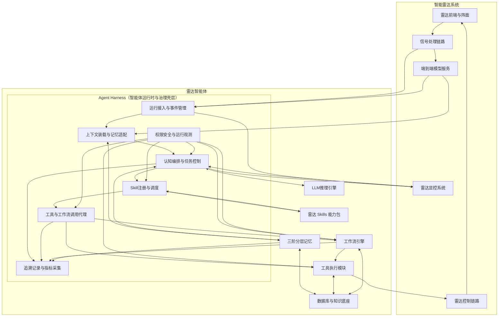
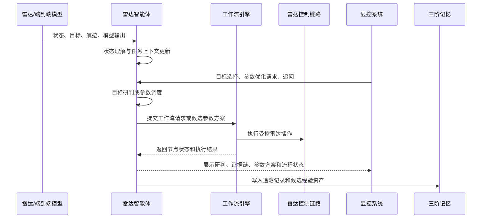

# 雷达智能体项目实施方案

## 1. 建设定位与方案升级关系

本文档承接前期《雷达智能体研究》的研究内容，是原雷达智能体方案面向项目实施阶段的详细版和升级版。研究阶段重点回答雷达智能体具备哪些功能、采用哪些核心技术、能够带来什么智能化价值；实施阶段重点回答这些功能如何搭建成系统、如何嵌入智能雷达、如何与端到端模型、雷达显控系统、雷达控制链路和数据底座协同运行，以及关键技术如何攻关落地。

本项目建设对象是嵌入智能雷达系统的雷达智能体。它与雷达端到端模型部署在同一智能雷达体系内，面向雷达显控系统提供智能调度、波形参数设置、当前环境目标研判、复杂场景解释、标准流程执行和经验沉淀能力。它的直接服务对象是雷达操作员、雷达任务流程和雷达系统内部的控制/分析组件。

实施方案继承原研究方案中的五大模块：认知核心模块、记忆管理模块、工具执行模块、工作流引擎、数据库管理与接入模块。在实施阶段，这五大模块从概念性功能描述进一步落成模块职责、接口关系、数据流转、任务执行链路和工程边界。原方案中的智能调度、波形参数设置、目标研判、工具调用、工作流执行和经验沉淀等功能，在本方案中分别对应到具体模块、输入输出、调用流程和关键技术攻关任务。

## 2. 能力体系与业务场景

本章完整承接原雷达智能体方案中的功能体系，并将其转化为实施阶段的能力边界和业务场景。雷达智能体不是单一问答工具，也不是独立于雷达系统之外的通用智能助手，而是嵌入智能雷达系统的智能协同层，围绕雷达调度、波形参数设置、当前环境目标研判和经验沉淀形成可落地能力。

### 2.1 建设目标

雷达智能体建设目标是推动智能雷达从“被动感知与人工配置”向“主动理解、智能协同、受控执行和经验进化”升级。系统以雷达显控系统为主要交互入口，以端到端模型和雷达状态数据为主要感知输入，以雷达控制链路和专业工具为执行出口，以三阶分层记忆支撑任务连续性和经验复用。

从评审视角看，本方案需要回答四个问题。第一，雷达智能体具备哪些完整能力；第二，这些能力在系统架构中由哪些模块承载；第三，一次目标研判或波形参数调整任务如何从触发走到输出和执行；第四，三阶分层记忆架构这一关键技术如何从研究内容落成工程机制。

### 2.2 核心能力体系

雷达智能体形成五类核心能力。

第一类是深度场景理解与目标研判能力。智能体接收雷达观测、端到端模型结果、航迹状态、环境信息、当前参数配置和历史案例，对当前目标的类别、行为、异常程度、跟踪质量、威胁等级和证据缺口进行综合研判。该能力不是简单展示模型结果，而是把观测事实、模型判断、历史经验和工具分析组织为可解释证据链，并通过显控系统呈现给操作员。

第二类是自然语言交互与人机协同能力。智能体通过显控系统接收自然语言、按钮操作、目标选择、区域选择、告警卡片和参数面板状态，将操作员意图解析为结构化雷达任务。系统支持多轮追问和连续指代，例如“分析这个目标”“继续刚才的研判”“沿用上次 A 区域方案”，并通过中期记忆保持目标、区域、参数和证据链的连续性。

第三类是智能雷达调度与波形参数设置能力。智能体根据任务目标、目标状态、环境条件、当前工作模式、端到端模型置信度、雷达资源约束和历史执行效果，生成工作模式选择、波形参数推荐、波束资源调度、检测门限调整和跟踪参数优化等候选方案。涉及雷达状态改变的动作统一进入工作流引擎，完成参数边界校验、仿真评估、审批确认、执行下发、效果监控和安全回滚。

第四类是工具统一调用与标准流程执行能力。智能体通过工具执行模块统一调用雷达控制工具、模型服务、数据查询工具、目标分析工具、参数仿真工具、工作流工具和报告生成工具。标准化、高风险或可重复的业务流程通过工作流模板执行，包括波形参数调整、异常目标研判、跟踪质量评估、复杂环境应对和参数回滚恢复。

第五类是持续学习与经验沉淀能力。智能体通过三阶分层记忆保存当前任务上下文、近期任务链和长期经验资产。每次目标研判、参数调度、工具调用、工作流执行和操作员反馈都会形成追溯记录，并经过经验抽取、评估发布和受控回流，支撑后续相似案例检索、参数策略推荐、工具匹配和工作流优化。

### 2.3 核心业务场景

实施方案围绕两类核心业务闭环展开。

第一类是智能雷达调度与波形参数设置闭环。智能体根据任务目标、目标状态、环境条件、端到端模型输出、雷达资源约束和历史执行效果，形成工作模式选择、波形参数推荐、波束资源调度、检测门限调整、跟踪参数优化等候选方案，并通过工作流引擎完成参数校验、仿真评估、审批确认、执行下发、效果监控和安全回滚。

第二类是当前环境目标研判闭环。智能体基于雷达观测、端到端模型输出、历史航迹、目标特征、环境因素、知识图谱和相似案例，对当前目标的类别、行为、异常程度、跟踪质量、威胁等级、证据缺口和后续处置动作进行综合分析，并通过显控系统以分层方式展示事实、证据、判断、置信度和推荐动作。

围绕上述两类闭环，系统还支撑日常状态理解、跟踪质量评估、异常原因分析、复杂环境应对、参数效果复盘、标准报告生成和经验资产沉淀等配套场景。这些场景共同构成雷达智能体从感知输入、智能研判、参数调度、流程执行到经验进化的完整业务范围。

## 3. 总体架构设计

### 3.1 设计思想

雷达智能体采用“LLM推理引擎 + Agent Harness运行时 + 雷达Skills能力包 + 受控工具/工作流/记忆/数据资源”的总体设计。LLM 推理引擎负责语义理解、复杂推理、计划生成和不确定性表达；Agent Harness 是围绕 LLM 推理引擎构建的智能体运行时与治理壳层，负责任务生命周期、上下文装载、执行循环、Skill 调度、工具/工作流调用、权限校验、运行观测和追溯记录；雷达 Skills 是面向目标研判、波形参数优化、异常归因、跟踪评估、复盘学习等任务的能力包和任务知识包；工具、工作流、记忆管理和数据底座作为受控资源或支撑组件，由 Harness 在任务运行过程中统一调度、治理和追溯。

该设计首先坚持雷达任务牵引。雷达智能体不是通用问答系统，也不是指挥所态势感知智能体，而是部署在智能雷达系统内部，围绕智能雷达调度、波形参数设置和当前环境目标研判运行。系统将雷达运行中的任务抽象为两类核心闭环：一类是围绕雷达资源、工作模式、波形参数、检测门限和跟踪参数展开的调度控制闭环；另一类是围绕目标、航迹、环境、模型置信度和异常证据展开的研判分析闭环。后续的模块、接口、工具、工作流和记忆设计都围绕这两类闭环展开。

其次，系统坚持推理能力与工程约束分离。LLM 负责理解、推理、计划和解释，但不直接执行雷达控制，也不直接越过参数边界、安全审批和工作流检查点。Agent Harness 负责把 LLM 的推理结果放入雷达工程约束中运行：它装载任务上下文，加载适用 Skill，限定可调用工具和工作流，执行权限与风险校验，记录运行轨迹，并把结果写入追溯记录。通过这种分工，智能体既能利用 LLM 的灵活推理能力，又能保证参数调度和控制执行处于可验证、可审计、可恢复的工程链路中。

第三，系统坚持“能力包、工具、工作流”分层。雷达 Skills 位于任务方法层，描述完成某类雷达任务时需要哪些上下文、遵循哪些步骤、使用哪些工具或工作流、输出什么结果、写入哪些记忆；工具执行模块位于原子能力层，负责封装数据查询、模型服务、分析算法、仿真评估、雷达控制和报告生成等能力；工作流引擎位于可靠流程层，负责把波形参数调整、异常目标研判、跟踪质量评估、参数回滚恢复等标准化或高风险流程固化为模板。Skill 不替代工具和工作流，而是为 Harness 和 LLM 提供任务方法与资源使用约束。

第四，系统坚持以三阶分层记忆支撑连续运行和经验进化。短期记忆服务当前任务上下文，中期记忆服务近期目标、区域、参数和异常事件的连续任务链，长期记忆服务雷达专业知识、历史案例、参数策略、异常模式和经验资产。三层记忆通过追溯记录、经验抽取、评估发布和受控回流贯通，使智能体能够从一次目标研判、一次参数调整和一次工作流执行中沉淀可复用经验。

这套设计的核心理由是：雷达系统同时具有实时运行要求、参数安全要求、复杂环境适应要求和长期经验积累要求。LLM 推理引擎提供智能理解和复杂推理，Agent Harness 提供运行时、编排和治理能力，雷达 Skills 把专业任务方法固化为可加载能力包，工具和工作流连接真实雷达系统并保障受控执行，三阶分层记忆支撑任务连续性和经验复用。通过这种关系，雷达智能体既具备 AI 原生的推理能力，又能够在雷达工程边界内稳定运行。

### 3.2 系统部署关系

雷达智能体部署在智能雷达系统内部，作为连接雷达端到端模型、雷达显控系统、雷达控制链路和数据知识底座的智能决策层。

```text
雷达传感器与前端设备
  → 信号处理链路
  → 端到端模型推理服务
  → 雷达状态、目标、航迹、置信度、异常评分
  → 雷达智能体
  → 显控系统展示、确认、执行、回放
  → 雷达控制链路和工作流执行链路
```

雷达端到端模型负责将雷达数据转化为目标检测、目标识别、航迹跟踪、目标分类、异常评分、环境感知和置信度输出。雷达智能体接收这些模型输出，将其纳入任务上下文，结合专业知识、历史经验和当前任务目标进行调度与研判。显控系统负责向智能体传递用户意图、当前界面上下文、目标选择、区域选择、参数面板状态和审批确认结果，同时接收智能体输出的候选判断、证据链、参数方案、流程状态和复盘结果。

这种部署关系把雷达智能体构建为雷达系统内部的智能协同层。端到端模型提供“当前看到了什么”和“模型有多确定”，显控系统提供“操作员正在关注什么”和“任务希望达成什么”，雷达控制链路提供“哪些参数和动作可以被执行”，数据知识底座提供“过去类似场景如何处理”。雷达智能体的职责是把这些信息组织成可执行任务，在安全边界内形成研判、参数方案和标准流程调用。

系统整体关系如下。



该部署关系体现三个实施重点。

第一，端到端模型和智能体形成上下游协同。端到端模型负责感知和识别，智能体负责理解、调度、解释和流程编排。模型输出不仅用于显控展示，也进入智能体任务上下文，成为目标研判、波形优化和经验沉淀的关键证据。

第二，显控系统是智能体的主要人机交互入口。操作员可以从目标列表、航迹视图、告警卡片、地图区域、参数面板和工作流面板触发智能体任务。智能体返回的内容也通过显控系统呈现为候选判断、证据链、参数方案、审批卡片、执行进度和复盘报告。

第三，雷达控制链路通过工具执行模块和工作流引擎进入智能体架构。涉及雷达状态改变的操作统一纳入工具描述、参数校验、工作流检查点和审计记录，使智能调度既具备灵活性，也具备工程可控性。

### 3.3 模块关系与数据流转

从模块关系看，雷达智能体处在“端到端模型输出”和“雷达控制执行”之间。LLM推理引擎负责语言理解、任务规划、复杂推理和结果生成；Agent Harness 负责智能体运行时支撑，将端到端模型输出转化为状态摘要、任务触发条件和可观测运行事件，并承载认知编排、上下文管理、Skill 调度、工具/工作流调用、权限安全、运行观测和追溯记录。认知编排与任务控制将显控系统输入、模型输出、记忆检索结果和候选能力包合并为任务上下文；雷达 Skills 能力包负责把任务映射为可复用的任务方法和资源使用约束；工具执行模块负责调用查询、分析、仿真、控制和报告工具；工作流引擎负责承接标准流程和高风险执行；数据库与知识底座负责保存结构化数据、向量知识、图谱关系、时序指标和追溯记录；三阶记忆负责把当前任务、中期任务链和长期经验连接起来。

从数据流转看，雷达智能体形成五条主数据流。

1. 感知数据流：雷达前端和信号处理链路产生回波、航迹、设备状态和环境指标，端到端模型输出检测、识别、跟踪、置信度和异常评分，Agent Harness 将这些内容标准化为目标状态、模型证据、运行事件和任务触发条件。
2. 交互数据流：显控系统把用户指令、目标选择、区域选择、参数面板状态、告警卡片上下文和审批结果传给认知核心，认知核心解析为结构化任务描述并写入任务上下文。
3. 推理数据流：认知核心基于任务上下文检索记忆、知识和能力包说明，选择目标研判、参数优化、跟踪评估、异常处置等 Skills，再由 Harness 按 Skill 约束调用相似案例检索、仿真评估、目标分析等工具，生成目标研判结果或候选参数方案。
4. 执行数据流：候选参数方案或工作流请求进入工作流引擎，工作流引擎调用工具执行模块和雷达控制链路完成参数校验、仿真评估、审批确认、执行下发、效果监控和回滚恢复。
5. 经验数据流：任务输入、上下文快照、工具调用、工作流节点、输出结果、操作员反馈和效果指标写入追溯记录，再进入短期记忆、中期任务链和长期经验资产库。

### 3.4 接口调用设计

从接口调用看，雷达智能体围绕外部接入和内部执行形成五类主接口。

1. 模型输出接入接口：由端到端模型服务向 Agent Harness 的运行接入与事件管理单元提供目标检测、识别、跟踪、置信度、异常评分和模型版本信息。接口输出进入状态理解类任务和任务上下文。
2. 显控交互接口：由显控系统经 Agent Harness 向认知编排组件提交用户指令、界面上下文、目标/区域引用、参数面板状态和审批结果；认知编排组件结合 LLM 推理结果向显控系统返回研判摘要、证据链、参数方案、流程状态和复盘报告。
3. Skill 调度接口：由认知编排组件根据任务类型、风险等级和上下文选择目标研判、参数优化、异常归因、跟踪评估等 Skills。Skill 接收任务上下文后，向 Harness 提供任务步骤、工具使用约束、工作流触发条件和记忆读写规则，由 Harness 按这些约束调度工具、工作流和记忆。
4. 工具调用接口：由 Harness 根据 Skill 约束、认知编排结果或工作流节点要求，通过工具执行模块调用数据查询、模型解释、目标分析、参数仿真、雷达控制和报告生成工具。每次调用都生成工具调用记录，并写入追溯记录。
5. 控制执行接口：由工作流引擎经工具执行模块调用雷达控制链路，执行工作模式切换、波形参数设置、检测门限调整、跟踪参数调整和参数回滚。控制执行接口携带审批状态、参数边界校验结果、检查点引用和审计标识。

上述主接口在工程实现中进一步展开为外部接入接口、内部支撑接口和控制执行接口，并按统一契约管理，避免各模块以临时字段直接耦合。接口矩阵如下。

| 接口 | 生产方 | 消费方 | 调用方式 | 核心对象 | 失败处理 | 追溯要求 |
| --- | --- | --- | --- | --- | --- | --- |
| 模型输出接入接口 | 端到端模型服务、信号处理链路 | Agent Harness、任务上下文、显控系统 | 事件推送为主，状态查询为辅 | 目标状态、航迹状态、模型证据、模型版本 | 模型低置信或字段缺失时标记证据质量，触发补证或人工复核 | 记录模型版本、时间窗口、目标引用和证据编号 |
| 显控交互接口 | 雷达显控系统、操作员 | Agent Harness、认知核心、工作流引擎 | 交互请求、审批回调、流程状态订阅 | 用户意图、界面焦点、目标/区域引用、审批结果 | 上下文缺失时返回追问；审批超时或否决时暂停或终止任务 | 记录用户操作、界面上下文、确认状态和展示结果 |
| Skill 调度接口 | Agent Harness、认知核心 | 雷达 Skills 能力包 | 同步选择，执行过程可异步回调 | Skill 调用、任务上下文、资源约束、记忆规则 | 无匹配 Skill 时降级为通用研判或请求人工选择；上下文不足时触发补证 | 记录 Skill 版本、匹配原因、输入上下文和输出质量 |
| 工具调用接口 | Agent Harness、工作流引擎 | 工具执行模块、外部分析服务、数据底座 | 同步调用短耗时工具，异步调用仿真和长耗时工具 | 工具调用、输入参数、输出结果、错误码、证据项 | 超时重试、备用工具、降级展示或人工确认；高风险工具失败时禁止继续控制 | 记录工具版本、参数、耗时、错误码、结果质量和证据引用 |
| 工作流执行接口 | Agent Harness、显控系统 | 工作流引擎、工具执行模块、显控系统 | 异步流程实例，节点状态持续回调 | 工作流实例、节点状态、检查点、回滚点 | 节点失败时按模板进入重试、等待确认、回滚或安全恢复分支 | 记录模板版本、节点输入输出、人工确认、异常分支和回滚结果 |
| 控制执行接口 | 工作流引擎、工具执行模块 | 雷达控制链路、雷达状态监测 | 受控同步下发，执行效果异步回传 | 参数方案、审批状态、控制请求、执行结果 | 参数越界、审批缺失、设备状态异常时拒绝执行；执行后效果异常时触发回滚 | 记录控制请求、校验结果、审批引用、执行时间和效果指标 |
| 记忆读写接口 | Agent Harness、认知核心、工具执行、工作流引擎 | 记忆管理模块、数据库与知识底座 | 短期记忆同步读写，中长期记忆异步沉淀 | 任务上下文、任务链、经验资产、追溯记录 | 记忆冲突时标记来源和版本；检索低置信时降低引用权重 | 记录记忆来源、版本、使用场景、写入规则和回流状态 |

### 3.5 典型调用链

典型接口调用链如下。

```text
目标研判调用链：
显控系统选择目标
  → 认知核心解析任务意图
  → 构建任务上下文
  → 接入端到端模型输出
  → 查询历史航迹
  → 检索相似案例
  → 调用目标研判工具
  → 向显控系统返回研判结果
  → 写入追溯记录

参数调度调用链：
显控系统或状态监测触发参数优化
  → 认知核心解析任务意图
  → 构建任务上下文
  → 检索参数调整案例
  → 生成候选参数方案
  → 调用参数仿真评估工具
  → 启动波形参数调整工作流
  → 执行雷达控制接口
  → 监控调整效果
  → 写入追溯记录
```

### 3.6 核心数据对象与接口契约

为了使雷达智能体能够从架构设计落到工程实现，系统需要在 Agent Harness 的运行治理下定义统一的数据对象和接口契约。各模块不直接交换零散字段，而是围绕任务实例、任务上下文、证据项、Skill 调用、工具调用、工作流实例、参数方案、研判结果、追溯记录和记忆资产等对象运行。这样可以保证显控系统、端到端模型、认知核心、Skills、工具、工作流和记忆管理使用同一套语义边界。

核心数据对象如下。

| 数据对象 | 主要字段 | 使用模块 | 作用 |
| --- | --- | --- | --- |
| 任务实例 | 任务标识、触发来源、任务类型、目标/区域引用、风险等级、状态、创建时间 | Agent Harness、认知核心、工作流引擎 | 承载一次智能体任务的生命周期，是所有模块协同的主索引。 |
| 任务上下文 | 显控上下文、雷达状态、模型输出、当前证据、候选方案、执行状态、上下文版本 | 认知核心、记忆管理、Skills | 为目标研判、参数调度和流程执行提供统一任务视图。 |
| 证据项 | 证据编号、来源类型、来源引用、时间窗口、置信度、适用范围、质量标识 | 认知核心、工具执行、显控系统、追溯记录 | 支撑证据链展示、结论引用和复盘回放。 |
| Skill 调用 | Skill 标识、版本、输入上下文、可调用工具、可调用工作流、执行结果、记忆规则 | Skills、Agent Harness、追溯记录 | 记录任务能力的选择、执行和效果。 |
| 工具调用 | 工具标识、版本、输入参数、输出结果、错误码、耗时、证据编号、审计级别 | 工具执行模块、记忆管理、追溯记录 | 保证每次外部能力调用可校验、可复用、可审计。 |
| 工作流实例 | 模板标识、模板版本、节点状态、检查点、人工确认、异常分支、回滚点 | 工作流引擎、显控系统、追溯记录 | 承载标准流程和高风险动作的可靠执行。 |
| 参数方案 | 参数类型、候选值、适用条件、推荐依据、仿真结果、风险点、回滚条件 | 认知核心、参数调度 Skill、工作流引擎 | 支撑波形参数设置、门限调整、跟踪参数优化等任务。 |
| 研判结果 | 目标引用、事实摘要、证据链、候选判断、不确定性、后续动作、展示层级 | 认知核心、显控系统、记忆管理 | 支撑当前环境目标研判和显控展示。 |
| 追溯记录 | 任务输入、上下文版本、Skill 调用、工具调用、工作流节点、输出结果、反馈、效果指标 | Agent Harness、数据库管理、记忆管理 | 支撑审计、复盘、经验抽取和版本回放。 |
| 记忆资产 | 来源任务、资产类型、情景摘要、模式标签、适用范围、质量状态、版本状态 | 记忆管理、长期记忆、Skills | 支撑经验沉淀、相似案例检索和策略回流。 |

接口契约包括三类约束。

1. 输入输出约束。所有接口请求需要包含任务标识、目标/区域引用、时间窗口、调用来源、权限信息和上下文版本；所有接口返回需要包含结果状态、错误码、证据编号、耗时、质量标识和追溯引用。
2. 状态流转约束。任务实例、工具调用和工作流实例均采用状态机管理，状态变化必须写入追溯记录。典型状态包括已创建、执行中、等待确认、已完成、已失败、已回滚和已归档。
3. 版本追溯约束。Skill、工具、工作流模板、参数方案、记忆资产和追溯记录都保留版本信息。历史任务回放时，系统按当时版本还原上下文、工具结果和工作流逻辑，避免后续版本变化影响复盘结论。

任务实例状态机用于统一约束智能体执行过程。每次显控触发、模型事件触发或状态告警触发后，Harness 都先创建任务实例，再根据任务类型进入研判、调度、工作流或复盘路径。典型状态流转如下。

| 状态 | 进入条件 | 主要动作 | 下一状态 |
| --- | --- | --- | --- |
| 已创建 | 显控请求、模型事件、雷达状态告警或工作流回调触发任务 | 分配任务标识，绑定目标/区域引用、触发来源和风险等级 | 上下文装载中 |
| 上下文装载中 | 任务实例创建完成 | 装载显控上下文、雷达状态、端到端模型结果、三阶记忆和历史追溯记录 | 执行中、等待补证、已失败 |
| 执行中 | 上下文满足 Skill 输入要求 | 选择 Skill，调用 LLM 推理，按约束调度工具、工作流和记忆读写 | 等待确认、等待工具/工作流、结果校验中、已失败 |
| 等待工具/工作流 | 工具调用或工作流节点进入异步执行 | 监听工具结果、工作流节点状态、异常分支和检查点 | 执行中、等待确认、回滚中、已失败 |
| 等待补证 | 模型低置信、证据不足或上下文引用不完整 | 向显控系统发起追问，或触发补充查询、扩大时间窗口、增加工具分析 | 执行中、已取消 |
| 等待确认 | 参数调整、控制下发、高风险研判或经验发布需要人工确认 | 展示参数方案、证据链、风险说明、回滚条件和审批入口 | 执行中、回滚中、已取消 |
| 结果校验中 | 研判结果、参数方案或流程结果生成 | 校验证据引用、参数边界、工具结果质量、工作流状态和记忆写入规则 | 已完成、等待补证、回滚中 |
| 回滚中 | 控制执行失败、效果异常、人工要求恢复或安全策略触发 | 根据检查点恢复参数或切换安全模板，记录回滚原因和恢复效果 | 已回滚、已失败 |
| 已完成 | 输出通过校验且无需继续执行 | 向显控系统返回结果，写入追溯记录，触发短期到中期、长期记忆流转 | 已归档 |
| 已失败/已取消 | 工具不可用、权限不足、上下文无法补齐、用户取消或流程异常终止 | 返回失败原因、保留上下文快照和已完成节点，避免错误经验进入长期记忆 | 已归档 |
| 已回滚 | 控制动作恢复完成或安全模板生效 | 展示回滚结果，写入追溯记录，形成参数失效条件和安全恢复案例候选 | 已归档 |
| 已归档 | 任务完成、失败、取消或回滚后的收尾状态 | 固化追溯记录、更新任务链索引、生成经验候选或失败样例 | 结束 |

通过上述数据对象和接口契约，雷达智能体的各个模块可以稳定集成。显控系统看到的是任务、证据、方案和流程状态；认知核心处理的是任务上下文、证据链和候选动作；工具执行模块处理的是标准化工具调用；工作流引擎处理的是模板实例和节点状态；记忆管理模块处理的是追溯记录、任务链和经验资产。

## 4. 功能落地与任务执行设计

雷达智能体按照任务类型组织执行机制。不同任务对时效、证据、控制边界和输出形态的要求不同，因此系统为状态理解、目标研判、参数调度、标准流程和复盘学习分别设计执行链路。这样可以从“智能体如何完成任务”的角度描述技术方案，也便于后续实施时按任务闭环拆分工具、接口和验证项。

各类任务共享一条基础运行链路。显控系统、雷达状态监测或端到端模型结果触发任务后，Agent Harness 创建任务实例，认知核心解析任务意图并建立短期任务记忆；随后从中期记忆检索近期目标、区域和参数任务链，从长期记忆检索雷达知识、相似案例和历史经验；认知核心据此选择执行路径和 Skill，Harness 再按 Skill 声明的资源约束匹配工具或工作流，生成目标研判结果、候选参数方案或流程执行请求；工作流引擎负责高风险参数动作和标准流程的受控执行；结果通过显控系统展示、确认和追问，并以追溯记录形式写回三阶记忆。

```text
显控触发 / 状态触发 / 模型结果触发
  → Agent Harness创建任务实例
  → 认知核心解析任务意图
  → 建立短期任务记忆
  → 检索中期任务链和长期经验
  → 选择执行路径和Skill
  → Skill匹配工具或工作流
  → 生成目标研判、候选参数方案或流程请求
  → 显控展示或进入受控执行
  → 追溯记录写入三阶记忆
```

这条基础链路把原方案中的功能清单转化为可实施的运行机制。状态理解类任务重点完成雷达状态进入任务记忆，目标研判类任务重点完成证据汇聚和判断生成，参数调度类任务重点完成候选方案生成和受控执行，标准流程类任务重点完成流程模板调用和检查点管理，复盘学习类任务重点完成追溯记录到经验资产的转化。

### 4.1 状态理解类任务

状态理解类任务负责把雷达系统的连续运行状态转化为智能体可理解、显控系统可展示、后续任务可引用的结构化状态。输入包括雷达状态流、端到端模型输出、目标航迹更新、设备健康状态、环境指标、当前工作模式和显控系统当前焦点。输出包括目标状态摘要、模型置信度摘要、异常提示、基础风险标识、任务触发条件和上下文引用。

状态理解类任务的执行链路如下。

```text
雷达状态 / 端到端模型输出
  → 状态标准化
  → 目标与航迹摘要
  → 置信度与异常评分解析
  → 显控状态刷新
  → 任务触发条件判断
```

该类任务解决的关键问题是当前雷达状态如何进入智能体任务记忆。端到端模型输出包含检测、航迹、类别、置信度和异常分数，Agent Harness 将这些结果作为当前状态证据写入短期任务记忆。这样，目标研判和参数调度可以直接引用当前目标状态，并在后续追问、参数调整和复盘中保持证据来源一致。

### 4.2 目标研判类任务

目标研判类任务负责对当前环境中的目标、异常、跟踪质量和威胁程度进行综合分析。输入包括目标引用、区域引用、时间窗口、端到端模型输出、历史航迹、环境信息、当前参数配置、历史相似案例和知识图谱关系。输出为目标研判结果，包括观测事实、支撑证据、候选判断、置信度、不确定性和推荐动作。

目标研判类任务的执行链路如下。

```text
目标/区域选择
  → 汇聚模型输出、航迹、环境和参数状态
  → 检索历史相似案例和知识图谱
  → 调用目标行为分析、跟踪质量评估、异常归因工具
  → 形成候选研判、证据链和不确定性
  → 显控系统分层展示
```

该类任务解决的关键问题是复杂目标判断如何形成可信证据链。系统将端到端模型判断、航迹变化、环境因素、设备状态、历史案例和知识图谱关系分别作为证据来源，并在输出中区分观测事实、模型判断、智能体推理和待确认结论。这样，操作员可以看到智能体判断的依据、置信度和证据缺口。

### 4.3 参数调度类任务

参数调度类任务负责生成雷达工作模式、波形参数、检测门限、跟踪参数和资源调度方案。输入包括当前任务目标、目标状态、环境状态、当前参数配置、端到端模型置信度、跟踪质量指标、历史参数案例和设备约束。输出为候选参数方案，包括候选参数集合、适用范围、推荐依据、预期收益、风险点、验证结果和回滚方案。

参数调度类任务的执行链路如下。

```text
参数优化触发
  → 汇聚目标、环境、模型输出和当前参数状态
  → 检索历史参数案例和策略知识
  → 生成候选参数方案
  → 调用仿真评估和性能估计工具
  → 进入波形参数调整工作流
  → 执行、监控、回滚或确认
```

该类任务解决的关键问题是智能推理如何参与雷达参数设置。智能体生成的是候选参数方案，方案需要携带依据、适用范围、风险和回滚方式。涉及雷达控制链路的动作通过工作流引擎完成参数边界校验、仿真评估、审批确认、执行下发和效果监控。这样，智能体能够参与调度决策，同时保持参数执行过程可控、可审计、可恢复。

### 4.4 标准流程类任务

标准流程类任务负责把高频、稳定、可验证的雷达业务固化为工作流模板。典型任务包括波形参数调整、异常目标研判、跟踪质量评估、复杂环境应对、参数回滚恢复和报告生成。输入包括任务请求、目标引用、参数方案、工作流模板和执行上下文；输出包括工作流运行记录、节点状态、检查点、审批记录、执行结果和追溯记录。

标准流程类任务的执行链路如下。

```text
任务请求 / 候选方案
  → 匹配工作流模板
  → 注入运行参数
  → 节点执行与检查点保存
  → 人工确认或自动继续
  → 结果回填任务上下文
  → 写入追溯记录
```

该类任务解决的关键问题是雷达智能体如何稳定执行可重复业务。工作流将参数校验、状态检查、仿真评估、审批确认、执行下发、效果监控和回滚恢复固化为节点，使智能体可以调用流程、解释流程和使用流程结果，而关键业务动作由可追溯的流程引擎承接。

### 4.5 复盘学习类任务

复盘学习类任务负责将一次目标研判、参数调度或工作流执行转化为可检索、可评估、可复用的经验资产。输入包括追溯记录、操作员反馈、执行效果指标、模型输出变化、参数调整历史和工作流节点记录。输出包括情景摘要、模式标签、候选经验片段、评估样例、工具路由信号和经验资产。

复盘学习类任务的执行链路如下。

```text
任务完成
  → 汇总追溯记录
  → 抽取关键证据、参数变化和执行效果
  → 生成情景摘要与模式标签
  → 进入经验资产评估
  → 回流长期记忆、Skill选择、工具匹配和工作流优化
```

该类任务解决的关键问题是智能体如何持续成长。系统将真实任务中的目标状态、模型判断、参数方案、工具调用、工作流结果和操作员反馈转化为经验资产，并通过评估、发布和回流机制进入长期记忆。这样，后续相似目标研判和参数调度可以复用历史经验。

### 4.6 任务协同链路

五类任务在运行时形成协同链路。状态理解类任务持续提供当前雷达状态和模型证据；目标研判类任务在复杂目标、异常和低置信度场景中形成判断；参数调度类任务根据研判结果和任务目标生成候选参数方案；标准流程类任务负责安全执行和过程追踪；复盘学习类任务把执行结果沉淀为经验。



这种任务协同机制使雷达智能体能够围绕不同类型任务选择不同技术组合：状态理解依赖标准化和轻量判断，目标研判依赖检索增强和证据融合，参数调度依赖候选方案生成和仿真评估，标准流程依赖工作流模板，复盘学习依赖追溯记录和三阶记忆。

### 4.7 核心业务闭环落地设计

系统总体设计最终落在两类核心业务闭环上。

第一类是智能雷达调度与波形参数设置闭环。该闭环围绕“发现需求、生成方案、评估方案、受控执行、监控效果、沉淀经验”展开。任务由操作员参数优化请求、检测率下降、虚警升高、跟踪质量下降、模型异常评分升高、环境变化或工作流回调触发。智能体汇聚当前任务模式、工作模式、波形参数、检测门限、跟踪参数、目标航迹、环境状态、历史相似任务和端到端模型输出，生成候选参数方案。候选方案包含调整目标、参数集合、适用范围、推荐依据、预期收益、风险说明和回滚方案。方案随后进入波形参数调整工作流，由工作流完成参数边界校验、任务适配检查、仿真评估、审批确认、执行下发和效果监控。执行结果写入追溯记录，中期记忆保存参数调整历史，长期记忆抽取稳定经验，形成参数策略候选、相似案例和工具路由信号。

第二类是当前环境目标研判闭环。该闭环围绕“接收模型输出、汇聚证据、形成判断、表达不确定性、触发后续动作、沉淀案例”展开。任务由操作员选择目标、端到端模型低置信度或异常评分、目标航迹异常、环境状态变化或历史任务回调触发。智能体汇聚目标检测、识别、跟踪、分类结果，模型置信度、异常评分、中间特征摘要，航迹连续性、速度变化、机动特征、空间关系，当前波形、门限、跟踪参数、资源分配，环境因素、设备状态、历史相似案例和目标类型知识。研判输出采用分层结构，区分观测事实、支撑证据、候选判断、不确定性和推荐动作，并通过显控系统呈现为目标卡片、证据链面板、参数方案卡片、风险说明和后续动作按钮。任务完成后，目标状态、证据链、研判结果、用户反馈和后续效果进入追溯记录，长期记忆抽取目标案例、异常模式、误判原因和有效处置策略。

### 4.8 任务类型与模块映射

为了让功能落地不停留在流程描述上，系统按任务类型明确模块分工、关键接口、记忆读写和输出形态。实施时，每类任务都可以据此拆分为 Skill、工具、工作流模板、数据接口和验证样例。

| 任务类型 | 主要触发来源 | 主承载模块 | 关键调用 | 记忆读写 | 显控输出 |
| --- | --- | --- | --- | --- | --- |
| 状态理解类任务 | 模型结果刷新、雷达状态变化、显控焦点切换 | Agent Harness、认知核心 | 模型输出接入、状态查询、时序数据查询 | 写入短期状态证据，更新目标/区域当前上下文 | 状态摘要、告警提示、目标卡片更新 |
| 目标研判类任务 | 目标选择、异常评分升高、低置信度、操作员追问 | 认知核心、目标研判 Skill、记忆管理 | 航迹查询、相似案例检索、图谱关系查询、目标行为分析 | 读取中期目标时间线和长期案例，写入研判结果和证据链 | 事实摘要、证据链、候选判断、不确定性、后续动作 |
| 参数调度类任务 | 参数优化请求、检测效果下降、跟踪质量下降、环境变化 | 参数优化 Skill、工具执行模块、工作流引擎 | 当前参数查询、策略检索、仿真评估、控制执行接口 | 读取参数历史和策略经验，写入候选方案、执行结果和效果指标 | 参数方案卡片、风险说明、审批卡片、效果曲线 |
| 标准流程类任务 | Skill 调用、显控按钮触发、系统事件触发 | 工作流引擎、工具执行模块 | 工作流模板匹配、节点工具调用、人工确认、回滚接口 | 写入工作流节点、检查点、异常分支和回滚记录 | 流程进度、等待确认节点、执行结果、回滚状态 |
| 复盘学习类任务 | 任务完成、人工复盘、周期性经验治理 | 记忆管理、复盘学习 Skill、数据库管理 | 追溯回放、效果指标查询、经验候选抽取、质量评估 | 读取追溯记录，写入中期任务链和长期经验候选 | 复盘摘要、经验片段、失败原因、版本状态 |

该映射关系同时约束模块间的数据流。状态理解类任务主要产生当前证据，目标研判类任务把证据组织为判断，参数调度类任务把判断转化为候选参数方案，标准流程类任务把候选方案转化为受控执行过程，复盘学习类任务把执行过程转化为经验资产。每一类任务都必须生成追溯记录，并至少写入一种记忆层级：状态理解写入短期记忆，目标研判和参数调度写入短期与中期记忆，标准流程写入短期记忆和追溯记录，复盘学习写入长期记忆候选池。

## 5. 分模块实施设计

分模块设计用于回答“原方案中的功能由哪些工程模块承载、模块之间如何调用、运行数据如何流转”。实施阶段将雷达智能体拆解为 LLM 推理引擎、Agent Harness 运行时、雷达 Skills 能力包以及工具/工作流/记忆/数据等受控资源。LLM 推理引擎负责语义理解、复杂推理和生成；Agent Harness 负责围绕 LLM 的任务生命周期、上下文装载、执行循环、Skill 调度、工具与工作流调用、权限安全、运行观测和追溯记录；雷达 Skills 负责把任务方法和专业约束封装为可加载能力包；工具执行模块、工作流引擎、记忆管理模块、数据库管理与接入模块作为被 Harness 编排和治理的能力资源，分别承担原子能力调用、可靠流程执行、上下文与经验管理、数据知识支撑。原方案中的五个核心模块仍然保留，但在实施形态上需要区分“运行时治理层”和“受控资源层”。

本章按“运行底座、任务能力包、核心资源组件”的顺序展开。5.1 说明 Agent Harness 如何作为智能体运行时与治理壳层承载任务执行循环，5.2 说明 Skills 如何把雷达任务方法封装为可加载能力包，5.3 至 5.7 则对应原方案中的认知核心、记忆管理、工具执行、工作流引擎、数据库管理与接入模块。这样组织的原因是：评审专家可以先理解 LLM 推理如何被运行时接住和治理，再理解每类雷达任务如何通过 Skill 能力包进入系统，最后看到原五大模块分别如何落成可调用、可治理、可追溯的工程组件。

### 5.1 Agent Harness 运行底座

Agent Harness 是雷达智能体围绕 LLM 推理引擎构建的运行时与治理壳层，负责把任务生命周期、上下文装载、执行循环、Skill 调度、工具调用、工作流调用、安全校验、运行观测和追溯记录组织成可持续运行的智能体过程。它不是把工具、工作流、记忆和数据底座全部合并进来的“大模块”，也不是独立于原五大模块之外的旁路组件，而是位于 LLM 与工具/工作流/记忆/数据等受控资源之间的编排和治理层。LLM 通过 Harness 获取上下文、加载 Skill 能力包和使用受控资源，Harness 再把推理结果转化为雷达系统可执行、可审计、可恢复的任务过程。

Agent Harness 的核心职责包括：

1. 会话与任务生命周期管理：为每次显控触发、状态触发或模型结果触发建立任务实例，记录任务开始、暂停、恢复、完成和失败状态。
2. 上下文装载与裁剪：从短期记忆、中期记忆、长期记忆和显控界面上下文中装载任务所需信息，并根据任务类型生成认知核心可使用的上下文视图。
3. 执行循环承载：承载“计划、调用、观察、修正”的智能体执行循环，负责在 LLM、Skill、工具、工作流和记忆之间传递状态，记录每一步推理、Skill 选择、工具调用、工作流调用和结果观察。
4. 权限与风险控制：在调用雷达控制工具、参数调整工作流和高风险 Skill 前检查用户权限、风险等级、审批状态和参数边界。
5. 可观测性与追溯：统一记录任务输入、上下文版本、Skill 选择、工具结果、工作流节点、异常事件、耗时指标和输出结果。
6. 异常恢复与降级：在工具超时、工作流失败、上下文不足、模型低置信或权限不满足时，触发重试、降级、人工确认或回滚流程。

Agent Harness 在工程上由六类运行组件组成。第一类是事件接入与任务管理组件，负责接收显控系统操作、端到端模型状态事件、雷达运行告警和工作流回调，并统一转化为智能体任务实例。第二类是上下文与记忆适配组件，负责装载显控上下文、雷达状态、三阶记忆和历史追溯记录，并向 LLM 推理引擎提供裁剪后的上下文视图。第三类是 Skill 注册与调度组件，负责管理 Skill 元数据、版本、触发条件、输入要求、风险边界和记忆读写规则。第四类是工具与工作流调用代理，负责把 Skill 声明的工具需求、工作流触发条件和记忆访问规则转化为统一接口请求，并执行参数校验、权限检查、超时控制和结果标准化。第五类是安全与运行治理组件，负责高风险动作审批、参数边界控制、异常降级、回滚触发和审计留痕。第六类是可观测性组件，负责记录任务轨迹、耗时指标、失败原因、上下文版本、工具成功率和工作流节点状态。

Agent Harness 的核心运行对象是任务实例。每个任务实例包含任务标识、触发来源、任务类型、目标/区域引用、当前雷达状态、显控界面状态、已装载记忆、候选 Skill、候选工具、工作流状态、用户确认状态、输出结果和追溯记录引用。任务实例贯穿一次智能体执行全过程：任务创建时绑定显控和雷达状态，任务执行时承载推理循环和工具反馈，任务完成时沉淀为追溯记录并触发记忆流转。这样设计可以避免各模块各自维护状态，保证认知核心、Skills、工具、工作流和记忆管理围绕同一个任务对象运行。

在接口层面，Agent Harness 对外承接显控系统、端到端模型服务、雷达控制链路和数据底座，对内承接 LLM 推理引擎、Skills、工具执行模块、工作流引擎和记忆管理模块。显控系统向 Harness 传入用户意图、界面焦点、目标选择、区域选择和审批确认；端到端模型服务向 Harness 传入目标、航迹、分类、置信度和异常评分；雷达控制链路接收 Harness 经过工作流校验后的控制请求；数据底座向 Harness 提供查询、检索、关系推理和追溯记录能力。通过 Harness 的统一接口，LLM 不直接面对复杂系统接口，而是在受控的任务上下文和工具集合中完成推理。

Agent Harness 承载雷达 Agent Run Loop。该循环不是单次 LLM 调用，而是围绕任务实例持续推进的“感知、规划、执行、观测、校验、记忆”过程。

```text
事件接入
  → 创建任务实例
  → 装载显控上下文、雷达状态、模型证据和三阶记忆
  → 根据任务类型加载 Skill 能力包
  → LLM 生成研判计划、参数方案或补证路径
  → Harness 按 Skill 约束调度工具、工作流和记忆读写
  → 观察工具结果、工作流节点、模型置信度和雷达效果指标
  → 校验证据链、参数边界、权限状态和输出格式
  → 向显控系统返回结果、确认请求或流程状态
  → 写入追溯记录并触发记忆流转
```

该运行循环在不同任务中表现为不同执行路径。状态理解类任务主要走“事件接入、上下文装载、状态摘要、显控展示”；目标研判类任务重点走“证据汇聚、相似案例检索、异常归因、结论校验”；参数调度类任务重点走“候选方案生成、仿真评估、审批确认、控制执行、效果监控”；复盘学习类任务重点走“追溯读取、经验抽取、质量评估、受控回流”。Harness 通过同一个任务实例串联这些路径，使智能体可以在任务之间复用上下文和经验，而不是把每次交互处理成互不相关的问答。

为保证运行循环可以被工程验证，Harness 同时采集运行观测指标。核心指标包括任务完成率、任务取消率、工具调用成功率、工作流节点通过率、人工确认率、参数方案采纳率、控制回滚率、证据引用完整率、记忆检索命中率、端到端响应时延、LLM 输入上下文长度、异常恢复耗时和经验回流通过率。上述指标既用于系统运行监控，也用于评估 Skills、工具、工作流模板和三阶记忆是否真正提升目标研判和参数调度质量。

这样设计的原因是雷达智能体不是一次性模型调用，而是持续运行在显控系统和雷达控制链路之间的工程系统。LLM 只提供推理能力，真正让智能体能够稳定运行的是 Harness。Harness 让智能体具备状态保持、Skill 调用、工具治理、流程执行、安全控制、异常恢复和过程观测能力，保证智能推理能够被雷达系统接住、管住和复盘。

### 5.2 雷达 Skills 能力包体系

Skills 是雷达智能体的任务能力包机制。原方案中的目标研判、参数优化、异常归因、跟踪评估、报告生成、复盘学习等能力，在实施阶段不直接写成零散提示词或临时工具调用，而是封装为可加载、可注册、可选择、可组合、可评估的 Skill。每个 Skill 面向一类雷达任务或任务片段，明确任务入口、上下文要求、专业步骤、可调用工具、可调用工作流、输出格式、风险边界和记忆读写规则。Skill 更接近任务知识包和操作规程包，不是底层执行模块，也不直接替代工具或工作流。

Skills 与工具执行模块、工作流引擎之间形成三层关系。Skill 是任务方法包，描述完成某类雷达任务的步骤、约束、资源使用方式和输出要求；工具执行模块是原子能力接口，负责把雷达控制、数据查询、模型服务、分析算法、仿真评估等能力标准化封装并安全调用；工作流引擎是可靠流程执行器，负责把波形参数调整、异常目标研判、回滚恢复等标准化或高风险流程按模板执行。一个 Skill 可以声明多个可用工具和工作流触发条件，Harness 根据这些声明完成实际调度；工作流内部也可以继续调用工具。这样，Skill 负责“任务应该怎么做”，工具负责“具体能力怎么调”，工作流负责“标准流程怎么可靠执行”，Harness 负责“调用过程如何被编排、治理和追溯”。

Skill 的标准结构包括：

1. 技能标识：技能名称、版本、适用任务类型和维护责任。
2. 触发条件：适用的显控操作、状态触发条件、模型结果触发条件和人工调用入口。
3. 输入上下文：目标引用、区域引用、时间窗口、当前参数、模型结果、历史案例、用户意图等必要信息。
4. 执行步骤：技能内部的推理顺序、工具调用顺序、工作流调用条件和人工确认节点。
5. 可调用资源：允许调用的工具、工作流、数据库查询和记忆检索范围。
6. 风险边界：是否影响雷达运行状态、是否需要审批、参数边界、回滚要求和禁止动作。
7. 输出规范：面向显控系统的摘要、证据链、候选参数方案、流程请求、报告或复盘结果。
8. 记忆规则：短期记忆写入项、中期任务链更新项、长期经验候选项和追溯记录字段。

雷达智能体的基础 Skill 集包括：

1. 目标研判 Skill：汇聚目标状态、航迹、模型结果、环境信息和历史案例，输出目标判断、证据链、不确定性和推荐动作。
2. 波形参数优化 Skill：基于任务目标、目标状态、环境条件、当前参数和历史效果生成候选波形参数方案。
3. 跟踪质量评估 Skill：分析航迹连续性、丢点率、关联稳定性、测量误差和机动特征，输出跟踪质量等级和参数调整方向。
4. 异常归因 Skill：针对低置信度、虚警升高、跟踪异常、环境突变等情况，分析可能原因和补证路径。
5. 参数调整说明 Skill：把候选参数方案转化为操作员可理解的调整理由、预期收益、风险说明和回滚方案。
6. 复盘学习 Skill：从追溯记录中抽取情景摘要、模式标签、效果指标、失败原因和经验候选项。
7. 显控报告 Skill：面向显控系统生成目标卡片、证据链面板、参数方案卡片、复盘报告和技术摘要。

Skill 调用链路如下。

```text
结构化任务描述
  → Skill 匹配
  → Skill 上下文检查
  → Skill 执行步骤展开
  → Harness 按 Skill 约束调度工具、工作流和记忆
  → 生成结构化输出
  → 写入追溯记录和三阶记忆
```

这样设计的原因是雷达智能体的能力会持续增长，如果全部依赖临时提示和自由工具调用，系统会难以稳定复用、难以验证、难以审计。Skills 将雷达专业任务固化为可治理的任务能力包，使智能体既保持智能推理的灵活性，又具备工程系统要求的稳定性、可复用性和可追溯性。工具系统和工作流引擎仍然保留清晰边界：工具系统提供原子接口能力，工作流引擎提供可靠流程能力，Skills 在任务方法层约束二者的使用方式。

Skills 在工程实现中还需要具备注册、评估、发布和迭代机制。每个 Skill 注册时需要提交能力包说明、输入 schema、输出 schema、可调用工具清单、可调用工作流清单、风险等级、权限要求、记忆读写规则、提示模板、示例任务和测试样例。Agent Harness 在运行时根据任务类型、目标/区域引用、上下文完整性、工具可用性和历史效果选择 Skill，并在执行结束后记录 Skill 的调用耗时、成功率、人工确认率、回滚率和用户反馈。对于参数调度、异常目标研判等高风险 Skill，系统保留版本号和发布状态，新的 Skill 版本先以候选能力包参与影子运行和人工审核，验证稳定后再进入正式调度。这样可以让 Skills 既是任务能力封装，也是可评估、可治理、可持续演进的工程资产。

### 5.3 认知核心模块

认知核心模块是雷达智能体的任务执行核心，在实施形态上由 LLM 推理引擎和 Agent Harness 内的认知编排组件共同实现。LLM 推理引擎负责语言理解、复杂推理、计划生成和响应生成；认知编排组件负责把用户意图、雷达状态、模型输出、任务目标、记忆知识、Skills 和雷达工具组织成可执行的智能任务。它的设计目标是形成可追踪、可验证、可协同的雷达智能体运行机制。

认知核心模块承担雷达智能体的构建主线。它把显控输入转化为结构化任务描述，把模型输出和雷达状态组织为任务上下文，把任务复杂度转化为执行路径选择结果，把任务意图转化为候选 Skill，把 Skill 选择转化为候选工具集，把推理结果转化为候选参数方案或目标研判结果，把执行过程转化为追溯记录。通过这条主线，智能体从“能够回答问题”落成“能够参与雷达调度和目标研判”的工程系统。

认知核心模块由六个运行单元组成。其中 LLM 推理引擎承担意图理解、复杂推理和响应生成中的智能推理部分，Agent Harness 承担任务上下文、路径选择、Skill与工具匹配、验证追溯和执行治理部分。

认知核心模块的输入包括四类信息。第一类是显控交互输入，包括自然语言指令、目标选择、区域框选、按钮操作、告警卡片、参数面板状态和审批确认。第二类是雷达运行输入，包括当前工作模式、波形参数、检测门限、跟踪参数、设备状态、资源占用和环境信息。第三类是端到端模型输入，包括检测、识别、分类、跟踪、置信度、异常评分和模型版本。第四类是记忆与知识输入，包括短期任务上下文、中期任务链、长期知识案例和历史追溯记录。模块输出包括结构化任务对象、执行路径决策、候选 Skill、候选工具集合、目标研判结果、参数候选方案、工作流调用请求、显控展示内容和追溯记录。

认知核心的内部运行采用“任务对象化、证据链化、执行可追踪”的方式实现。任务对象化是指所有输入先被归并为统一的雷达任务对象，避免自然语言、模型输出和显控状态分别流转。证据链化是指目标研判、参数调度和异常归因都必须保留证据引用，区分观测事实、工具结果、历史案例、模型判断和智能体推理。执行可追踪是指每一步意图解析、上下文装载、Skill 匹配、工具调用、工作流调用、结果验证和响应生成都写入追溯记录，使后续复盘能够还原智能体为何做出某个判断或参数推荐。

#### 5.3.1 意图理解单元

意图理解单元接收显控系统输入，将自然语言、按钮操作、目标选择、区域选择、告警卡片、参数面板状态和当前任务模式统一解析为结构化任务请求。

典型输入包括：

1. “分析这个目标是否异常。”
2. “优化当前区域的探测参数。”
3. “为什么刚才跟踪质量下降？”
4. “把 A 区域切换到更适合弱小目标检测的模式。”
5. “对比上次参数调整前后的效果。”

结构化任务请求包含任务类型、目标引用、区域引用、时间范围、当前参数配置、期望输出、风险等级、用户权限、界面上下文和后续动作类型。这样设计的原因是显控系统中的用户意图通常与当前目标、地图区域、参数面板和告警状态强相关，结构化解析可以减少后续模型推理中的歧义。

该单元解决的关键问题是显控交互如何进入智能体任务体系。雷达操作员的输入通常同时绑定目标卡片、航迹视图、地图区域、参数面板和当前任务模式。意图理解单元把这些界面上下文与语言意图一起编码，形成后续模块可以稳定处理的任务对象。

意图理解单元在实施中包含三项机制。第一是多轮指代解析机制，将“这个目标”“刚才那个区域”“上次参数方案”等表达解析为显控系统中的目标编号、航迹编号、区域范围或参数方案版本。第二是主动补全机制，当任务缺少目标、时间窗口、参数类别或风险确认时，系统通过显控交互发起澄清，而不是直接生成不完整方案。第三是任务分类机制，将输入划分为状态查询、目标研判、参数调度、标准流程、复盘学习和报告生成等类型，并标注风险等级和是否需要工作流承接。这样可以保证后续路径选择、Skill 匹配和工具调用有稳定入口。

#### 5.3.2 雷达任务上下文

雷达任务上下文是一次智能任务的认知工作台。它围绕目标、区域、任务和参数方案维护当前上下文。

任务上下文包含：

1. 任务目标：例如目标研判、参数优化、异常归因、跟踪质量评估。
2. 目标与区域引用：目标编号、航迹编号、区域范围、时间窗口。
3. 当前证据：端到端模型输出、航迹指标、环境数据、设备状态、历史案例。
4. 活跃假设：例如目标机动、干扰增强、杂波变化、参数失配、模型低置信。
5. 证据缺口：例如缺少历史轨迹、缺少环境测量、缺少参数调整前后对比。
6. 候选方案：波形参数方案、跟踪参数方案、模式切换方案、继续观测方案。
7. 执行状态：已调用工具、工作流状态、审批状态、检查点和结果摘要。

这样设计的原因是雷达智能体需要处理连续、多源、多轮的任务，任务上下文把分散信息组织成稳定任务视角，为上下文投影、Skill 选择、工具匹配和结果回放提供基础。

该单元解决的关键问题是多源雷达信息如何在一次智能体任务中保持一致。任务上下文将模型输出、航迹、环境、参数、历史案例和用户意图组织在同一个任务视角下，使目标研判和参数优化能够围绕同一组证据推进。

雷达任务上下文采用版本化管理。每次装载新的模型结果、工具结果、用户确认或工作流节点状态，都会形成上下文变更记录，记录变更来源、变更字段、证据引用和更新时间。上下文不会把所有信息原样送入 LLM，而是由 Agent Harness 按任务类型生成上下文投影：目标研判任务重点投影目标状态、航迹变化、模型置信度、环境因素和相似案例；参数调度任务重点投影当前参数、性能短板、资源约束、候选策略和安全边界；复盘任务重点投影执行过程、效果指标、用户反馈和异常记录。这样既保持任务视图完整，又控制推理输入规模。

#### 5.3.3 注意力与路径选择单元

注意力与路径选择单元决定任务进入状态理解、标准工作流、复杂研判、参数调度或人工确认。它读取任务请求、当前雷达状态、端到端模型置信度、风险等级、任务优先级、工具可用性和系统负载，输出结构化路径决策。

路径决策包括：

1. 即时处理：显控系统刷新、轻量提示、状态更新。
2. 标准工作流：已知参数调整、标准巡检、已验证异常研判流程。
3. 复杂研判：复杂目标、低置信度、证据冲突、异常归因、策略优化。
4. 人工确认：高风险参数下发、关键模式切换、证据不足的高影响判断。

这样设计的原因是雷达系统中任务价值和处理成本差异很大。路径选择让简单任务走短链路，复杂任务获得深度分析，高风险动作进入确认流程。

该单元解决的关键问题是智能体何时快速处理、何时深入研判、何时进入标准流程。路径选择把实时性、风险等级、证据充分性和任务复杂度转化为结构化决策，使系统能够在不同场景下选择合适运行路径。

路径选择单元的决策依据包括任务风险、任务复杂度、证据充分性、实时性要求、工具可用性、工作流模板匹配度和用户权限。对于只读、低风险、证据充分的状态理解任务，系统走轻量路径，直接生成显控提示或摘要。对于证据不足、模型低置信、目标行为异常的任务，系统进入复杂研判路径，允许多轮工具调用和历史案例检索。对于影响雷达运行状态的参数调整任务，系统必须进入工作流路径，执行参数边界校验、仿真评估、人工确认和回滚准备。路径选择结果会写入追溯记录，后续复盘时可以评估某类任务是否走了合适链路。

#### 5.3.4 Skill与工具匹配单元

Skill与工具匹配单元先从雷达 Skills 能力包集合中选择适合当前任务的 Skill，再从工具执行模块中选择该 Skill 允许使用的候选工具。它根据任务类型、目标状态、环境条件、参数类别、风险等级、历史效果、当前路径类型和用户权限进行匹配。

匹配输出包括候选 Skill 和候选工具集，例如：

1. 目标研判任务：选择目标研判 Skill，匹配航迹查询、模型结果解释、相似案例检索、目标行为分析、证据链生成等工具。
2. 波形优化任务：选择波形参数优化 Skill，匹配当前参数查询、环境影响分析、候选参数生成、仿真评估、波形调整工作流。
3. 跟踪质量任务：选择跟踪质量评估 Skill，匹配航迹连续性评估、关联稳定性分析、丢点率统计、跟踪参数优化等工具。
4. 干扰环境任务：选择异常归因或复杂环境应对 Skill，匹配频谱环境查询、杂波特征分析、抗干扰策略库、模式切换工作流。

这样设计的原因是雷达工具体系和智能体能力都会持续增长。认知核心先选择 Skill，可以获得稳定的任务结构和风险边界；Harness 再按 Skill 声明约束工具集合，可以让模型面对小规模、高相关、带约束的候选工具集，使规划与调用更稳定。

该单元解决的关键问题是 Skill 能力包和工具数量增长后如何保持可控调用。Skill 匹配通过任务语义、场景标签和风险等级选择任务能力包，工具匹配通过输入输出约束、权限策略、历史效果和参数边界筛选可调用工具，使智能体既能复用专业任务方法，又能避免工具误调用。

Skill 与工具匹配采用两级筛选。第一级由任务类型、场景标签和风险等级筛选候选 Skill，例如目标异常、跟踪质量下降、弱小目标检测、干扰环境、参数效果复盘等场景分别进入不同 Skill 集。第二级由 Harness 根据 Skill 的可调用资源清单筛选工具和工作流，工具执行模块再根据输入完整性、权限、健康状态、历史成功率和当前系统负载排序。对于存在多个可用工具的场景，系统优先选择与当前任务证据类型匹配、历史效果稳定、返回结果可追溯的工具。这样可以把 LLM 面对的工具空间压缩到当前任务真正需要的范围。

#### 5.3.5 推理与执行单元

推理与执行单元负责复杂任务的计划生成、工具调用、结果观察和策略调整。它采用“计划、行动、观察、修正”的循环。

在目标研判任务中，推理与执行单元先读取目标基本信息和模型输出，再查询历史航迹和环境信息，随后检索相似案例和知识图谱，最后形成候选判断、证据链和置信度说明。

在波形参数优化任务中，推理与执行单元先识别任务目标和当前性能短板，再生成候选参数方向，随后调用仿真评估和工作流校验，最后输出可执行参数方案或人工确认请求。

这样设计的原因是雷达复杂任务常常需要边查边判、边评估边修正。循环式执行比一次性生成更适合处理证据缺口、工具反馈和不确定性。

该单元解决的关键问题是智能推理如何与雷达工具、知识库和工作流协同运行。推理与执行单元通过计划、调用、观察、修正的循环，把复杂研判拆成多个可追踪步骤，并在每一步吸收工具反馈。

推理与执行单元的每一次循环都生成可记录的执行步。执行步包括当前问题、所依据的上下文片段、拟调用的工具或工作流、输入参数、预期获得的证据、实际返回结果、是否需要修正计划以及下一步动作。在目标研判中，执行步可以表现为“查询目标历史航迹、分析机动特征、检索相似案例、判断证据缺口、生成候选研判”。在参数调度中，执行步可以表现为“识别性能短板、查询当前参数、生成候选参数方向、调用仿真评估、进入工作流校验”。执行步写入短期记忆和追溯记录，使复杂推理不再是不可见的模型内部过程，而是可回放、可评估的任务轨迹。

#### 5.3.6 验证与响应单元

验证与响应单元负责把推理结果转化为显控系统可展示、工作流可执行、审计系统可追溯的输出。

验证内容包括：

1. 证据充分性：判断是否有足够数据支撑结论。
2. 参数边界：候选参数是否处于设备和任务允许范围。
3. 风险等级：动作是否需要人工确认或更严格工作流。
4. 输出一致性：报告、参数方案、证据链和工作流输入是否一致。
5. 追溯完整性：任务输入、工具调用、关键判断和结果是否记录完整。

响应内容包括：

1. 面向显控系统的摘要结论。
2. 面向专业人员的证据链和详细报告。
3. 面向工作流引擎的结构化执行参数。
4. 面向记忆系统的经验沉淀数据。

这样设计的原因是雷达智能体输出需要同时服务人、流程和系统记录。验证与响应单元把模型推理结果转化为工程系统可消费的稳定对象。

该单元解决的关键问题是模型生成结果如何进入真实雷达业务。验证与响应单元把自然语言解释、结构化参数方案、工作流输入和经验沉淀数据统一整理，保证显控展示、流程执行和后续复盘使用同一组结果。

验证与响应单元还承担输出质量控制。系统在输出前执行四类检查：一是证据引用检查，确保每个关键判断都能关联模型输出、工具结果、历史案例或显控状态；二是动作边界检查，确保参数方案没有越过设备边界、任务边界和权限边界；三是冲突检查，识别候选判断之间、参数方案之间、历史经验与当前约束之间的矛盾；四是展示一致性检查，确保显控摘要、证据链面板、参数方案卡片、工作流输入和追溯记录使用同一版本结果。对于检查不通过的输出，系统进入补证、降级、人工确认或拒绝执行路径。

### 5.4 记忆管理模块

记忆管理模块负责支撑雷达智能体的上下文保持、任务连续性、知识检索和经验进化。实施阶段采用短期记忆、中期记忆、长期记忆三层结构，并通过追溯记录实现层间流转。

记忆管理模块解决雷达智能体构建中的持续性问题。短期记忆解决一次任务中上下文不断裂的问题，中期记忆解决近期目标、区域和参数任务可以连续推进的问题，长期记忆解决雷达专业知识和历史经验可以复用的问题。三层记忆共同支撑智能体从“完成当前任务”走向“积累任务经验”。

第5章中的记忆管理模块重点描述工程实现，第6章重点描述三阶分层记忆架构的关键技术攻关。工程实现层面，记忆管理模块提供统一的记忆读写接口、记忆对象模型、检索接口、生命周期管理、价值评估、晋升策略、一致性校验和权限隔离。认知核心、Skills、工具执行模块和工作流引擎不直接操作底层数据库，而是通过记忆管理模块读取任务上下文、任务链和长期经验，并把执行结果按记忆规则写回。这样可以把记忆能力从散落在各模块中的临时状态，统一为可管理、可治理、可追溯的基础能力。

记忆管理模块的通用运行流程如下。

```text
任务实例创建
  → 装载短期任务上下文
  → 根据目标、区域、参数、事件检索中期任务链
  → 根据任务类型检索长期知识、案例和策略
  → 生成上下文投影供认知核心和Skill使用
  → 接收工具、工作流、用户确认和推理结果写入
  → 任务完成后生成追溯记录
  → 按价值评估结果流转到中期记忆或长期经验候选池
```

#### 5.4.1 短期记忆

短期记忆面向当前任务运行。它保存当前任务上下文、工具调用中间结果、候选参数方案、模型输出摘要、工作流检查点、临时证据和当前推理状态。

短期记忆的核心对象包括：

1. 任务上下文：任务类型、目标、区域、时间窗、用户意图。
2. 证据缓存：当前证据集合，包括模型输出、航迹、环境、设备状态。
3. 候选方案：候选参数方案、候选研判、候选工作流。
4. 工具观测：工具调用输入、输出、异常和耗时。
5. 运行检查点：当前运行进度、可恢复节点和检查点引用。

短期记忆采用高速缓存和任务生命周期管理实现。这样设计的原因是复杂智能任务需要多轮调用工具，短期记忆可以保证上下文稳定、工具结果可复用、异常恢复有依据。

短期记忆在工程上采用任务级缓存和检查点机制。任务级缓存保存当前任务频繁访问的数据，例如目标状态、模型输出摘要、工具返回结果、候选参数方案和显控焦点；检查点机制保存关键执行节点，例如完成证据汇聚、完成仿真评估、等待人工确认、完成参数下发、进入效果监控等状态。缓存数据设置生命周期，任务结束、超时或被取消后自动清理；具备沉淀价值的证据、参数方案和工具结果不会随缓存清理丢失，而是通过追溯记录进入中期或长期记忆候选。

短期记忆还提供上下文一致性校验。系统在写入短期记忆时检查目标引用、区域引用、时间窗口、参数版本和工具结果是否与当前任务实例一致；在读取时根据 Skill 输入要求裁剪字段，避免无关信息污染推理。对于并行工具调用返回的结果，短期记忆按执行步编号和证据编号归档，保证后续输出可以引用明确来源。

#### 5.4.2 中期记忆

中期记忆面向近期任务链和人机协同。它保存近期目标研判、连续任务状态、参数调整历史、工作流执行历史、用户偏好和未完成任务。

中期记忆的核心对象包括：

1. 任务线索：围绕一个目标、区域或任务形成的近期任务线索。
2. 目标研判时间线：记录模型输出变化、判断变化和证据变化。
3. 参数调整历史：记录调整前状态、调整方案、执行时间和调整后效果。
4. 操作偏好：记录操作员常用视图、报告粒度、参数偏好和确认习惯。
5. 待处理动作：记录待确认、待复核、待继续观测的任务项。

中期记忆支撑显控系统中的连续交互。例如，操作员追问“刚才那个目标为什么置信度下降”，系统能够沿用近期目标引用、模型输出变化和航迹质量记录；操作员要求“沿用上次 A 区域参数方案”，系统能够检索对应的参数调整历史和效果反馈。

这样设计的原因是雷达操作具有连续性，任务往往围绕同一目标、区域和参数状态持续演进。中期记忆让智能体具备连续协同能力。

中期记忆在工程上采用任务链索引和时间窗口管理。任务链索引围绕目标编号、航迹编号、区域范围、参数方案编号、异常事件编号和操作员会话建立；时间窗口用于控制近期记忆的有效范围，避免过久之前的上下文被错误续接。系统在解析“刚才”“上次”“继续前一次”等表达时，先查找当前显控焦点，再查找同目标、同区域、同参数方案的近期任务链，最后结合时间窗口和用户确认状态确定引用对象。

中期记忆还负责维护人机协同状态。对于待确认的参数方案、待复核的目标研判、待继续观察的异常事件、待生成的复盘报告，系统会以待处理动作的形式保存。显控系统再次进入相关目标或区域时，Agent Harness 可以读取这些待处理动作，提醒操作员继续确认、补证或复盘。这样中期记忆不只是对话历史，而是显控任务连续协同的工程支撑。

#### 5.4.3 长期记忆

长期记忆面向专业知识和经验资产。它保存雷达技术文档、设备手册、波形策略、目标特征、典型环境、异常案例、参数调整案例、故障处置案例、成功/失败经验、工作流模板经验和工具匹配信号。

长期记忆的核心对象包括：

1. 知识片段：文档片段、手册条目、技术规范和算法说明。
2. 雷达案例：目标研判案例、参数调整案例、干扰处置案例、跟踪异常案例。
3. 领域关系：目标、环境、参数、设备、故障、策略之间的关系。
4. 经验资产：从追溯记录中抽取的经验片段、模式标签、评估样例。
5. 工具匹配信号：某类任务下工具调用效果、适用场景和失败模式。

长期记忆通过向量检索、图谱查询、关系查询和案例检索共同实现。这样设计的原因是雷达知识既包含文本语义，也包含实体关系、参数效果和时间序列规律。多种存储和检索方式可以覆盖不同类型的知识召回需求。

长期记忆在工程上采用知识资产分层管理。原始文档、历史案例、策略条目和复盘经验进入长期记忆前，需要完成来源登记、类型标注、适用场景标注、证据引用、版本状态和权限范围标注。知识检索时，系统按任务类型组合多种召回方式：目标研判任务优先召回相似目标案例、异常模式和目标特征知识；参数调度任务优先召回波形策略、参数约束、历史效果和风险案例；复盘学习任务优先召回同类追溯记录、失败原因和经验模板。

长期记忆的更新采用候选发布机制。系统自动抽取的经验先进入候选池，候选经验包含情景摘要、模式标签、关键证据、执行动作、效果指标和失败原因。候选经验经过质量评估、冲突检查、专家复核或规则校验后，才发布为正式经验资产。正式经验资产回流时只作为相似案例、候选策略、工具匹配信号和工作流优化依据，不直接绕过参数校验、审批确认和安全回滚。

#### 5.4.4 记忆流转

三层记忆通过任务追溯记录形成流转。

```text
短期记忆记录当前运行
  → 任务完成后形成追溯记录
  → 中期记忆聚合近期任务链
  → 长期记忆抽取稳定经验
  → 经评估发布后回流工具匹配和工作流优化
```

每次智能体任务完成后，系统从追溯记录中提取任务目标、关键证据、工具调用、候选判断、参数方案、执行结果、用户确认、效果反馈和异常信息。近期相关任务在中期记忆中聚合，形成目标或区域维度的连续上下文。稳定、可复用、有价值的模式进入长期记忆，成为候选经验资产。

这样设计的原因是经验成长需要可追溯来源和评估过程。记忆流转让智能体的成长来自真实任务记录、结构化评估和稳定资产发布。

记忆流转需要解决两个工程问题。第一是价值评估问题，即哪些短期任务信息应该进入中期任务链，哪些中期任务链应该抽取为长期经验。系统按访问频率、任务重要性、用户确认状态、执行效果、失败原因清晰度和复用潜力进行评估。第二是一致性与回滚问题，即长期经验发布后如果被证明不适用或与新规则冲突，系统能够定位来源任务、撤回经验版本，并避免继续参与相似案例检索和参数策略推荐。

记忆管理模块向其他模块提供四类接口。读取接口用于按任务、目标、区域、参数、事件和语义查询记忆；写入接口用于写入任务上下文、工具结果、工作流节点、用户确认和执行效果；流转接口用于将追溯记录转为中期任务链或长期经验候选；治理接口用于经验发布、版本回滚、权限隔离、冲突标记和质量评估。这些接口使三阶记忆能够被认知核心、Skills、工具和工作流稳定调用，而不是停留在概念层面。

### 5.5 工具执行模块

工具执行模块负责统一封装、匹配、调用和监控各类雷达工具。工具范围包括原子接口、分析工具、模型服务、数据适配器、仿真评估工具、雷达控制接口和工作流调用入口。

工具执行模块解决雷达智能体构建中的工具接入问题。雷达智能体需要同时调用模型服务、数据查询、雷达控制、仿真评估、知识检索和工作流工具。工具执行模块通过统一工具描述、统一调用流程和统一追溯记录，把异构工具封装成智能体可匹配、可调用、可治理的工具资源。

工具执行模块由四类组件组成。第一类是工具封装与注册组件，负责将雷达控制接口、模型服务、数据查询服务、分析算法、仿真工具、报告工具和工作流入口注册为统一工具资源。第二类是工具匹配与参数校验组件，负责根据 Skill 的可调用资源清单筛选工具，并检查输入字段、参数范围、权限、风险等级和工具健康状态。第三类是执行代理与监控组件，负责实际调用工具、处理同步/异步执行、超时、重试、中断和异常返回。第四类是结果标准化与回填组件，负责把不同工具返回的结果转为统一格式，写入短期记忆、追溯记录和工具效果统计。

工具执行模块的输入包括 Harness 按 Skill 约束生成的工具调用请求、任务上下文、用户权限、工具描述和当前系统状态；输出包括标准化工具结果、错误状态、执行耗时、证据编号、审计记录和记忆回填项。对于只读工具，输出主要进入证据链和短期记忆；对于控制工具，输出同时进入工作流状态、审计记录和参数效果监控；对于仿真评估工具，输出需要保留仿真条件、假设边界、评估指标和适用范围，避免仿真结论被误当成实装效果。

#### 5.5.1 工具分类

雷达智能体工具分为七类。

1. 雷达控制工具：工作模式切换、波形参数设置、波束调度、门限调整、跟踪参数调整。
2. 端到端模型工具：模型结果查询、置信度解释、中间特征摘要、模型版本查询、模型效果评估。
3. 数据查询工具：航迹查询、目标历史查询、设备状态查询、环境数据查询、参数记录查询。
4. 分析研判工具：目标行为分析、异常归因、跟踪质量评估、干扰判断、相似案例检索。
5. 仿真评估工具：候选参数仿真、探测概率估计、虚警率估计、资源占用评估、风险评估。
6. 工作流工具：波形调整流程、异常目标研判流程、跟踪质量评估流程、回滚恢复流程。
7. 报告生成工具：显控摘要、技术报告、复盘报告、参数调整说明、证据链展示。

这样设计的原因是雷达智能体既要调用底层设备接口，也要调用知识分析工具和流程工具。统一工具分类可以让后续工具扩展保持一致接口。

工具分类不仅用于展示工具清单，也用于调用治理。雷达控制工具和工作流工具属于高风险工具，默认需要参数边界校验、权限校验、审批或确认；端到端模型工具、数据查询工具和分析研判工具多为只读工具，重点校验输入完整性、数据权限和结果可追溯性；仿真评估工具需要记录仿真条件和适用边界；报告生成工具需要保证引用证据和任务结果一致。通过分类治理，系统可以对不同风险等级的工具执行不同调用策略。

#### 5.5.2 工具描述

每个工具通过工具描述定义运行约束。工具描述包含：

1. 工具标识：工具唯一编号和版本。
2. 工具类型：控制、模型、查询、分析、仿真、工作流、报告。
3. 任务标签：适用任务类型，例如目标研判、波形优化、跟踪评估。
4. 输入约束：输入字段、类型、范围和必要性。
5. 输出约束：输出字段、单位、置信度和错误码。
6. 风险等级：工具调用风险和是否影响雷达运行状态。
7. 权限策略：调用权限、审批策略和操作员确认要求。
8. 参数边界：参数物理边界、任务边界和安全边界。
9. 超时策略：超时控制和中断处理。
10. 重试策略：可重试条件、重试次数和失败处理。
11. 降级策略：替代工具、只读模式或人工确认方式。
12. 审计级别：审计内容、追溯粒度和保存周期。
13. 效果统计：历史效果、耗时、失败率和适用条件。

这样设计的原因是工具描述把工具从“可调用接口”提升为“可治理资源”。认知核心、工作流引擎和审计系统都可以基于工具描述进行匹配、调用、校验和追踪。

工具描述在注册后进入工具注册表。工具注册表保存工具元数据、版本状态、健康状态、可调用 Skill、依赖服务、权限范围和历史效果。新增工具接入时，需要完成接口描述、输入输出 schema、测试样例、风险等级和失败处理策略登记；工具升级时，需要保留版本兼容关系和回滚版本；工具下线或故障时，工具注册表将其标记为不可调用，并向 Skill 匹配单元提供替代工具或降级策略。这样可以避免工具生态扩大后出现“能注册但不可管、能调用但不可控”的问题。

#### 5.5.3 工具调用流程

工具调用采用统一流程。

```text
任务请求
  → Skill确定可调用工具范围
  → 工具匹配
  → 工具描述加载
  → 参数校验
  → 权限与风险检查
  → 执行调用
  → 结果标准化
  → 追溯记录
  → 结果回填任务上下文
```

对于只读分析工具，流程重点关注输入完整性、结果标准化和证据记录。对于影响雷达运行状态的控制工具，流程增加参数边界、审批策略、工作流检查点和回滚策略。对于仿真评估工具，流程记录仿真条件、输入假设和评估指标。

这样设计的原因是不同工具风险不同，但调用行为需要统一可追踪。统一流程让智能体的每次工具调用都具备审计依据。

工具调用过程支持同步和异步两种模式。状态查询、知识检索、目标分析等短耗时工具以同步方式返回结果；仿真评估、批量历史回放、长时间效果评估等工具以异步方式执行，执行代理返回任务编号，并把进度、阶段结果和完成结果持续写入短期记忆和追溯记录。对于超时、服务不可用、返回格式异常、权限不足和参数越界等情况，工具执行模块按工具描述中的策略执行重试、替代工具、降级输出或人工确认。所有异常都需要记录错误码、输入条件、工具版本和处理动作，支撑后续工具效果统计和故障复盘。

工具结果需要经过质量检查后才能进入认知核心。质量检查包括必要字段完整性、单位和量纲一致性、时间窗口一致性、目标/区域引用一致性、置信度或评估指标有效性、错误码和告警状态解析。检查通过的结果生成证据编号，写入短期记忆并返回给 Skill；检查不通过的结果标记为低可信证据，认知核心需要选择补充调用、降级解释或人工确认。这样可以避免工具返回异常结果时直接影响目标研判或参数方案生成。

#### 5.5.4 Skill与工具关系

Skill 与工具不是同一层对象。Skill 面向雷达任务，描述“如何完成一类任务”；工具面向系统接口，描述“可以调用什么能力”。例如，目标研判 Skill 声明需要航迹查询工具、模型结果解释工具、相似案例检索工具和证据链生成工具；波形参数优化 Skill 声明需要当前参数查询工具、环境影响分析工具、参数仿真工具和波形调整工作流。

这种分层关系使雷达智能体具备两类扩展能力。新增工具时，只需要在工具执行模块注册工具描述，并声明哪些 Skill 可以将其列为可用资源；新增业务能力时，可以新增 Skill，复用已有工具、工作流和记忆访问方式。这样既避免每个任务都从零开始规划工具调用，也避免工具注册越来越多后直接暴露给模型造成误调用。

工具执行模块还向记忆管理模块回填工具使用效果。每次工具调用结束后，系统记录工具适用场景、输入条件、执行耗时、成功或失败状态、返回结果质量、是否被最终结论采用、是否触发人工修正。长期运行后，这些统计形成工具匹配信号，反向支撑 Skill 与工具匹配单元选择更稳定的工具组合。例如，在某类弱小目标检测场景下，如果某个相似案例检索工具召回质量更高，后续目标研判 Skill 可以提高该工具的推荐优先级；如果某个仿真工具在特定环境下误差较大，系统可以降低其结果权重或要求人工复核。

### 5.6 工作流引擎

工作流引擎是雷达智能体落地的可靠执行骨架。它将标准流程固化为可执行模板，并在执行过程中提供节点状态、检查点、异常处理、人工确认、审计记录和结果回填。

工作流引擎解决雷达智能体构建中的可靠执行问题。雷达调度和波形参数设置涉及设备状态、任务模式、安全边界和执行后果，工作流将这些约束固化为节点、条件、检查点和回滚动作，使智能体生成的候选方案能够通过受控流程进入执行链路。

工作流引擎由模板管理、模板执行、状态检查点、异常降级和显控反馈五类能力组成。模板管理负责维护工作流模板库、节点库、参数 schema、版本、权限和适用条件；模板执行负责根据 Harness 按 Skill 约束生成的流程请求或显控系统发起的流程请求匹配模板、注入参数、调度节点和返回执行结果；状态检查点负责记录当前节点、节点输入输出、中间结果、人工确认状态、回滚点和恢复位置；异常降级负责处理工具超时、参数校验失败、审批未通过、执行失败和效果异常；显控反馈负责把工作流进度、等待确认节点、风险说明和执行结果实时呈现给操作员。

工作流模板采用状态图方式定义。节点类型包括任务节点、条件节点、并行节点、同步节点、人工确认节点、工具调用节点、效果监控节点和回滚节点。每个节点定义输入字段、输出字段、调用工具、超时策略、重试策略、异常分支、记忆写入规则和显控展示内容。模板启动时，工作流引擎根据任务类型、目标/区域引用、风险等级、当前雷达状态和 Harness 按 Skill 约束传入的参数进行模板匹配与参数注入，形成具体工作流实例。实例执行过程中，节点状态持续写入短期记忆和追溯记录，关键节点自动创建检查点。

工作流引擎与 Skills 的关系是“Skill 声明任务意图和业务步骤，工作流保障标准流程可靠执行”。目标研判 Skill 可以声明异常目标研判工作流作为标准证据汇聚路径；波形参数优化 Skill 可以声明波形参数调整工作流作为参数校验、仿真评估、审批确认和下发路径；复盘学习 Skill 可以声明复盘流程抽取经验候选。工作流结果返回任务上下文后，Harness 继续组织解释生成、显控输出和记忆写入。这样设计可以避免把高风险流程交给自由推理直接执行。

为了使智能调度和波形参数设置具备工程可控性，工作流引擎对雷达动作采用分级门控。不同风险等级对应不同执行权限、检查点和显控交互方式。

| 动作等级 | 典型动作 | 执行方式 | 必要校验 | 人工介入 | 回滚与追溯 |
| --- | --- | --- | --- | --- | --- |
| L0 只读研判 | 查询目标状态、航迹、当前参数、历史案例、环境信息 | Harness 直接调度只读工具 | 权限校验、目标/区域引用校验、时间窗口校验 | 不需要审批，显控系统可直接展示结果 | 记录证据编号、查询条件和结果质量 |
| L1 推荐生成 | 生成目标研判、异常归因、参数调整方向、补证建议 | LLM 在 Skill 约束下生成候选结论，不触发控制链路 | 证据完整性、模型置信度、历史案例适用性、输出格式 | 低置信或证据不足时提示人工复核 | 写入研判结果和不确定性，不写入控制记录 |
| L2 仿真评估 | 对候选波形参数、门限、跟踪参数进行仿真和效果估计 | 工作流调用仿真评估工具，输出预期收益和风险 | 参数物理边界、任务模式适配性、仿真假设边界、资源占用 | 仿真风险较高或结果冲突时需要人工确认 | 记录仿真条件、候选参数、效果指标和适用范围 |
| L3 待确认控制 | 工作模式切换、波形参数设置、检测门限调整、跟踪参数调整 | 工作流生成控制请求，人工确认后经工具执行模块下发 | 权限、审批状态、参数边界、设备状态、检查点、回滚方案 | 必须人工确认，显控系统展示风险说明和回滚条件 | 保存调整前检查点、审批记录、执行结果和效果监控 |
| L4 安全恢复 | 参数回滚、安全模板切换、异常状态恢复 | 工作流根据检查点或安全策略执行恢复动作 | 回滚条件、恢复目标、设备状态、影响范围 | 自动触发时同步告警，必要时要求人工确认 | 记录触发原因、恢复动作、恢复后效果和失败条件 |
| L5 禁止自动执行 | 超出参数边界、缺少审批、设备异常、目标/区域引用不明、经验冲突未解决 | Harness 阻断执行并返回显控系统 | 风险策略、权限策略、设备保护策略、记忆冲突策略 | 必须人工处理或修改任务条件 | 记录阻断原因、上下文快照和后续处理结果 |

该门控矩阵把智能体的推理自由度限制在雷达工程边界内。LLM 在 Skill 约束下可以提出候选判断、候选参数和流程请求，但只读、推荐、仿真、控制和恢复动作分别进入不同执行通道。涉及雷达状态改变的动作必须经过工作流检查点、参数边界校验、审批确认、执行下发、效果监控和回滚准备；禁止自动执行的动作由 Harness 阻断，并通过显控系统给出明确原因。

#### 5.6.1 工作流设计原则

工作流面向三类任务。

第一类是高频标准流程，例如日常巡检、目标研判、跟踪质量评估、报告生成。

第二类是高风险控制流程，例如波形参数调整、工作模式切换、波束资源调整、参数回滚。

第三类是复合智能流程，例如复杂环境研判、干扰应对、参数优化加效果评估。

工作流模板由节点、条件、输入输出、检查点、人工确认、异常分支和回滚动作组成。这样设计的原因是雷达业务流程既需要智能体参与，也需要稳定执行路径。工作流把可重复、可验证的部分固化下来，让智能体把精力放在理解、选择和解释上。

工作流模板管理遵循三项原则。第一，模板参数化，模板不固化具体目标、区域和参数值，而是通过 schema 接收运行时参数，保证同一模板可复用于不同任务。第二，模板版本化，参数边界、节点逻辑、审批策略和回滚动作发生变化时保留版本，历史任务追溯时能够还原当时执行的模板。第三，模板可观测，工作流执行过程中的节点状态、耗时、异常、人工确认和结果输出都需要进入显控系统和追溯记录。对于波形参数调整等高风险流程，模板必须包含回滚节点和效果监控节点。

#### 5.6.2 波形参数调整工作流

波形参数调整工作流服务智能雷达调度闭环。

流程包括：

1. 接收候选参数方案。
2. 查询当前雷达状态、任务模式和设备约束。
3. 校验参数物理范围、任务适配性和安全边界。
4. 调用仿真评估工具，估计探测性能、虚警风险、资源占用和潜在副作用。
5. 生成参数调整说明，包含调整原因、预期收益、风险和回滚方案。
6. 根据风险等级触发自动执行或人工确认。
7. 下发参数设置。
8. 监控调整后效果，包括检测率、虚警率、航迹稳定性和资源占用。
9. 记录执行结果，并将效果反馈回中期记忆和长期经验候选池。

这样设计的原因是波形参数直接影响雷达工作效果和资源分配，需要把智能推荐、规则校验、仿真验证和执行追踪结合起来。

该工作流的关键检查点包括参数校验完成、仿真评估完成、人工确认完成、参数下发完成和效果监控完成。参数校验完成前，任何候选方案都只能作为分析结果展示；仿真评估完成后，系统将预期收益、风险和适用条件写入短期记忆；人工确认完成后，工作流才生成控制链路调用请求；参数下发完成后，系统进入效果监控阶段，持续采集检测率、虚警率、航迹稳定性和资源占用。若效果低于预设阈值或出现异常状态，工作流自动进入回滚或安全恢复分支。

#### 5.6.3 异常目标研判工作流

异常目标研判工作流服务当前环境目标研判闭环。

流程包括：

1. 接收目标引用、区域引用和时间窗口。
2. 汇聚端到端模型输出、目标航迹、检测置信度和异常评分。
3. 查询环境信息、设备状态和当前参数配置。
4. 检索历史相似目标、相似异常和典型处置案例。
5. 调用目标行为分析、跟踪质量评估和异常归因工具。
6. 形成候选研判，包括事实、证据、推理、置信度和证据缺口。
7. 在显控系统展示研判摘要、证据链和下一步动作。
8. 根据操作员确认或追问继续补证、调整参数或生成报告。

这样设计的原因是目标异常通常来自目标机动、环境变化、干扰、参数失配、模型低置信或数据质量下降等多种因素。工作流将证据汇聚和分析路径标准化，保证研判过程完整。

该工作流的重点不是替代认知核心推理，而是保障研判证据完整。工作流节点按照“模型结果、航迹质量、环境因素、参数状态、历史案例、补证动作”的顺序组织证据，每个节点返回标准化证据项和证据编号。认知核心在此基础上形成候选判断和不确定性说明。若证据不足，工作流返回补证请求，例如扩大时间窗口、查询环境数据、调用跟踪质量评估或进入参数效果对比。这样可以让复杂目标研判既有智能推理，也有稳定的证据收集路径。

#### 5.6.4 跟踪质量评估工作流

跟踪质量评估工作流服务目标跟踪稳定性分析和参数优化。

流程包括：

1. 接收目标或航迹引用。
2. 统计航迹连续性、丢点率、关联稳定性、测量误差和机动特征。
3. 对比端到端模型置信度和历史跟踪质量。
4. 分析环境、杂波、干扰和当前参数对跟踪质量的影响。
5. 输出跟踪质量等级、主要影响因素和参数调整方向。
6. 触发波形参数调整或跟踪参数优化流程。

这样设计的原因是目标研判和参数设置都依赖跟踪质量。把跟踪质量评估固化为工作流，可以为后续调度和研判提供稳定依据。

该工作流输出不仅包括跟踪质量等级，还包括影响因素分解和后续动作输出。影响因素分解区分目标机动、信噪比下降、杂波增强、干扰影响、参数不适配、模型低置信和数据缺失等原因；后续动作包括继续观察、补充环境查询、调整跟踪参数、触发波形参数调整或提交人工复核。工作流结果进入中期记忆中的目标研判时间线，支撑后续“为什么刚才跟踪质量下降”的连续追问。

#### 5.6.5 参数回滚与安全恢复工作流

参数回滚与安全恢复工作流服务执行后的风险控制。

流程包括：

1. 读取参数调整前检查点。
2. 监控调整后的性能指标和异常状态。
3. 判断是否触发回滚条件。
4. 执行参数恢复或切换安全模板。
5. 记录回滚原因、影响范围和后续复盘信息。

这样设计的原因是智能调度需要闭环控制。参数调整既要有执行路径，也要有恢复路径，系统才能在真实雷达运行中形成可信任的自动化能力。

回滚与安全恢复工作流需要与波形参数调整工作流共享检查点。每次参数调整前，系统保存调整前参数、工作模式、目标状态、性能指标和任务上下文；调整后，系统持续比较检测性能、跟踪质量、资源占用和告警状态。触发回滚时，工作流根据检查点恢复参数或切换到安全模板，并把回滚原因、触发指标、恢复动作和恢复后效果写入追溯记录。长期记忆从这些记录中抽取参数失效条件和安全恢复案例，反向优化后续参数调度。

### 5.7 数据库管理与接入模块

数据库管理与接入模块为雷达智能体提供结构化数据、语义知识、关系知识、时间序列数据和追溯记录支撑。实施阶段按照数据用途组织存储，使数据库能力直接服务任务运行、目标研判、参数调度和经验沉淀。

数据库管理与接入模块解决雷达智能体构建中的数据底座问题。雷达智能体运行需要同时读取结构化配置、语义文档、关系知识、时序指标和历史追溯记录。数据底座按任务对象和知识用途组织数据，使认知核心能够在同一任务中完成状态查询、案例检索、关系推理、趋势分析和经验沉淀。

数据库管理与接入模块采用“统一接入、专业存储、任务服务、运行治理”的实施方式。统一接入是指认知核心、Skills、记忆管理模块、工具执行模块和工作流引擎不直接访问底层数据库，而是通过数据访问接口获取任务所需数据。专业存储是指关系型、向量、图和时序数据分别承载不同数据形态。任务服务是指数据库能力不只是存储，而要提供航迹查询、参数记录查询、相似案例检索、关系推理、时间窗口分析和追溯回放等任务接口。运行治理是指对连接池、配置、权限、数据质量、索引、备份、监控告警和生命周期进行统一管理。

该模块对外提供五类服务接口。第一类是结构化查询接口，用于查询任务、参数、权限、工具描述、工作流实例和审批记录。第二类是语义检索接口，用于召回雷达文档、历史案例、经验片段和目标特征描述。第三类是关系推理接口，用于查询目标、环境、参数、设备、故障、策略之间的关联路径。第四类是时序分析接口，用于查询雷达状态、航迹、模型置信度、参数效果和设备健康指标的时间变化。第五类是追溯回放接口，用于还原某次目标研判、参数调整、工作流执行和经验抽取的全过程。

#### 5.7.1 关系型数据

关系型数据库保存强一致性和结构稳定的数据，包括用户权限、角色策略、参数模板、工具描述、工作流实例、审批记录、任务记录、操作审计、参数调整记录和报告索引。

这样设计的原因是这些数据需要事务一致性、权限控制和稳定查询。关系型数据库适合承载系统运行中的核心结构化对象。

关系型数据接入需要提供连接池管理、事务控制、参数绑定、结果映射和审计日志。连接池根据显控请求、工作流执行和批量复盘任务的负载动态调整连接数量，避免高并发任务导致数据库连接耗尽。事务控制用于参数调整、审批确认、工作流状态更新和追溯记录写入等需要一致性的场景。数据访问接口对外提供任务记录查询、参数模板查询、工具描述查询、审批状态查询和操作审计查询，保证上层模块不直接依赖具体表结构。

关系型数据还承担权限和治理职责。用户身份、角色权限、工具调用权限、工作流审批权限、参数下发权限和数据访问范围统一在关系型数据中维护。高风险工具调用和工作流执行前，Agent Harness 通过权限接口确认用户权限和审批状态；任务完成后，审计记录保存调用人、调用时间、工具版本、参数变化、审批结果和执行结果，为复盘和责任追溯提供依据。

#### 5.7.2 向量数据

向量数据库保存雷达技术文档、设备手册、操作规程、历史案例、任务摘要、经验片段和目标特征文本化描述。它为相似案例检索、知识召回和经验检索提供语义匹配能力。

这样设计的原因是操作员和智能体提出的问题常常与历史资料存在语义相似关系，而非关键词完全一致。向量检索能够找到“相似场景”和“相关经验”。

向量数据接入包括知识切分、向量化、索引构建、增量更新和检索评估。雷达技术文档、设备手册、操作规程和复盘案例入库时，需要按主题、设备、参数、目标类型、场景和时间进行切分与标注，生成可追溯的知识片段。向量化过程保留来源文档、章节、版本、适用范围和权限标签，避免检索结果脱离来源。索引构建需要支持按任务类型和场景标签过滤，例如目标研判任务检索目标特征和异常案例，参数调度任务检索波形策略和参数效果案例。

向量检索结果进入认知核心前需要经过重排和质量检查。系统根据语义相似度、场景标签匹配度、时间有效性、专家确认状态和历史复用效果对结果排序。对于低质量、过期或来源不明的片段，系统降低权重或不进入推理上下文。检索日志记录查询条件、召回结果、最终采用结果和用户反馈，为长期记忆质量优化和知识库更新提供依据。

#### 5.7.3 图数据

图数据库保存目标、环境、设备、参数、故障、干扰、模型输出、处置策略之间的关系。它支撑异常归因、影响范围分析、参数关联分析和策略推荐。

这样设计的原因是雷达系统中的问题往往由多因素耦合形成。图结构能够表达“参数影响性能”“环境触发杂波”“干扰导致置信度下降”“某策略适用于某类场景”等关系。

图数据接入需要建立雷达领域实体和关系模型。实体包括目标、航迹、区域、环境条件、工作模式、波形参数、检测门限、跟踪参数、设备部件、模型输出、异常类型、处置策略和效果指标；关系包括影响、依赖、适用、冲突、导致、缓解、相似和来源。异常归因时，认知核心可以通过图查询寻找“环境变化-杂波增强-检测置信度下降-虚警升高”的关联路径；参数调度时，可以查询某类波形策略适用的目标类型、环境条件和风险边界。

图数据库需要支持图谱演进和冲突治理。新的经验资产、参数效果和异常案例进入长期记忆后，会产生新的实体或关系。系统对新增关系标注来源任务、证据引用、置信等级、专家确认状态和版本状态。当新关系与既有规则或专家知识冲突时，图数据库不直接覆盖原关系，而是保留冲突标记，交由经验治理流程处理。这样可以让图谱随任务经验增长，同时保持可追溯和可回滚。

#### 5.7.4 时序数据

时序数据库保存雷达运行状态、环境变化、检测指标、跟踪指标、目标航迹摘要、模型置信度变化、参数调整前后效果曲线和设备健康指标。

这样设计的原因是雷达运行数据具有强时间属性。参数调整效果、跟踪质量变化、环境影响和异常演化都需要基于时间窗口进行分析。

时序数据接入需要支持高频写入、时间窗口查询、聚合统计、趋势分析和生命周期管理。雷达状态、模型置信度、航迹质量、检测率、虚警率、资源占用和设备健康指标按统一时间戳写入，保证不同数据源可以按同一时间窗口对齐。目标研判任务通过时间窗口查询模型置信度、航迹连续性和环境变化；参数调度任务通过调整前后窗口对比检测率、虚警率和资源占用；复盘任务通过时间序列回放还原异常演化过程。

时序数据库还需要进行冷热分层和降采样。近期高频数据作为热数据保存，用于实时研判、效果监控和参数回滚；历史数据按时间粒度降采样，保存趋势、关键事件和统计摘要，用于长期复盘和经验分析。系统监控写入速率、查询耗时、存储容量和异常时间点，发现时序数据缺失、延迟或指标突变时，将异常状态反馈给 Agent Harness 和工作流引擎。

#### 5.7.5 追溯记录

追溯记录保存智能体任务的完整过程，包括输入、上下文、工具匹配结果、工具调用、工作流节点、候选判断、参数方案、用户确认、执行结果、效果反馈和经验抽取。

追溯记录用于三类场景：

1. 运行审计：回答某次参数调整为何发生、由谁确认、调用了哪些工具。
2. 复盘分析：回看目标研判证据、判断变化和执行效果。
3. 经验沉淀：从真实运行中抽取可复用案例和模式。

这样设计的原因是智能体落地需要“可解释”转化为“可回放、可审计、可改进”的工程能力。

追溯记录是数据库管理与接入模块连接 Agent Harness、记忆管理和经验治理的核心数据对象。每条追溯记录至少包含任务标识、触发来源、显控上下文、目标/区域引用、任务类型、上下文版本、Skill 选择、工具调用、工作流节点、候选判断、候选参数方案、用户确认、执行结果、效果指标、异常记录和经验抽取状态。追溯记录采用不可随意覆盖的追加式写入方式，关键字段变更通过版本记录保存。

追溯回放接口支持按任务、目标、区域、参数方案、操作员、工具、工作流和时间窗口进行查询。回放时，系统能够还原一次任务从触发到输出的完整链路，包括当时装载了哪些记忆、选择了哪个 Skill、调用了哪些工具、工作流停在什么节点、操作员做了什么确认、参数执行后效果如何。经验治理流程从追溯记录中抽取候选经验，评估完成后再写入长期记忆。这样可以保证智能体每次成长都有来源、有证据、有版本。

## 6. 三阶分层记忆架构关键技术攻关

为了实现雷达智能体在智能雷达调度、波形参数设置和当前环境目标研判中的功能，关键技术攻关聚焦三阶分层记忆架构。该架构不是单纯的数据缓存，而是雷达智能体运行的上下文组织、任务连续性保持、经验资产沉淀和策略回流机制。它把单次任务、近期任务链和长期经验统一起来，使智能体既能完成当前研判和参数调度，也能在后续任务中复用历史经验。

原研究方案将三阶分层记忆架构提炼为雷达智能体的关键技术，本实施方案进一步把它落到工程实现。三阶记忆需要解决的不只是“存什么”，还包括“何时写入、如何检索、怎样更新、如何评估、如何回流”。在雷达智能体中，短期记忆直接支撑当前目标研判和候选参数方案生成，中期记忆支撑同一目标、同一区域、同一参数任务的连续协同，长期记忆支撑相似案例、波形策略、异常模式和参数效果的经验复用。三阶记忆的攻关结果直接决定智能体能否从一次性问答升级为可持续运行的雷达任务智能体。

本章按“关键问题、攻关思路、解决方案、当前进展”的方式展开。关键问题说明三阶记忆要突破什么，攻关思路说明为什么按这种路径设计，解决方案说明在系统中如何实现，当前进展说明已经形成的设计基础和后续需要通过工程联调、样例任务或专家校验验证的部分。

### 6.1 三阶分层记忆总体架构

三阶分层记忆由短期记忆、中期记忆和长期记忆组成。短期记忆面向当前任务运行，负责保存任务上下文、当前证据、工具结果、候选方案和工作流检查点；中期记忆面向近期任务连续性，负责保存目标研判时间线、区域任务链、参数调整历史、操作员反馈和待处理动作；长期记忆面向知识经验沉淀，负责保存雷达专业知识、历史案例、波形策略、异常模式、参数效果和工作流经验。

三层记忆不是简单分库保存，而是按照“当前运行、近期连续、长期复用”的任务生命周期组织。一次目标研判或参数调度首先在短期记忆中形成完整任务上下文；任务完成后，相关目标、区域、参数和操作记录进入中期记忆，形成可追问、可续接的任务链；经过复盘和评估后，稳定有效的规律进入长期记忆，成为后续智能体检索、判断和参数推荐的经验依据。

该架构解决的核心问题是雷达智能体如何从“单次推理”变成“连续工作”。雷达任务具有目标连续出现、环境持续变化、参数多次调整、操作员反复确认、历史经验强相关等特点，如果没有分层记忆，智能体只能处理孤立请求，难以支撑真实显控系统中的连续研判和调度闭环。

总体攻关思路是以雷达任务生命周期划分记忆层级，而不是按数据库类型划分记忆层级。短期记忆对应一次智能体任务，中期记忆对应一个目标、区域或参数任务在近期时间窗内的连续演化，长期记忆对应经过复盘和评估后可以复用的知识与经验资产。三层记忆通过统一任务标识、目标/区域引用、时间窗口、证据引用、工具调用记录和经验版本号贯通，保证当前任务可以向近期任务链沉淀，近期任务链可以向长期经验抽取，长期经验回流时也能够追溯来源。

工程解决方案采用“三层对象模型 + 统一追溯记录 + 多形态存储”的方式实现。短期记忆以任务上下文对象承载，中期记忆以目标时间线、区域任务链、参数调整链和异常事件链承载，长期记忆以知识条目、案例条目、策略条目和经验资产承载。统一追溯记录作为三层记忆之间的转换枢纽，保存任务输入、上下文版本、工具结果、工作流节点、用户确认、执行结果和效果指标。关系型数据、向量数据、图数据和时序数据分别承载结构化记录、语义检索、关系推理和时间演化分析。

当前已经形成三阶分层记忆的总体对象划分、流转链路和数据承载方案。后续工程验证重点包括：通过目标研判任务验证短期记忆到中期任务链的沉淀，通过波形参数调整任务验证参数历史与效果指标的连续记录，通过复盘学习任务验证候选经验向长期记忆的评估发布和受控回流。

### 6.2 短期记忆关键技术

短期记忆解决“当前任务如何稳定执行”的问题。雷达智能体在一次任务中需要同时处理显控输入、目标引用、区域范围、当前参数、端到端模型结果、航迹状态、环境信息、工具调用结果、候选参数方案和工作流节点状态。短期记忆将这些信息组织为雷达任务上下文，使认知核心、工具执行模块和工作流引擎围绕同一任务视图运行。

短期记忆的关键攻关点包括：

1. 任务上下文组织：围绕任务目标、目标/区域引用、时间窗口、当前证据、活跃假设、证据缺口、候选方案和待处理动作建立统一上下文。
2. 上下文投影：根据目标研判、参数调度、标准流程、复盘学习等不同任务类型，向认知核心提供不同粒度的上下文片段，避免无关信息干扰推理。
3. 工具结果缓存：保存航迹查询、目标分析、参数仿真、相似案例检索等工具结果，使多轮推理可以复用已有证据，减少重复调用。
4. 工作流检查点：记录参数校验、仿真评估、人工确认、执行下发、效果监控等关键节点，使任务中断后可以恢复。
5. 证据一致性维护：保证显控展示、智能体判断、参数方案和追溯记录引用同一组证据，避免同一任务中出现结论与证据脱节。

通过短期记忆，智能体能够在一次目标研判中持续补证、修正判断和生成解释，也能够在一次参数调度中持续维护候选方案、风险点、验证结果和回滚条件。

短期记忆的攻关思路是把一次智能体任务抽象为可版本化的雷达任务上下文。每当显控输入、模型结果、工具反馈、工作流节点或用户确认发生变化，系统不只是覆盖当前状态，而是生成新的上下文版本，并保留关键证据引用和变更原因。这样可以解决三类问题：一是多源数据同时进入任务时如何保持一致，二是多轮推理时如何避免丢失关键证据，三是流程中断或工具异常时如何从检查点恢复。

短期记忆的解决方案包括五项机制。第一，建立任务上下文模板，按任务类型固定字段集合，例如目标研判上下文包含目标引用、模型置信度、航迹指标、环境证据、历史案例、活跃假设和证据缺口；参数调度上下文包含当前模式、候选参数、参数边界、仿真结果、审批状态、执行结果和回滚条件。第二，建立上下文投影机制，由 Agent Harness 根据 Skill 的输入要求抽取必要上下文，避免把全部记忆直接交给 LLM 推理。第三，建立工具结果缓存和证据引用机制，工具结果进入短期记忆后生成证据编号，显控展示、研判结论和追溯记录均引用同一证据编号。第四，建立工作流检查点机制，对参数校验、仿真评估、人工确认、执行下发和效果监控等节点保存状态。第五，建立上下文一致性检查机制，在输出研判结论或参数方案前检查结论引用的证据、参数边界和工作流状态是否一致。

当前已经明确短期记忆的数据字段、写入触发点和与 Agent Harness 的任务实例关系，并已将短期记忆写入规则纳入目标研判 Skill、波形参数优化 Skill 和工作流节点设计。后续需要在样例任务中验证上下文裁剪粒度、证据引用稳定性和工具结果缓存有效性，重点评估短期记忆对任务实时性和 LLM 输入长度的影响。

### 6.3 中期记忆关键技术

中期记忆解决“近期任务如何连续协同”的问题。雷达任务往往不是一次问答即可结束：同一目标可能持续跟踪，同一区域可能多次调整参数，同一次异常处置可能经历发现、研判、确认、调整、观察和复盘多个阶段。中期记忆围绕目标、区域、参数和事件建立任务链，使智能体能够理解连续语境。

中期记忆的关键攻关点包括：

1. 任务链建模：围绕目标编号、航迹编号、区域范围、任务类型和时间窗口组织近期任务链。
2. 跨轮次指代解析：支持“刚才那个目标”“上次参数方案”“继续前面的异常研判”等显控交互中的连续指代。
3. 目标研判时间线：记录目标检测、识别、跟踪质量、异常评分、研判结论和证据变化，支撑目标状态回看。
4. 参数调整历史：记录调整前状态、候选方案、审批结果、执行时间、调整后效果和回滚情况，支撑参数方案复用和效果对比。
5. 人机协同记忆：记录操作员确认、否决、追问、偏好视图和报告粒度，使后续交互更贴近实际显控工作方式。

通过中期记忆，智能体能够把目标研判、参数调度和工作流执行串成连续任务链。例如，操作员要求“解释刚才目标置信度下降的原因”时，系统可以沿用近期目标引用、模型结果变化、航迹质量变化和参数状态变化；操作员要求“沿用上次 A 区域弱小目标检测方案”时，系统可以检索对应参数调整历史和效果反馈。

中期记忆的攻关思路是把近期任务从“会话历史”升级为“雷达任务链”。显控系统中的连续交互并不只是自然语言上下文，更多是围绕同一目标、同一区域、同一异常事件或同一参数方案持续推进。系统因此以目标、区域、参数和事件为索引组织中期记忆，使“刚才”“上次”“继续前一次”能够映射到明确的任务对象、时间窗口和证据链，而不是依赖模型自行猜测。

中期记忆的解决方案包括四类任务链。第一，目标研判链记录目标检测、识别、航迹、异常评分、研判结论和证据变化，用于解释目标状态变化和置信度波动。第二，区域任务链记录区域范围、关注目标、环境状态、参数方案和执行效果，用于支撑同一区域多次调度和策略对比。第三，参数调整链记录调整前状态、候选方案、审批结果、下发时间、效果指标和回滚情况，用于复用有效参数方案并识别失败条件。第四，异常事件链记录发现、研判、补证、确认、处置、观察和复盘状态，用于支撑跨阶段处置。每条任务链都与短期任务上下文和长期经验条目建立引用关系，使近期连续任务既能向上汇聚，也能向下追溯。

当前已经形成中期记忆的任务链类型、索引字段和典型使用方式，尤其明确了目标研判时间线和参数调整历史在显控交互中的作用。后续需要通过显控联调验证跨轮次指代解析、目标/区域引用绑定、任务链过期策略和多任务并行时的冲突处理，避免不同目标或不同区域的上下文被错误续接。

### 6.4 长期记忆关键技术

长期记忆解决“雷达知识和历史经验如何沉淀复用”的问题。雷达智能体需要长期掌握雷达设备知识、波形策略、目标特征、环境影响、异常模式、参数调整案例和工作流经验。长期记忆将这些内容组织为可检索、可评估、可追溯的经验资产，为目标研判和参数调度提供稳定依据。

长期记忆的关键攻关点包括：

1. 雷达知识组织：将雷达技术文档、设备手册、操作规程、波形策略、参数约束和目标特征组织为可检索知识。
2. 历史案例沉淀：保存目标研判案例、参数调整案例、干扰处置案例、跟踪异常案例和回滚恢复案例。
3. 领域关系建模：建立目标、航迹、环境、参数、设备状态、故障、策略和效果指标之间的关系。
4. 相似案例检索：根据任务类型、目标状态、环境条件、参数状态和异常模式检索历史相似案例。
5. 知识冲突治理：对新经验与既有策略、设备约束、专家规则之间的冲突进行标记、评估和版本管理。

通过长期记忆，智能体能够在复杂目标研判时引用历史相似目标、典型异常模式和处置经验，在波形参数设置时引用既有参数策略、历史效果和风险案例，使智能推理不只依赖当前输入，而是建立在长期雷达经验之上。

长期记忆的攻关思路是把雷达知识、历史案例和运行经验组织为可检索、可评估、可追溯的经验资产，而不是简单沉淀为文档库。长期记忆既要支持语义检索，又要支持关系约束和效果评估；既要能给目标研判提供相似案例和知识依据，也要能给参数调度提供策略候选、适用条件和风险边界。

长期记忆的解决方案采用“知识库、案例库、策略库、经验库”组合实现。知识库保存设备手册、波形原理、参数约束、操作规程和目标特征，主要通过向量检索和结构化标签检索进入任务上下文。案例库保存目标研判、参数调整、干扰处置、跟踪异常和回滚恢复案例，按照任务类型、目标状态、环境条件、参数状态、异常模式和效果指标建立索引。策略库保存波形参数设置、资源调度、门限调整和跟踪参数优化的候选策略，并记录适用条件、禁用条件和审批要求。经验库保存经复盘发布的经验资产，记录来源任务、证据引用、复用次数、效果反馈、版本状态和失效条件。

当前已经明确长期记忆的资产分类、索引维度、数据载体和回流边界。后续攻关重点是长期记忆的质量治理：一是构建雷达知识与案例的入库模板，二是建立相似案例检索的评估样例，三是建立知识冲突和经验冲突的标记机制，四是通过专家校验和影子运行验证长期经验是否能稳定提升目标研判和参数方案生成质量。

### 6.5 经验资产治理与安全回流

经验资产治理解决“记忆如何从记录变成可靠经验”的问题。系统将每次运行结果先沉淀为候选经验，再经过评估、发布和回流流程进入长期记忆，使目标研判经验、参数调整经验和流程执行经验在受控状态下成长。

经验治理流程如下。

```text
任务追溯记录
  → 候选经验片段
  → 情景摘要与模式标签
  → 效果指标与失败原因分析
  → 专家复核或规则校验
  → 影子运行验证
  → 已发布经验资产
  → 相似案例检索、工具匹配、参数策略和工作流模板回流
```

经验资产治理的关键攻关点包括：

1. 追溯记录标准化：完整记录任务输入、显控上下文、当前证据、工具调用、候选方案、审批确认、执行结果和效果指标。
2. 经验片段抽取：从目标研判、参数调度、异常处置和复盘报告中抽取可复用的情景、动作、结果和原因。
3. 经验质量评估：根据成功率、适用场景、风险等级、专家确认状态和历史复用效果判断经验是否可以发布。
4. 受控回流机制：成熟经验只以相似案例、候选策略、工具匹配信号和工作流优化项的形式回流，不直接绕过参数校验和审批流程。
5. 版本与回滚机制：每条经验资产保留来源任务、发布时间、适用范围、失效条件和版本状态，发现问题后可以降级或撤回。

通过该技术，雷达智能体能够把每一次目标研判、波形参数设置、工作流执行和操作员反馈转化为可追溯、可验证、可回滚的经验资产。成熟经验回流后，可以提升相似目标研判效率、参数方案生成质量、工具匹配准确性和标准流程执行稳定性。

经验治理的攻关思路是把“运行记录”和“可复用经验”分开管理。所有任务都会形成追溯记录，但不是所有记录都能直接进入长期记忆并影响后续判断。只有经过情景归纳、效果评估、冲突检查、专家复核或规则校验、影子运行验证的内容，才能发布为经验资产。这样可以避免偶然成功、错误判断或不完整证据被系统放大。

经验治理的解决方案分为候选抽取、质量评估、发布回流三步。候选抽取阶段从追溯记录中抽取任务场景、关键证据、执行动作、参数变化、效果指标和失败原因，形成候选经验片段。质量评估阶段根据适用场景清晰度、证据完整性、效果稳定性、风险等级、专家确认状态和与既有规则的冲突情况进行分级。发布回流阶段将成熟经验以相似案例、候选策略、工具匹配信号和工作流优化项的形式回流，不直接绕过参数边界校验、工作流审批和人工确认。

当前已经形成经验治理流程、追溯记录字段和受控回流原则。后续需要补充经验质量评分规则、影子运行对照样例和经验版本管理策略，特别是对参数调度类经验建立失效条件和回滚标识，保证经验回流后仍然服从雷达系统安全边界。

### 6.6 三阶记忆与各模块协同

三阶分层记忆不是独立模块内部的静态存储，而是贯穿 Agent Harness、Skills、认知核心、工具执行模块、工作流引擎和数据库管理模块的协同机制。

Agent Harness 负责触发记忆读写和记录运行观测。任务开始时，Harness 创建任务实例并装载短期任务记忆；任务执行过程中，Harness 记录上下文版本、Skill 选择、工具调用、工作流节点、异常事件和检查点；任务完成后，Harness 将完整运行轨迹整理为追溯记录，交由记忆管理模块进行沉淀。

Skills 负责定义不同任务对记忆的使用方式。目标研判 Skill 需要读取目标历史、相似案例和证据链，并写入目标研判时间线；波形参数优化 Skill 需要读取参数调整历史、波形策略和历史效果，并写入候选参数方案和调整结果；复盘学习 Skill 需要读取追溯记录，并生成经验片段、模式标签和评估样例。通过在 Skill 中声明记忆读写规则，三阶记忆不再是被动存储，而是参与任务执行的能力基础。

认知核心负责记忆的读写决策。任务开始时，认知核心从中期记忆和长期记忆检索相关目标、区域、参数策略和历史案例，写入短期任务上下文；任务执行过程中，认知核心持续把工具结果、候选判断、参数方案和用户反馈写入短期记忆；任务结束后，认知核心把追溯记录提交给记忆管理模块进行沉淀。

工具执行模块负责提供可进入记忆的标准化结果。所有工具调用都需要返回结构化结果、错误状态、耗时、输入条件和适用范围，使工具结果能够进入短期记忆，并在任务完成后进入追溯记录。工具历史效果也会作为长期记忆中的工具匹配信号，支撑后续任务选择更合适的查询、分析、仿真和控制工具。

工作流引擎负责将标准流程状态写入记忆。波形参数调整、异常目标研判、跟踪质量评估和参数回滚恢复等流程的节点状态、检查点、审批确认、异常分支和执行结果都会进入短期记忆和追溯记录。经过复盘后，稳定流程经验可以进入长期记忆，反向优化工作流模板。

数据库管理与接入模块负责承载三阶记忆的数据形态。关系型数据保存任务、参数、审批和追溯记录；向量数据保存文档知识、案例摘要和经验片段；图数据保存目标、环境、参数、设备和策略关系；时序数据保存雷达状态、目标航迹、参数变化和效果指标。通过这些数据形态的组合，三阶记忆能够同时支撑当前任务、近期连续任务和长期经验复用。

模块协同的攻关思路是把记忆读写变成 Agent Harness 的运行机制和 Skill 的显式契约，而不是放在任务结束后的附加记录。每个 Skill 在定义时声明需要读取哪些短期、中期、长期记忆，执行过程中哪些结果必须写入短期记忆，任务结束后哪些内容进入中期任务链或候选经验。工具执行模块和工作流引擎按照统一结果格式返回可入库数据，数据库管理模块负责把这些结果落到关系型、向量、图和时序数据中。

当前已经明确三阶记忆与 Agent Harness、Skills、认知核心、工具执行、工作流引擎和数据库管理模块的协同关系。后续工程联调重点是记忆读写契约的实现：在 Skill 注册时校验记忆依赖，在工具和工作流返回时校验结果字段，在任务结束时自动生成追溯记录和候选经验，形成从任务执行到经验沉淀的闭环。

### 6.7 关键技术攻关进展汇总

三阶分层记忆架构的攻关不是一次性完成所有能力，而是先完成架构、对象、流程和接口的工程化设计，再通过目标研判、波形参数调整、异常处置和复盘学习等样例任务逐步验证。当前进展可归纳如下。

| 技术方向 | 已形成的解决方案 | 后续工程验证与攻关重点 |
| --- | --- | --- |
| 三阶分层记忆总体架构 | 已明确短期任务上下文、中期任务链、长期经验资产的分层边界，以及通过追溯记录贯通三层记忆的流转机制。 | 验证短期到中期、中期到长期、长期回流到任务执行的闭环是否稳定，重点检查追溯链路和版本回滚。 |
| 短期记忆 | 已形成任务上下文模板、上下文投影、工具结果缓存、工作流检查点和证据一致性机制。 | 验证上下文裁剪粒度、实时性开销、证据引用稳定性和复杂任务中断恢复能力。 |
| 中期记忆 | 已形成目标研判链、区域任务链、参数调整链和异常事件链的索引设计。 | 验证显控多轮交互中的指代解析、目标/区域绑定、任务链过期策略和并行任务冲突处理。 |
| 长期记忆 | 已形成知识库、案例库、策略库、经验库的资产分类，以及向量、关系、图和时序数据组合承载方案。 | 建立入库模板、检索评估样例、知识冲突标记和专家校验流程，验证长期经验对研判和调度的增益。 |
| 经验治理与安全回流 | 已形成候选经验抽取、质量评估、专家复核、影子运行、发布回流和版本回滚流程。 | 补充质量评分规则、影子运行对照样例和参数类经验失效条件，防止错误经验扩散。 |
| 模块协同 | 已明确 Harness 触发读写、Skills 声明记忆契约、工具和工作流提供标准化结果、数据库承载多形态记忆的协同方式。 | 在 Skill 注册、工具返回、工作流节点和任务结束处实现字段校验与自动追溯记录生成。 |

## 7. 总结

雷达智能体项目从研究内容进入实施方案后，架构重点从“能力完整性”转向“运行可落地性”。系统以智能雷达调度、波形参数设置和当前环境目标研判为核心业务，以雷达端到端模型为感知输入，以雷达显控系统为交互入口，以 Agent Harness 作为智能体运行时与治理壳层，以 Skills 封装雷达任务能力包，以任务类型驱动执行机制保障不同雷达任务的处理质量，以工作流引擎保障关键流程可靠执行，以三阶分层记忆支撑经验复用和持续成长。

整体实施主线如下。

```text
雷达观测与端到端模型输出
  → 状态理解类任务实时消费与结构化摘要
  → Agent Harness创建任务实例并装载上下文
  → 雷达任务上下文组织相关信息
  → Skills加载雷达任务能力包
  → 雷达智能体完成目标研判与参数方案生成
  → 工作流引擎完成标准流程和受控执行
  → 显控系统展示、确认、追问和回放
  → 三阶记忆沉淀经验并受治理地回流
```

通过上述设计，雷达智能体能够在智能雷达系统内部形成从实时感知、智能分析、参数调度、流程执行到经验进化的闭环能力，为后续工程实现提供清晰的系统关系、模块边界、数据流转和关键技术攻关方向。
